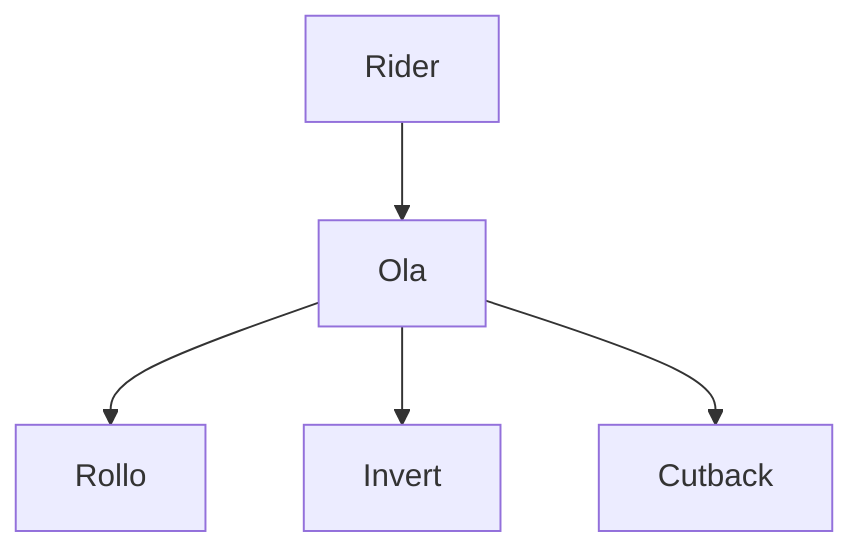
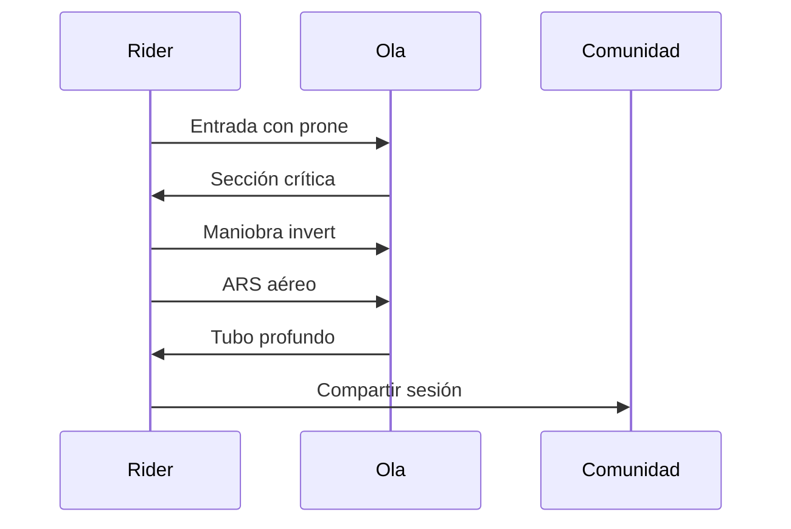

# 🎯 Técnicas y Maniobras del Bodyboard

**Inicio > Técnica > Maniobras y estilo**  
📅 Creado: 25/10/2025 · 🔄 Actualizado: 25/10/2025 · ⏱️ Lectura: 13 min  
🏷️ #Bodyboard #Técnica #Maniobras

---

## 📑 Tabla de Contenidos
- [Introducción](#introducción)
- [Estilos de Práctica](#estilos-de-práctica)
- [Maniobras Clásicas](#maniobras-clásicas)
- [Maniobras Aéreas y Avanzadas](#maniobras-aéreas-y-avanzadas)
- [Secuencias Técnicas](#secuencias-técnicas)
- [Conclusión](#conclusión)

---

## Introducción

El bodyboard es un deporte que combina técnica, creatividad y dominio del medio acuático. Las maniobras realizadas sobre la ola definen el estilo del rider y su nivel de progresión.

Desde movimientos básicos hasta acrobacias aéreas, cada maniobra requiere control corporal, lectura de la ola y conocimiento del equipo. Este artículo explora los estilos de práctica, las maniobras más representativas y las secuencias técnicas que forman parte del repertorio profesional.

---

## Estilos de Práctica

| Estilo       | Posición        | Características principales         |
|--------------|------------------|-------------------------------------|
| Prone        | Acostado         | Mayor velocidad y control           |
| Dropknee     | Rodilla flexionada| Estilo híbrido, más expresivo       |
| Stand-up     | De pie           | Similar al surf, menos común        |

Consejos técnicos

- El estilo prone permite mayor estabilidad en tubos  
- Dropknee requiere fuerza en piernas y equilibrio  
- Stand-up exige tablas específicas y olas suaves  

---

## Maniobras Clásicas

### El Rollo

Rotación sobre la cresta de la ola, aprovechando el impulso del labio.

### Invert

Flexión de la tabla en el aire, generando torsión y estilo.

### Cutback

Cambio de dirección hacia la parte crítica de la ola.

---

## Maniobras Aéreas y Avanzadas

| Maniobra     | Descripción técnica                  | Nivel recomendado |
|--------------|--------------------------------------|-------------------|
| ARS          | Air Roll Spin: giro aéreo con rotación | Avanzado          |
| Backflip     | Salto hacia atrás con rotación completa | Profesional       |
| Reverse      | Giro inverso en la base de la ola      | Intermedio        |
| Barrel Ride  | Entrada profunda en tubo cerrado       | Avanzado          |

Ejecución del ARS

1. Entrada con velocidad  
2. Impulso en el labio de la ola  
3. Giro completo en el aire  
4. Aterrizaje controlado en la base  

---

## Secuencias Técnicas

---

## Conclusión

Las técnicas y maniobras del bodyboard son el lenguaje del rider sobre la ola.

Dominar estilos y secuencias permite progresar, competir y expresarse con fluidez en cualquier spot del mundo.

| Aspecto técnico     | Evaluación     |
|---------------------|----------------|
| Variedad de estilos | Excelente      |
| Dificultad técnica  | Muy alta       |
| Creatividad aérea   | Destacada      |
| Evolución histórica | Significativa  |

---

## 📚 Notas y Referencias

[1] [Federación Española de Surf (FESURF)](https://www.fesurf.es/competiciones/bodyboard/)  
[2] [Blog Surf Destiny](http://blog.surfdestiny.com/noticias/bodyboard/historia-bodyboard-como-empezo-todo/)  
[3] [IBC World Tour](https://ibcworldtour.com/)  
[4] [YouTube, entrevistas y sesiones](https://www.youtube.com/results?search_query=bodyboarding)

## Navegación

Siguiente →[Spots Famosos del mundo](articulo4.md)
← Anterior [Equipamiento y materiales](articulo2.md)