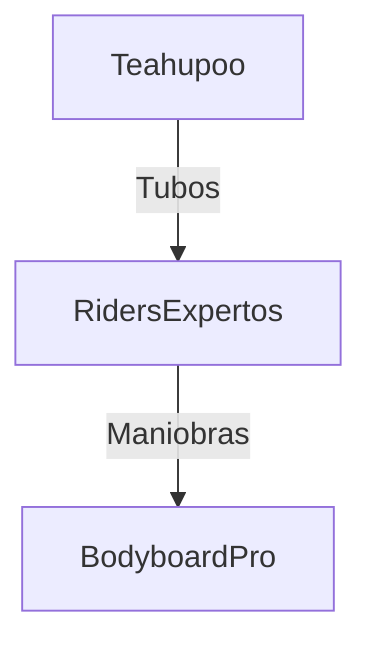
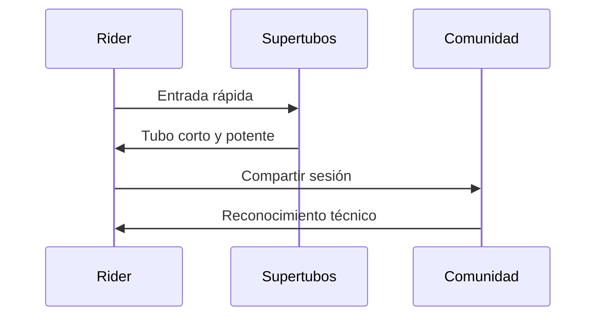

# 🌊 Spots Legendarios del Bodyboard

**Inicio > Destinos > Spots Legendarios**  
📅 Creado: 25/10/2025 · 🔄 Actualizado: 25/10/2025 · ⏱️ Lectura: 15 min  
🏷️ #Bodyboard #Spots #Olas

---

## 📑 Tabla de Contenidos
- [Introducción](#introducción)
- [Pipeline (Hawái)](#pipeline-hawái)
- [Teahupo’o (Tahití)](#teahupoo-tahití)
- [El Frontón (Gran Canaria)](#el-frontón-gran-canaria)
- [The Wedge (California)](#the-wedge-california)
- [Supertubos (Portugal)](#supertubos-portugal)
- [Conclusión](#conclusión)

---

## Introducción

El bodyboard es un deporte que encuentra su máxima expresión en olas potentes, tubulares y verticales. A lo largo del mundo existen spots legendarios que han marcado la historia del bodyboard, tanto por sus condiciones extremas como por los campeonatos que han acogido.

Este artículo recorre los destinos más icónicos para practicar bodyboard, destacando sus características técnicas, temporadas ideales y el legado que han dejado en la comunidad rider. Se incluyen diagramas, tablas comparativas, bloques colapsables y enlaces para explorar cada lugar en profundidad.

---

## Pipeline (Hawái)

Pipeline, en la costa norte de Oahu, es considerado el Santo Grial del bodyboard.

Información adicional

- Olas tubulares de izquierda  
- Fondo de arrecife peligroso  
- Temporada ideal: diciembre a febrero  
- Sede de campeonatos APB World Tour  

Características: Potencia extrema, tubos profundos

Nivel recomendado: Avanzado

---

## Teahupo’o (Tahití)

Ubicado en la Polinesia Francesa, Teahupo’o es famoso por sus olas monstruosas y perfectas.

- Temporada ideal: mayo a agosto  
- Fondo de coral afilado  
- No apto para principiantes  

---

## El Frontón (Gran Canaria)

Considerado uno de los mejores spots de Europa, El Frontón ofrece tubos potentes y maniobrables.

| Característica     | Detalle               |
|--------------------|-----------------------|
| Tipo de ola        | Izquierda explosiva   |
| Fondo              | Volcánico             |
| Eventos destacados | Frontón King          |
| Temporada ideal    | Octubre a diciembre   |

Campeones destacados

- Amaury Lavernhe  
- Tanner McDaniel  
- Iain Campbell  

---

## The Wedge (California)

Ubicado en Newport Beach, The Wedge es famoso por sus olas impredecibles y verticales.

- Olas de hasta 6 metros  
- Formación por rebote contra escollera  
- Temporada ideal: verano (julio a septiembre)  

Nivel recomendado: Experto

---

## Supertubos (Portugal)

En Peniche, Supertubos es una ola orillera rápida y técnica, ideal para maniobras aéreas.

- Olas de izquierda y derecha  
- Fondo de arena  
- Temporada ideal: otoño (septiembre a noviembre)  

---

## Conclusión

Los spots legendarios del bodyboard son más que destinos: son escenarios donde se forja la historia del deporte.

Cada ola representa un reto técnico, una cultura local y una oportunidad para evolucionar como rider.

| Spot               | Evaluación Técnica |
|--------------------|--------------------|
| Pipeline (Hawái)   | Excelente          |
| Teahupo’o (Tahití) | Muy alta           |
| El Frontón (GC)    | Destacada          |
| The Wedge (USA)    | Significativa      |
| Supertubos (PT)    | Técnica y versátil |

---

## 📚 Notas y Referencias

[1] [Federación Española de Surf (FESURF)](https://www.fesurf.es/competiciones/bodyboard/)  
[2] [Blog Surf Destiny](http://blog.surfdestiny.com/noticias/bodyboard/historia-bodyboard-como-empezo-todo/)  
[3] [IBC World Tour](https://ibcworldtour.com/)  
[4] [YouTube, entrevistas y sesiones](https://www.youtube.com/results?search_query=bodyboarding)

## Navegación

Siguiente →[Riders legendarios](articulo5.md)
← Anterior [Técnicas y maniobras](articulo3.md)