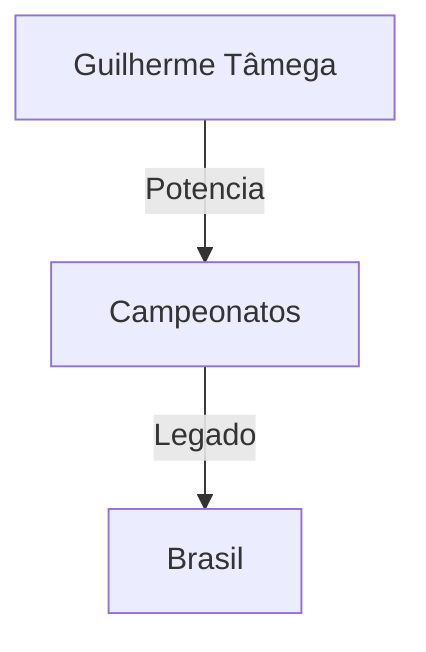
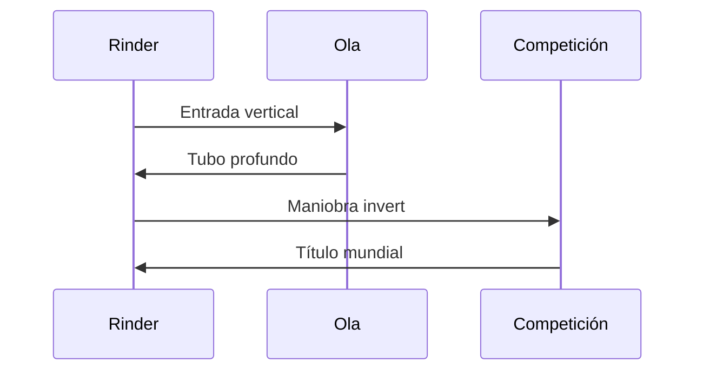

# 🏅 Riders Legendarios del Bodyboard

**Inicio > Ídolos > Riders Legendarios**  
📅 Creado: 01/11/2025 · 🔄 Actualizado: 01/11/2025 · ⏱️ Lectura: 15 min  
🏷️ #Bodyboard #Riders #Leyendas

---

## 📑 Tabla de Contenidos
- [Introducción](#introducción)
- [Mike Stewart](#mike-stewart)
- [Guilherme Tâmega](#guilherme-tâmega)
- [Amaury Lavernhe](#amaury-lavernhe)
- [Alexandra Rinder](#alexandra-rinder)
- [Legado y Cultura](#legado-y-cultura)
- [Conclusión](#conclusión)

---

## Introducción

El bodyboard ha sido moldeado por figuras que no solo dominaron las olas, sino que también transformaron el deporte con su estilo, técnica y filosofía. Estos riders legendarios han dejado huella en campeonatos mundiales, spots icónicos y generaciones de nuevos practicantes.

Este artículo recorre la trayectoria de los más influyentes, sus logros, maniobras emblemáticas y el legado que han construido. Se incluyen tablas comparativas, diagramas, bloques colapsables y enlaces para explorar más sobre cada uno.

---

## Mike Stewart

Considerado el pionero y maestro del bodyboard moderno.

Información adicional

- 9 veces campeón mundial  
- Fundador de Science Bodyboards  
- Pionero en maniobras como el ARS y el tubo profundo  

| Aspecto        | Valor         |
|----------------|---------------|
| Nacionalidad   | EE.UU.        |
| Años activos   | Desde 1980    |
| Estilo         | Prone         |
| Tabla icónica  | Science MS Pro|

---

## Guilherme Tâmega

Rider brasileño con estilo agresivo y técnica impecable.

- 6 títulos mundiales  
- Reconocido por su potencia en olas grandes  
- Figura clave en el desarrollo del APB Tour  

---

## Amaury Lavernhe

Rider francés que combina técnica, elegancia y compromiso con el deporte.

Logros destacados

- Campeón mundial APB 2010 y 2014  
- Ganador del Frontón King  
- Embajador técnico en Europa  

| Año | Título                     | Evento             |
|-----|----------------------------|--------------------|
|2010 | Campeón Mundial APB        | Sintra Pro         |
|2014 | Campeón Mundial APB        | Nazaré Pro         |
|2022 | Ganador Frontón King       | Gran Canaria       |

---

## Alexandra Rinder

Referente femenina del bodyboard, nacida en Gran Canaria.

- Campeona mundial APB en 2014 y 2015  
- Estilo potente y técnico  
- Promotora del bodyboard femenino internacional  

---

## Legado y Cultura

Influencia en la Comunidad

Los riders legendarios han inspirado escuelas, marcas y eventos en todo el mundo.

Referencias en Medios

“Mike Stewart es el Da Vinci del bodyboard” – SurferToday  
“Alexandra Rinder redefine el bodyboard femenino” – El País

Formación de Nuevas Generaciones

Programas juveniles y clínicas técnicas lideradas por riders profesionales.

---

## Conclusión

Los riders legendarios del bodyboard son pilares del deporte, no solo por sus títulos, sino por su impacto cultural y técnico.

Su legado continúa en cada ola surcada por nuevos talentos.

| Rider               | Evaluación Histórica |
|---------------------|----------------------|
| Mike Stewart        | Excelente            |
| Guilherme Tâmega    | Muy alta             |
| Amaury Lavernhe     | Destacada            |
| Alexandra Rinder    | Significativa        |

---

## 📚 Notas y Referencias

[1] [Federación Española de Surf (FESURF)](https://www.fesurf.es/competiciones/bodyboard/)  
[2] [Blog Surf Destiny](http://blog.surfdestiny.com/noticias/bodyboard/historia-bodyboard-como-empezo-todo/)  
[3] [IBC World Tour](https://ibcworldtour.com/)  
[4] [YouTube, entrevistas y sesiones](https://www.youtube.com/results?search_query=bodyboarding)

## Navegación

← Anterior [Spots del mundo](articulo4.md)