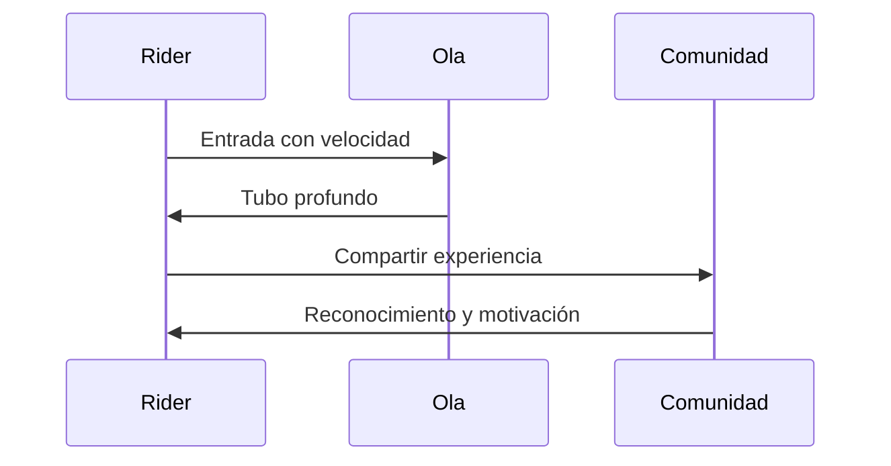

# 🕰️ Historia del Bodyboard

**Inicio > Historia > Origen y evolución mundial**  
📅 Creado: 25/10/2025 · 🔄 Actualizado: 25/10/2025 · ⏱️ Lectura: 15 min  
🏷️ #Historia #Bodyboard #Introducción

---

## 📑 Tabla de Contenidos
- [Introducción](#introducción)
- [Orígenes](#orígenes-y-evolución)
- [Era Dorada y Campeones](#era-dorada-y-campeones)
- [Competiciones y Logros](#competiciones-y-logros)
- [Espíritu del Deporte](#espíritu-del-deporte)
- [Conclusiones](#conclusiones)

---

## Introducción

El bodyboard es una disciplina acuática que combina velocidad, técnica y conexión con el mar. Surgido en los años 70, ha evolucionado hasta convertirse en un deporte con circuitos profesionales, estilos definidos y una comunidad apasionada.

Este artículo recorre los orígenes del bodyboard, sus figuras legendarias, los campeonatos más importantes y el espíritu que lo convierte en una forma de vida para miles de riders. Incluye tablas, diagramas, bloques colapsables y visualizaciones interactivas.

---

## Orígenes y Evolución

### Primeras olas (1971–1980)

El bodyboard fue popularizado por Tom Morey, quien diseñó la primera tabla con espuma y forma ergonómica.

Información adicional

Morey llamó a su invento "Boogie Board", buscando una experiencia musical y fluida sobre las olas. Su diseño permitió maniobras más radicales y accesibilidad para nuevos practicantes.

### Expansión global

Durante los años 80 y 90, el bodyboard se expandió por Hawái, Australia, Brasil y Europa, con estilos diferenciados como prone (acostado) y dropknee (rodilla).

---

## Era Dorada y Campeones

### Mike Stewart

“El maestro eterno del bodyboard”

- 9 veces campeón mundial
- Pionero en maniobras como el ARS y el tubo profundo

### Guilherme Tâmega

Rider brasileño con 6 títulos mundiales, conocido por su agresividad y precisión.

### Amaury Lavernhe

Campeón europeo y mundial, referente técnico y embajador del deporte.

---

## Competiciones y Logros

### Campeonatos Mundiales

| Año  | Campeón           | País       |
|------|-------------------|------------|
| 1995 | Mike Stewart      | EE.UU.     |
| 2001 | Guilherme Tâmega  | Brasil     |
| 2010 | Amaury Lavernhe   | Francia    |
| 2023 | Tristan Roberts   | Sudáfrica  |

### Estilos y Maniobras

- **Prone**: Acostado sobre la tabla  
- **Dropknee**: Una rodilla sobre la tabla, estilo híbrido  
- **Stand-up**: Similar al surf, pero con tabla de bodyboard  

Maniobras clave

- **ARS** (Air Roll Spin): Giro aéreo con rotación  
- **Invert**: Flexión de la tabla en el aire  
- **El Rollo**: Rotación sobre la cresta de la ola  

---

## Espíritu del Deporte

### Conexión con la naturaleza

El bodyboard se practica en condiciones extremas, desde olas gigantes en Teahupo'o hasta tubos perfectos en El Frontón (Gran Canaria).

### Comunidad y cultura

Ambiente inclusivo, donde riders comparten sesiones, vídeos y progresión técnica.

---

## Conclusiones

El bodyboard es más que un deporte: es una forma de expresión, una cultura y una conexión directa con el océano.

Su evolución técnica y humana lo convierte en un referente de pasión, resiliencia y creatividad sobre las olas.

## 📊 Evaluación General del Bodyboard

| Aspecto                  | Evaluación     |
|--------------------------|----------------|
| Evolución técnica        | Excelente      |
| Comunidad y cultura      | Muy alta       |
| Rendimiento competitivo  | Destacado      |
| Impacto cultural global  | Significativo  |

---

## 📚 Notas y Referencias

[1] [Federación Española de Surf (FESURF)](https://www.fesurf.es/competiciones/bodyboard/)  
[2] [Blog Surf Destiny](http://blog.surfdestiny.com/noticias/bodyboard/historia-bodyboard-como-empezo-todo/)  
[3] [IBC World Tour](https://ibcworldtour.com/)  
[4] [YouTube, entrevistas y sesiones](https://www.youtube.com/results?search_query=bodyboarding)

## Navegación

Siguiente →[Equipo y Materiales](articulo2.md)