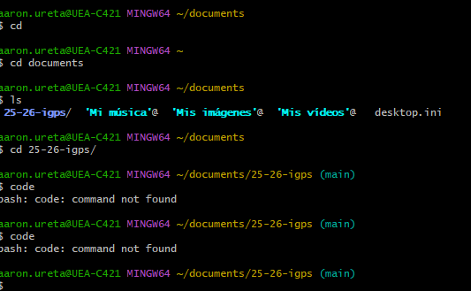
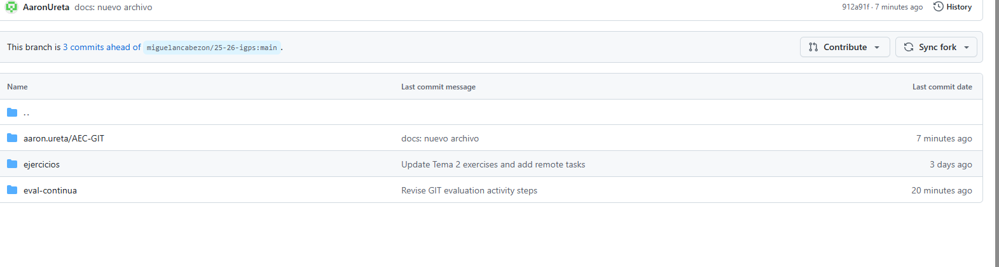

1. Primero, abrí Git Bash y configuré mi usuario con los siguientes comandos:


Cloné el repositorio con el comando:

```bash
git clone URL_DEL_REPOSITORIO
cd NOMBRE_DEL_REPOSITORIO
Luego, dentro de la carpeta actividades, creé una carpeta con mi nombre y apellido:

bash
Copiar código
mkdir actividades/aaron.ureta
Dentro de esa carpeta, creé otra carpeta llamada AEC-GIT:

bash
Copiar código
mkdir actividades/aaron.ureta/AEC-GIT

Después, creé una rama llamada docs/modificaciones para trabajar en mis cambios:

git checkout -b docs/modificaciones
