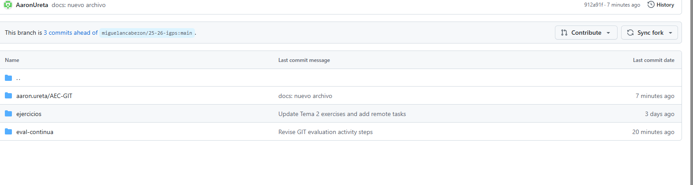

1. Primero, abrí Git Bash y configuré mi usuario con los siguientes comandos:

Cloné el repositorio con el comando:

Cloné el repositorio con el comando git clone URL_DEL_REPOSITORIO y luego entré en la carpeta del repositorio con cd NOMBRE_DEL_REPOSITORIO.

Luego, dentro de la carpeta actividades, creé una carpeta con mi nombre y apellido usando mkdir actividades/aaron.ureta.

Dentro de esa carpeta, creé otra carpeta llamada AEC-GIT con mkdir actividades/aaron.ureta/AEC-GIT.

Después, creé una rama llamada docs/modificaciones para trabajar en mis cambios usando git checkout -b docs/modificaciones.

Después, creé una rama llamada docs/modificaciones para trabajar en mis cambios:

git checkout -b docs/modificaciones
y termine haciendo merge.