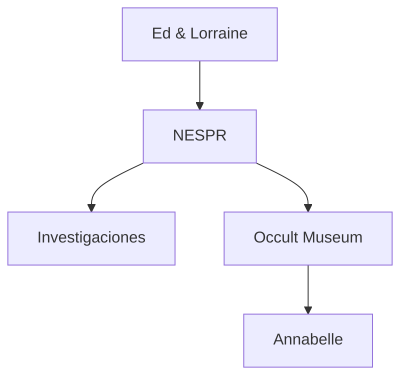

# 🕯️ Ed & Lorraine Warren — Biografía y Legado

**Inicio > Biografía > Ed & Lorraine Warren**

 *Creado: 25/10/2025 — Actualizado: 29/10/2025*  
 *Lectura: 4 min*  
 *Tags:* #Biografía #NESPR #Museo

---

## Tabla de Contenidos
- [Introducción](#introducción)
- [Orígenes y vida personal](#orígenes-y-vida-personal)
- [Nespr y museo](#nespr-y-museo)
- [Legado y crítica](#legado-y-crítica)
- [Conclusión](#conclusión)

---

## Introducción

Edward (Ed) y Lorraine Warren fueron una pareja de investigadores paranormales estadounidenses que documentaron numerosos casos desde mediados del siglo XX. Ed (1926-2006) se describía como demonólogo autodidacta; Lorraine (1927-2019) era medium y clarividente, según ellos mismos. Fundaron la New England Society for Psychic Research (NESPR) en 1952 y mantuvieron una colección pública-privada de artefactos llamada la *Warrens' Occult Museum* en Monroe, Connecticut. Su trabajo inspiró numerosas películas y libros, pero también generó escepticismo y disputas sobre la veracidad de sus afirmaciones.

---

## Orígenes y vida personal
- **Nacimiento y familia** — Resumen cronológico.  
- **Formación y creencias** — Su acercamiento religioso (catolicismo) y la influencia en su trabajo.
- **Actividad pública** — Conferencias, libros y apariciones.

### Subsecciones
- Matrimonio y vida familiar
- Formación autóctona en demonología
- Actividad mediática y presencia en prensa

---

## Nespr y museo

| Item | Descripción |
|:-----|:------------|
| NESPR | Organización fundada 1952 para investigación paranormal. :contentReference[oaicite:15]{index=15} |
| Museo | Colección de objetos (Annabelle, ídolos, reliquias). :contentReference[oaicite:16]{index=16} |
| Estado | Cerrado al público por normativa local; piezas han sido objeto de tours. :contentReference[oaicite:17]{index=17} |

---
## Legado y crítica

- **Influencia en la cultura pop** — Inspiraron películas (*The Conjuring Universe*), libros y documentales.  
- **Críticas y escepticismo** — Muchos investigadores cuestionaron la veracidad de sus casos y métodos.  
- **Impacto en la investigación paranormal** — Popularización de la demonología y fenómenos paranormales; creación de normas y estándares en investigación privada.
---

## Conclusión

Ed y Lorraine Warren fueron figuras controvertidas pero influyentes en el estudio de lo paranormal. Su trabajo abrió la puerta a la documentación de fenómenos paranormales, inspiró la cultura popular y generó debates sobre la credibilidad y ética de la investigación en este ámbito. Aunque su legado es discutido, no hay duda de que su vida y casos siguen fascinando al público alrededor del mundo.

---

---

**← [Inicio](./index.md)** | **Siguiente → [El caso Perron](./articulo-2.md)**  
[↑ Volver arriba](#top)