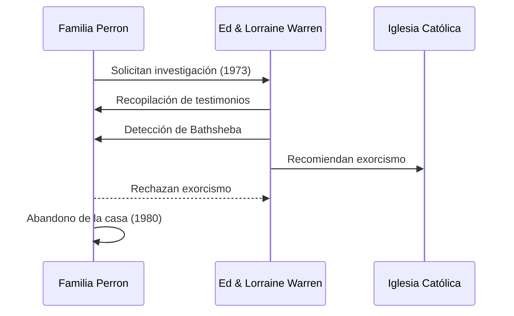

# 👻 El caso Perron — The Conjuring

**Inicio > Casos > Perron**

*Creado: 25/10/2025 — Actualizado: 29/10/2025*  
*Lectura: 3 min*  
*Tags:* #Perron #Harrisville #TheConjuring

---

## Tabla de Contenidos
- [Introducción](#introducción)
- [La familia Perron](#la-familia-perron)
- [Eventos reportados](#eventos-reportados)
- [Intervención de los Warren](#intervención-de-los-warren)
- [Adaptación cinematográfica](#adaptación-cinematográfica)

---

## Introducción

En 1971, la familia Perron se mudó a una granja en Harrisville (Rhode Island) y reportó fenómenos perturbadores: ruidos, marcas, y presencias. Estos incidentes fueron documentados por los Perron y luego investigados por Ed y Lorraine Warren, que atribuyeron parte de la actividad a una antigua bruja llamada Bathsheba Sherman (según la versión Warren). El relato inspiró la película *The Conjuring* (2013). Este caso es uno de los más mediáticos por la conexión directa con la saga cinematográfica.

---

## La familia Perron

- **Miembros:** Roger y Carolyn Perron y sus cinco hijas (Andrea, Nancy, Christine, Cindy y April).
- **Primeros signos:** Miedo inexplicable del perro, relojes que se detenían a las 3:07 AM, marcas en el cuerpo de Carolyn.
- **Duración:** Vivieron en la propiedad durante 10 años (1971-1980).

### Subsecciones
- Impacto psicológico en las niñas
- Testimonios publicados (Andrea Perron escribió una trilogía de libros)
- Seguimiento posterior y reconciliación con la experiencia

---

## Eventos reportados

| Año | Evento |
|:---:|:------|
| 1971 | Llegada de la familia a la granja de Old Arnold Estate |
| 1971-1974 | Actividad intensa: olores, apariciones, objetos moviéndose |
| 1973 | Los Warren realizan su investigación |
| 1974 | Intento de sesión espiritista que termina abruptamente |
| 1980 | La familia abandona la propiedad |
| 2013 | Estreno de *The Conjuring* inspirada en el caso |

---

## Intervención de los Warren

Los Warren llegaron en 1973 tras ser contactados por la familia. Lorraine afirmó detectar múltiples entidades, pero una dominante: Bathsheba Sherman, supuestamente una mujer del siglo XIX acusada de brujería y sacrificio infantil. Ed documentó el caso y realizó sesiones de investigación. Según los Perron, la intervención intensificó temporalmente la actividad paranormal. Los Warren recomendaron un exorcismo, pero Roger Perron lo rechazó por temor a empeorar la situación.

---

## Adaptación cinematográfica

*The Conjuring* (2013), dirigida por James Wan, dramatizó los eventos de Harrisville. La película fue un éxito mundial y lanzó un universo cinematográfico expandido. Andrea Perron, la hija mayor, ha comentado públicamente que la película tomó licencias creativas pero capturó la esencia aterradora de su experiencia. La casa real todavía existe y ha sido visitada por entusiastas de lo paranormal.

---

---

**← [Ed & Lorraine Warren — Biografía y Legado](./articulo-1.md)** | **Siguiente → [Annabelle — la muñeca (historia real vs cine)](./articulo-3.md)**  
[↑ Volver arriba](#top)