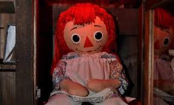
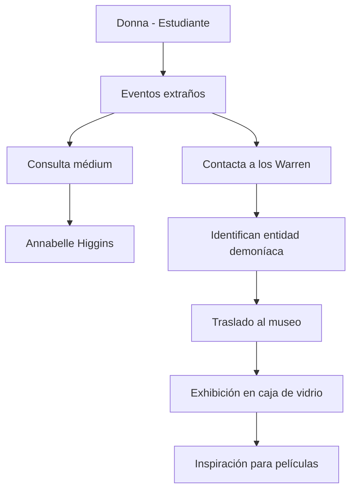

  <h1> 🎎 Annabelle — La muñeca</h1>
  

**Inicio > Casos > Annabelle**

*Creado: 26/10/2025 — Actualizado: 29/10/2025*  
*Lectura: 2–3 min*  
*Tags:* #Annabelle #Museo #LeyendaUrbana

---

## Tabla de Contenidos
- [Introducción](#introducción)
- [Origen del objeto](#origen-del-objeto)
- [La muñeca en el museo](#la-muñeca-en-el-museo)
- [Influencia en la cultura pop](#influencia-en-la-cultura-pop)
- [Controversias y escepticismo](#controversias-y-escepticismo)

---

## Introducción

La "Annabelle" real —según los Warren— era originalmente una muñeca Raggedy Ann entregada a una estudiante a finales de los años 60/70 que, según ella, mostraba comportamientos extraños. Los Warren afirmaron que la muñeca estaba manipulada por una entidad demoníaca y la encerraron en su museo. La versión cinematográfica convirtió a Annabelle en una figura de porcelana terrorífica y protagonizó su propia trilogía dentro del Conjuring Universe. Muchos investigadores y periodistas han cuestionado la veracidad y la gravedad de los hechos atribuidos a la muñeca.

---

## Origen del objeto

- **Año:** Final de los 1960 / principios de 1970 (según relatos).
- **Propietaria original:** Estudiante de enfermería llamada Donna.
- **Primeros fenómenos:** Cambios de posición, notas escritas en pergamino antiguo, supuestas agresiones leves a su compañera de cuarto.
- **Médium consultada:** Afirmó que la muñeca estaba poseída por el espíritu de "Annabelle Higgins", una niña fallecida.

### Subsecciones
- Testimonios originales de Donna y Angie
- Intervención de los Warren (declararon que era un demonio, no un espíritu infantil)
- Traslado al museo con bendición religiosa

---

## La muñeca en el museo

| Aspecto | Descripción |
|:--------|:------------|
| Ubicación | Occult Museum (Monroe, Connecticut) |
| Exhibición | Guardada en caja de vidrio con advertencias de no tocar |
| Estado actual | El museo permanece cerrado al público por regulaciones locales |
| Seguridad | Los Warren colocaron una nota: "Advertencia: No abrir bajo ninguna circunstancia" |

**Diferencias con el cine:**
- **Real:** Muñeca Raggedy Ann de trapo con aspecto inocente
- **Cine:** Muñeca de porcelana con rostro siniestro y apariencia victoriana

---

## Influencia en la cultura pop

La figura de Annabelle se expandió dramáticamente a través del cine:

- ***Annabelle* (2014):** Precuela que explora los orígenes ficticios de la muñeca
- ***Annabelle: Creation* (2017):** Historia de su creación y primera posesión
- ***Annabelle Comes Home* (2019):** La muñeca en el museo Warren desata otras entidades

El personaje se convirtió en icono del terror moderno, generando merchandising, disfraces y referencias en cultura popular. La muñeca real se volvió atracción turística antes del cierre del museo.

---

## Controversias y escepticismo

**Críticas principales:**
- Falta de evidencia física verificable de los fenómenos reportados
- Inconsistencias en las fechas y testimonios originales
- Expertos señalan que los relatos fueron dramatizados con fines comerciales
- Ningún investigador independiente ha podido verificar actividad paranormal en la muñeca
- El aspecto de la muñeca real (Raggedy Ann) contradice la narrativa terrorífica

**Defensores argumentan:**
- Los testimonios de Donna fueron consistentes
- Los Warren documentaron el caso según sus estándares
- La muñeca permanece encerrada "por precaución"

---

---

**← [El caso Perron — The Conjuring](./articulo-2.md)** | **Siguiente → [Amityville — participación de los Warren y la controversia](./articulo-4.md)**  
[↑ Volver arriba](#top)