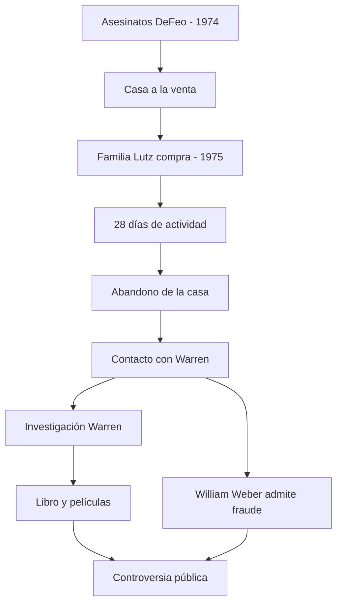

# 🏚️ Amityville — Lo que dijeron los Warren

**Inicio > Casos > Amityville**

*Creado: 26/10/2025 — Actualizado: 29/10/2025*  
*Lectura: 3 min*  
*Tags:* #Amityville #Controversia #Lutz

---

## Tabla de Contenidos
- [Introducción](#introducción)
- [Hechos clave](#hechos-clave)
- [Papel de los Warren](#papel-de-los-warren)
- [Críticas y teorías alternativas](#críticas-y-teorías-alternativas)
- [Legado en cine y prensa](#legado-en-cine-y-prensa)

---

## Introducción

El caso de Amityville (1975-1976) —protagonizado por George y Kathy Lutz— se convirtió en sinónimo de «casa encantada». Los Warren participaron como investigadores externos y ofrecieron su interpretación demoníaca del fenómeno; sin embargo, autores y periodistas han descrito partes del caso como posibles fraudes o exageraciones. El debate público en torno a Amityville es tan intenso como su presencia en la cultura popular, siendo uno de los casos paranormales más documentados y cuestionados de la historia.

---

## Hechos clave

- **Noviembre 1974:** Ronald DeFeo Jr. asesina a seis miembros de su familia en la casa de Ocean Avenue 112, Amityville (Nueva York).
- **Diciembre 1975:** La familia Lutz compra la casa con gran descuento debido a su historia.
- **28 días después:** Los Lutz abandonan precipitadamente la propiedad alegando actividad paranormal violenta.
- **1977:** Publicación del libro *The Amityville Horror* de Jay Anson, basado en los testimonios de los Lutz.
- **Fenómenos reportados:** Voces, olores nauseabundos, moscas en invierno, levitación, marcas demoníacas, temperaturas extremas.

### Subsecciones
- **Testimonios de los Lutz:** Declaraciones consistentes pero dramáticas sobre posesión y terror
- **Investigación policial y forense:** No se encontró evidencia física de fenómenos paranormales
- **Cobertura mediática:** El caso generó libros, películas, documentales y debates televisivos

---

## Papel de los Warren

Los Warren fueron contactados por los Lutz después de abandonar la casa y jugaron un papel crucial en la narrativa pública del caso:

- **Investigación:** Visitaron la propiedad y realizaron sesiones de documentación fotográfica
- **Interpretación demoníaca:** Lorraine afirmó detectar una presencia maligna poderosa en la casa
- **Fotografía famosa:** Capturaron la controvertida imagen del "niño fantasma" en las escaleras
- **Declaraciones públicas:** Respaldaron públicamente la versión de los Lutz, aumentando la credibilidad mediática del caso
- **Conexión con DeFeo:** Sugirieron que los asesinatos anteriores pudieron haber sido influenciados por fuerzas demoníacas

> **⚠️ ADVERTENCIA:** La participación de los Warren en Amityville es uno de los puntos más controvertidos de su carrera. Investigadores críticos denuncian inconsistencias, conflictos de interés comerciales y falta de evidencia verificable.

---

## Críticas y teorías alternativas

**Argumentos escépticos:**
- **Fraude financiero:** William Weber, abogado de DeFeo, admitió haber "creado" la historia con los Lutz durante una sesión con vino
- **Motivación económica:** Los Lutz enfrentaban problemas financieros; el libro y derechos cinematográficos les generaron ingresos significativos
- **Inconsistencias:** Vecinos y propietarios posteriores no reportaron actividad paranormal
- **Evidencia fotográfica cuestionada:** La foto del "niño fantasma" ha sido analizada y catalogada como posible doble exposición o manipulación
- **Contradicciones:** Detalles del relato cambiaron entre entrevistas

**Defensores argumentan:**
- Los Lutz pasaron pruebas de detector de mentiras (aunque estos no son científicamente concluyentes)
- El trauma psicológico de la familia era evidente
- Múltiples testigos (incluidos los Warren) respaldaron aspectos del caso

---

## Legado en cine y prensa

El caso Amityville generó una franquicia mediática masiva:

**Películas principales:**
- ***The Amityville Horror* (1979):** Adaptación del libro original
- ***Amityville II: The Possession* (1982):** Basada en los asesinatos DeFeo
- ***The Amityville Horror* (2005):** Remake moderno
- Más de 20 películas derivadas y spin-offs

**Impacto cultural:**
- La dirección "112 Ocean Avenue" se cambió a "108" para evitar el turismo morboso
- Inspiró innumerables historias de casas embrujadas
- Debate continuo sobre ética periodística y sensacionalismo paranormal
- Los Warren utilizaron el caso como ejemplo principal en conferencias durante décadas

---

---

**← [Annabelle — La muñeca](./articulo-3.md)** | **Siguiente → [Devil Made Me Do It" — Arne Cheyenne Johnson](./articulo-5.md)**  
[↑ Volver arriba](#top)