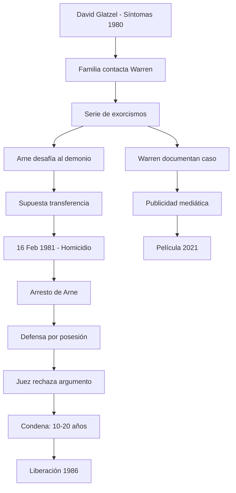

# ⚖️ "Devil Made Me Do It" — Arne Cheyenne Johnson

**Inicio > Casos > Arne Johnson**

*Creado: 27/10/2025 — Actualizado: 29/10/2025*  
*Lectura: 3 min*  
*Tags:* #Juicio #Glatzel #Possession

---

## Tabla de Contenidos
- [Introducción](#introducción)
- [Hechos y cronología](#hechos-y-cronología)
- [La defensa por posesión](#la-defensa-por-posesión)
- [Respuesta pública y prensa](#respuesta-pública-y-prensa)
- [Legado judicial y cultural](#legado-judicial-y-cultural)

---

## Introducción

El caso judicial de Arne Cheyenne Johnson (1981) es célebre porque la defensa intentó alegar posesión demoníaca como argumento legal tras una serie de exorcismos practicados en la familia Glatzel. Es conocido como el primer caso en Estados Unidos donde se invocó la posesión como motivo de defensa en un homicidio. Los Warren estuvieron profundamente vinculados a los eventos previos, documentando supuestos exorcismos en el hogar de los Glatzel. El tribunal finalmente condenó a Johnson por homicidio voluntario, rechazando la defensa por posesión. El caso inspiró la película *The Conjuring: The Devil Made Me Do It* (2021).

---

## Hechos y cronología

**Contexto inicial:**
- **1980:** David Glatzel (11 años), hermano menor de la prometida de Arne Johnson, comienza a experimentar episodios violentos y visiones
- **Julio 1980:** Los Warren documentan supuestos exorcismos en la casa de los Glatzel en Brookfield, Connecticut
- **Durante exorcismo:** Arne Johnson (19 años) supuestamente desafía al demonio a "poseerlo a él en lugar del niño"

**El homicidio:**
- **16 de febrero de 1981:** Johnson apuñala fatalmente a su casero, Alan Bono (40 años), durante una discusión
- **Contexto:** Johnson había estado bebiendo, pero testigos notaron comportamiento errático
- **Arresto inmediato:** Johnson fue detenido en el lugar de los hechos

**El juicio:**
- **Octubre-noviembre 1981:** Juicio en el Tribunal Superior de Danbury, Connecticut
- **Defensa:** Martin Minnella argumentó posesión demoníaca basándose en los testimonios de los Warren
- **Fiscalía:** Presentó el caso como homicidio bajo los efectos del alcohol y celos
- **Veredicto:** Culpable de homicidio voluntario en primer grado
- **Sentencia:** 10-20 años de prisión (cumplió 5 años por buen comportamiento)

### Subsecciones
- **Exorcismos documentados:** Registros de los Warren incluyen cintas de audio y testimonios de la familia
- **Testimonio de David Glatzel:** El niño describió entidades demoníacas específicas
- **Controversia familiar:** Años después, miembros de la familia Glatzel denunciaron que la historia fue fabricada

---

## La defensa por posesión

**Estrategia legal innovadora:**
Martin Minnella presentó la "defensa demoníaca" argumentando que:
- Johnson no era responsable de sus actos debido a posesión
- Los exorcismos previos y el testimonio de los Warren probaban la posesión
- Solicitó que expertos religiosos y los Warren testificaran como peritos

**Rechazo judicial:**
- **Juez Robert Callahan:** Declaró inadmisible la defensa por posesión
- **Fundamento:** No existe base legal para aceptar posesión demoníaca como causa de inimputabilidad
- **Alternativa:** La defensa tuvo que argumentar "locura temporal"

**Papel de los Warren:**
- Lorraine Warren testificó sobre los exorcismos de David Glatzel
- Ed Warren apoyó públicamente a Johnson y documentó el caso extensamente
- Su testimonio fue crucial para dar credibilidad mediática, aunque no legal

> **⚠️ NOTA LEGAL:** Este caso estableció precedente de que argumentos sobrenaturales no son admisibles como defensa en tribunales estadounidenses.

---

## Respuesta pública y prensa

**Cobertura mediática masiva:**
- El caso recibió atención nacional e internacional
- Debate público sobre religión, justicia y lo sobrenatural
- Los Warren realizaron conferencias extensas sobre el caso

**Reacciones divididas:**
- **Creyentes:** Vieron el caso como evidencia de lo paranormal
- **Escépticos:** Lo catalogaron como estrategia desesperada de defensa
- **Comunidad religiosa:** Dividida entre quienes apoyaban los exorcismos y quienes los cuestionaban

**Controversia posterior (2007):**
- Carl Glatzel Jr. (hermano de David) demandó a Lorraine Warren y al autor Gerald Brittle
- Alegó que la historia de posesión fue inventada y dañó a su familia
- Afirmó que David tenía problemas mentales, no posesión
- La demanda se resolvió fuera de los tribunales

---

## Legado judicial y cultural

**Impacto legal:**
- Primer y único intento de "defensa demoníaca" en un tribunal estadounidense
- Estableció que argumentos sobrenaturales no tienen cabida en el sistema judicial
- Usado como ejemplo en cursos de derecho sobre defensas inadmisibles

**Impacto cultural:**
- Inspiró libros, documentales y la película *The Conjuring 3* (2021)
- Reforzó la reputación de los Warren como investigadores paranormales
- Generó debate sobre límites entre fe religiosa y sistema judicial
- La historia continúa siendo citada en discusiones sobre exorcismo y posesión

**Estado actual:**
- Arne Johnson fue liberado en 1986 por buen comportamiento
- Se casó con Debbie Glatzel (hermana de David) y mantienen un perfil bajo
- David Glatzel vive privadamente; algunos familiares niegan la versión original
- El caso permanece como uno de los más controvertidos en la historia de los Warren

---

---

**← [Amityville — Lo que dijeron los Warren](./articulo-4.md)** | **[Inicio](./index.md)**  
[↑ Volver arriba](#top)