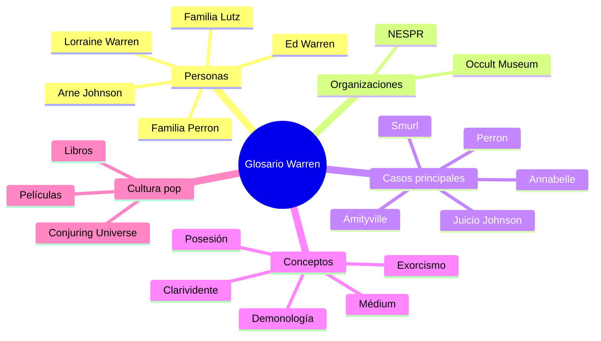

# 📘 Glosario — Universo Warren

**Inicio > Recursos > Glosario**

*Creado: 27/10/2025 — Actualizado: 29/10/2025*  
*Términos: 15*

---

## Índice alfabético
[A](#a) • [B](#b) • [C](#c) • [D](#d) • [E](#e) • [L](#l) • [M](#m) • [N](#n) • [O](#o) • [P](#p) • [W](#w)

---

## A

### Amityville
**Definición:** Caso mediático de 1975-1976 en el que la familia Lutz reportó actividad paranormal violenta en su casa de Ocean Avenue 112, Amityville (Nueva York). Los Warren investigaron el caso y respaldaron la versión demoníaca, aunque posteriormente surgieron acusaciones de fraude.  
**Artículo relacionado:** [Amityville](./articulo-4.md)

### Annabelle
**Definición:** Muñeca Raggedy Ann vinculada a relatos de posesión demoníaca según los Warren. Actualmente exhibida en el Occult Museum dentro de una caja de vidrio. La versión cinematográfica la transformó en una muñeca de porcelana terrorífica.  
**Artículo relacionado:** [Annabelle](./articulo-3.md)

---

## B

### Bathsheba Sherman
**Definición:** Figura histórica del siglo XIX asociada al caso Perron. Según los Warren, era una bruja satánica que maldijo la propiedad. Investigaciones posteriores cuestionan esta narrativa, señalando que Bathsheba fue una residente normal sin evidencia de brujería.  
**Artículo relacionado:** [El caso Perron](./articulo-2.md)

---

## C

### Clarividente
**Definición:** Persona que afirma poseer la capacidad de percibir información más allá de los sentidos físicos normales. Lorraine Warren se describía como clarividente y médium, afirmando poder ver auras y detectar presencias espirituales.  
**Artículo relacionado:** [Ed & Lorraine Warren](./articulo-1.md)

### Conjuring Universe
**Definición:** Franquicia cinematográfica de terror producida por Warner Bros. y New Line Cinema, basada en los casos documentados por los Warren. Incluye películas como *The Conjuring* (2013), *Annabelle* (2014), *The Nun* (2018) y sus secuelas.  
**Artículos relacionados:** [Todos los casos](./index.md)

---

## D

### Demonología
**Definición:** Estudio teológico de los demonios y su jerarquía. Ed Warren se autodefinía como demonólogo, aunque no tenía formación académica formal en teología. Su conocimiento se basaba en estudio autodidacta y colaboración con sacerdotes católicos.  
**Artículo relacionado:** [Ed & Lorraine Warren](./articulo-1.md)

---

## E

### Exorcismo
**Definición:** Ritual religioso (principalmente católico) destinado a expulsar entidades demoníacas de personas, lugares u objetos. Los Warren frecuentemente participaban o asistían a exorcismos como observadores y documentalistas, trabajando con sacerdotes autorizados.  
**Artículo relacionado:** [Juicio Arne C. Johnson](./articulo-5.md)

---

## L

### Lutz (Familia)
**Definición:** George y Kathy Lutz, junto con sus tres hijos, fueron los protagonistas del caso Amityville. Abandonaron su casa 28 días después de mudarse, alegando actividad paranormal aterradora. Su testimonio fue posteriormente cuestionado.  
**Artículo relacionado:** [Amityville](./articulo-4.md)

---

## M

### Médium
**Definición:** Persona que afirma ser intermediaria entre el mundo físico y el espiritual. Lorraine Warren se identificaba como médium clarividente, alegando poder comunicarse con espíritus y detectar presencias sobrenaturales.  
**Artículo relacionado:** [Ed & Lorraine Warren](./articulo-1.md)

---

## N

### NESPR
**Definición:** New England Society for Psychic Research (Sociedad de Nueva Inglaterra para la Investigación Psíquica), fundada por Ed y Lorraine Warren en 1952. Fue una de las primeras organizaciones privadas en Estados Unidos dedicadas a la investigación de fenómenos paranormales.  
**Artículo relacionado:** [Ed & Lorraine Warren](./articulo-1.md)

---

## O

### Occult Museum
**Definición:** Museo privado ubicado en la residencia de los Warren en Monroe, Connecticut. Albergaba una colección de objetos supuestamente poseídos o malditos, incluyendo la muñeca Annabelle. Actualmente cerrado al público por regulaciones de zonificación local.  
**Artículo relacionado:** [Ed & Lorraine Warren](./articulo-1.md)

---

## P

### Perron (Familia)
**Definición:** Roger y Carolyn Perron y sus cinco hijas (Andrea, Nancy, Christine, Cindy y April) vivieron en una granja de Harrisville, Rhode Island (1971-1980), donde reportaron extensa actividad paranormal. Su caso inspiró la película *The Conjuring* (2013).  
**Artículo relacionado:** [El caso Perron](./articulo-2.md)

### Posesión demoníaca
**Definición:** Alegación de control total o parcial de una entidad demoníaca sobre una persona. En el contexto legal, Arne Johnson intentó usar esto como defensa en su juicio por homicidio, siendo el primer y único caso de este tipo en Estados Unidos.  
**Artículo relacionado:** [Juicio Arne C. Johnson](./articulo-5.md)

---

## S

### Smurl (Familia)
**Definición:** Caso de supuesta actividad demoníaca en Pensilvania (1986-1989) investigado por los Warren. La familia reportó ataques físicos y agresiones sexuales por parte de entidades. El caso generó un libro y una película para televisión, pero también considerable escepticismo.  
**Artículo relacionado:** Referencias adicionales

---

## W

### Warren, Ed (1926-2006)
**Definición:** Edward Warren Miney, demonólogo autodidacta y artista. Cofundador de NESPR junto a su esposa Lorraine. Investigó miles de casos paranormales durante más de 50 años. Su trabajo inspiró múltiples libros y películas.  
**Artículo relacionado:** [Ed & Lorraine Warren](./articulo-1.md)

### Warren, Lorraine (1927-2019)
**Definición:** Lorraine Rita Warren (née Moran), médium clarividente y cofundadora de NESPR. Afirmaba poder ver auras y comunicarse con espíritus. Continuó dando conferencias y consultorías paranormales hasta edad avanzada.  
**Artículo relacionado:** [Ed & Lorraine Warren](./articulo-1.md)

---

## Términos relacionados

**Otros conceptos importantes en el universo Warren:**
- **Poltergeist:** Fenómeno paranormal caracterizado por ruidos y movimiento de objetos
- **EMF (Electromagnetic Field):** Herramienta usada para detectar supuestas anomalías eléctricas asociadas con presencias
- **EVP (Electronic Voice Phenomenon):** Grabaciones de audio que supuestamente capturan voces de espíritus
- **Sesión espiritista:** Reunión para intentar comunicación con espíritus
- **Infestación:** Primera etapa de actividad demoníaca según la demonología Warren
- **Opresión:** Segunda etapa de actividad demoníaca, con ataques físicos y psicológicos
- **Posesión:** Tercera y más grave etapa de actividad demoníaca

---

---

**← [Volver al inicio](./index.md)** | **[Referencias](./referencias.md)**  
[↑ Volver arriba](#top)