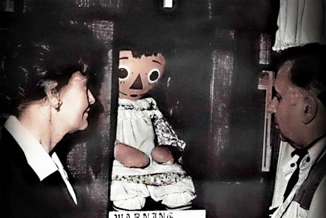

<center>
  <h1>🕯️ Bienvenid@s a la Mini-Wiki: Ed & Lorraine Warren</h1>
  
</center>

---

## Descripción

Esta mini-wiki recopila de forma concisa y conectada la vida, los casos y el legado mediático de **Ed y Lorraine Warren** — los investigadores paranormales detrás de relatos que inspiraron *The Conjuring Universe*. Aquí encontrarás artículos breves, enlazados entre sí, sobre los casos más famosos (Perron, Annabelle, Amityville, el juicio “Devil Made Me Do It”, etc.), su museo y las controversias asociadas.  

**Atención:** la wiki presenta los relatos según la versión de los Warren y la documentación pública; muchos casos son controvertidos y han sido objeto de debate y escepticismo.

---

## Índice visual (artículos destacados)

| Tema | Artículo | Enlace |
|:--------|:---------|:------:|
| Biografía & legado | Ed & Lorraine — Biografía y Museo | [Ir](./articulo-1.md) |
| Caso Perron | El caso Perron (The Conjuring) | [Ir](./articulo-2.md) |
| Annabelle | La historia de Annabelle (muñeca) | [Ir](./articulo-3.md) |
| Amityville | Amityville y la controversia | [Ir](./articulo-4.md) |
| Juicio 1981 | "Devil Made Me Do It" (Arne Johnson) | [Ir](./articulo-5.md) |

---

## Estadísticas rápidas

| Elemento | Cantidad aprox. |
|:---------|:---------------:|
| Artículos | 5 |
| Palabras totales (aprox.) | 2,000 |
| Diagramas Mermaid | 5 |
| Referencias principales | 8 |

---

## Últimas actualizaciones
- 29/10/2025 — Ajustes: referencias y notas sobre Annabelle (tour 2025).
- 27/10/2025 — Añadida sección sobre juicio Arne Johnson.
- 25/10/2025 — Creada la mini-wiki y estructura inicial.

---

## Timeline (Mermaid)

```mermaid
timeline
    1926 : Nace Edward "Ed" Warren
    1927 : Nace Lorraine Warren
    1945 : Ed y Lorraine se casan
    1952 : Fundación de NESPR (New England Society for Psychic Research)
    1970 : Caso Annabelle (muñeca)
    1971 : Perron family haunting (base de The Conjuring)
    1975 : Caso Amityville (participación de los Warren; controvertido)
    1981 : Juicio Arne Cheyenne Johnson ("Devil Made Me Do It")
    2006 : Fallece Ed Warren
    2019 : Fallece Lorraine Warren
    2013→2025 : Auge mediático: Conjuring Universe (películas y spin-offs)
