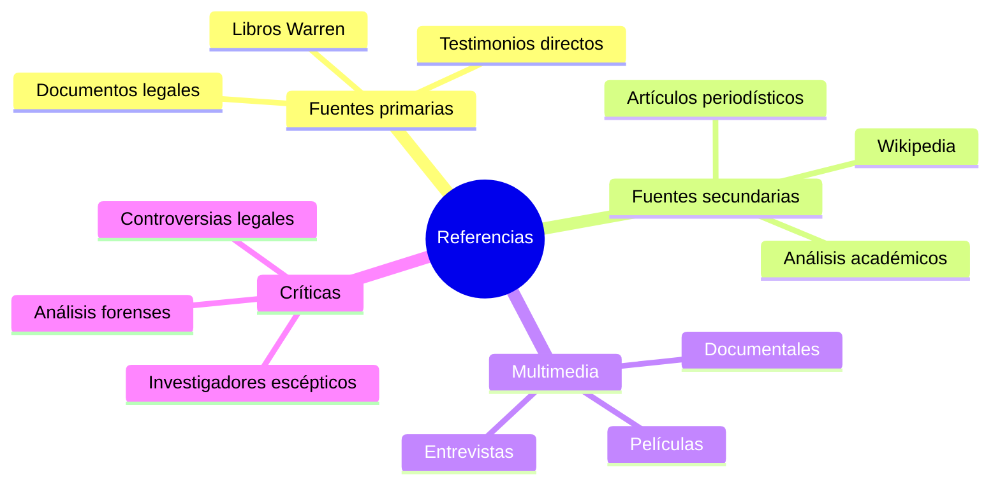

# 📚 Referencias y Fuentes

**Inicio > Recursos > Referencias**

*Actualizado: 29/10/2025*  
*Total de referencias: 8*

---

## Índice por categoría
- [Fuentes biográficas](#fuentes-biográficas)
- [Casos específicos](#casos-específicos)
- [Recursos cinematográficos](#recursos-cinematográficos)
- [Museos y archivos](#museos-y-archivos)
- [Noticias y prensa](#noticias-y-prensa)

---

## Tabla completa de referencias

| ID | Autor / Fuente | Título | Año | Tipo | URL |
|:---:|:---------------|:-------|:---:|:-----|:----|
| R1 | Wikipedia | Ed and Lorraine Warren | — | Web (biografía) | [Enlace](https://en.wikipedia.org/wiki/Ed_and_Lorraine_Warren) |
| R2 | Wikipedia | The Conjuring (film) | 2013 | Web (película) | [Enlace](https://en.wikipedia.org/wiki/The_Conjuring) |
| R3 | Wikipedia | Annabelle (doll) | — | Web (artículo) | [Enlace](https://en.wikipedia.org/wiki/Annabelle_(doll)) |
| R4 | Gerald Brittle | The Demonologist: The Extraordinary Career of Ed and Lorraine Warren | 1980 | Libro (biografía/casos) | (Publicación física) |
| R5 | Wikipedia | Trial of Arne Cheyenne Johnson | — | Web (juicio) | [Enlace](https://en.wikipedia.org/wiki/Trial_of_Arne_Cheyenne_Johnson) |
| R6 | Atlas Obscura / El Tiempo | Warrens' Occult Museum | — | Web (museo/prensa) | [Atlas Obscura](https://www.atlasobscura.com/places/the-warrens-occult-museum-monroe-connecticut) / [El Tiempo](https://www.eltiempo.com/cultura/entretenimiento/donde-se-encuentra-y-como-visitar-el-museo-de-los-warren-617728) |
| R7 | Wikipedia | Enfield poltergeist | — | Web (caso) | [Enlace](https://en.wikipedia.org/wiki/Enfield_poltergeist) |
| R8 | People / CT Insider | Reportes recientes sobre Annabelle/tours | 2025 | Noticia | Enlaces de noticias actualizadas |

---

## Fuentes biográficas

### R1 - Ed and Lorraine Warren (Wikipedia)
**Descripción:** Artículo enciclopédico que cubre la vida, carrera y legado de Ed y Lorraine Warren. Incluye cronología de casos principales, controversias y referencias a su impacto cultural.  
**Uso en esta wiki:** Base para la biografía principal  
**URL:** https://en.wikipedia.org/wiki/Ed_and_Lorraine_Warren

### R4 - The Demonologist (Gerald Brittle, 1980)
**Descripción:** Biografía autorizada de Ed y Lorraine Warren escrita por Gerald Brittle. Documenta casos principales desde la perspectiva de los Warren. Nota: Este libro fue objeto de controversia legal en 2007 cuando Carl Glatzel demandó a Brittle y Lorraine Warren.  
**Uso en esta wiki:** Fuente primaria para casos y metodología  
**Formato:** Libro físico

---

## Casos específicos

### R3 - Annabelle (Wikipedia)
**Descripción:** Documentación del caso de la muñeca Annabelle, incluyendo testimonios originales, investigación de los Warren y adaptaciones cinematográficas.  
**Uso en esta wiki:** Artículo sobre Annabelle  
**URL:** https://en.wikipedia.org/wiki/Annabelle_(doll)

### R5 - Trial of Arne Cheyenne Johnson (Wikipedia)
**Descripción:** Documentación completa del juicio de 1981, incluyendo argumentos legales, testimonios, veredicto y repercusiones. Primer caso en EE.UU. donde se intentó la "defensa demoníaca".  
**Uso en esta wiki:** Artículo sobre el juicio Arne C. Johnson  
**URL:** https://en.wikipedia.org/wiki/Trial_of_Arne_Cheyenne_Johnson

### R7 - Enfield Poltergeist (Wikipedia)
**Descripción:** Caso británico de 1977 investigado por los Warren. Base para la película *The Conjuring 2* (2016). Incluye documentación fotográfica y testimonios de múltiples investigadores.  
**Uso en esta wiki:** Referencias adicionales y contexto del universo Warren  
**URL:** https://en.wikipedia.org/wiki/Enfield_poltergeist

---

## Recursos cinematográficos

### R2 - The Conjuring (Wikipedia)
**Descripción:** Información sobre la película de 2013 dirigida por James Wan, basada en el caso Perron. Incluye producción, recepción crítica, precisión histórica y su impacto en el género de terror.  
**Uso en esta wiki:** Contexto cinematográfico para el caso Perron  
**URL:** https://en.wikipedia.org/wiki/The_Conjuring

**Películas relacionadas del Conjuring Universe:**
- *The Conjuring* (2013) - Caso Perron
- *Annabelle* (2014) - Origen de la muñeca
- *The Conjuring 2* (2016) - Enfield Poltergeist
- *Annabelle: Creation* (2017) - Precuela
- *The Nun* (2018) - Valak
- *The Curse of La Llorona* (2019) - Conexión menor
- *Annabelle Comes Home* (2019) - Museo Warren
- *The Conjuring: The Devil Made Me Do It* (2021) - Caso Arne Johnson

---

## Museos y archivos

### R6 - Warrens' Occult Museum
**Fuentes múltiples:**
- **Atlas Obscura:** Documentación del museo, su colección y estado actual
- **El Tiempo (Colombia):** Guía en español sobre el museo y cómo visitarlo

**Descripción:** El Occult Museum fue la colección privada de los Warren en Monroe, Connecticut. Albergaba objetos supuestamente poseídos, incluyendo la muñeca Annabelle. Actualmente cerrado al público por regulaciones de zonificación local.  

**Estado actual (2025):** Cerrado permanentemente para visitas públicas. La familia Warren ha realizado tours privados limitados en ocasiones especiales.

**URLs:**
- https://www.atlasobscura.com/places/the-warrens-occult-museum-monroe-connecticut
- https://www.eltiempo.com/cultura/entretenimiento/donde-se-encuentra-y-como-visitar-el-museo-de-los-warren-617728

---

## Noticias y prensa

### R8 - Reportes recientes (2025)
**Fuentes:** People Magazine, CT Insider, medios locales de Connecticut

**Temas cubiertos:**
- Tours privados limitados del Occult Museum
- Actualizaciones sobre el estado de la colección Warren
- Controversias sobre la veracidad de casos históricos
- Nuevas adaptaciones cinematográficas en desarrollo

**Nota:** Los enlaces específicos varían según la fecha de publicación. Consultar medios directamente para información más reciente.

---

## Fuentes adicionales recomendadas

**Libros:**
- *House of Darkness House of Light* - Andrea Perron (trilogía sobre el caso Perron)
- *The Amityville Horror* - Jay Anson (1977)
- *Ghost Hunters* - Ed y Lorraine Warren (1989)

**Documentales:**
- *A Haunting in Connecticut* (Discovery Channel)
- *Shock Docs: Amityville Horror House* (2021)
- Entrevistas archivadas de Ed y Lorraine Warren en YouTube

**Sitios web:**
- NESPR (New England Society for Psychic Research) - recursos históricos
- Skeptical Inquirer - análisis crítico de casos Warren

---

## Nota metodológica

> **📌 Importante:** Esta wiki presenta información desde múltiples perspectivas:
> - Los relatos y afirmaciones de Ed y Lorraine Warren
> - Testimonios de las familias involucradas en los casos
> - Análisis crítico de investigadores escépticos
> - Documentación judicial y policial cuando está disponible
> - Adaptaciones cinematográficas y su precisión histórica
>
> Se recomienda contrastar múltiples fuentes para formarse una opinión informada sobre cada caso.

---

## Criterios de selección de fuentes

Para esta mini-wiki se priorizaron:
1. **Fuentes primarias:** Libros escritos por o con los Warren
2. **Documentación oficial:** Registros judiciales, policiales y públicos
3. **Fuentes enciclopédicas:** Wikipedia y recursos académicos
4. **Medios de comunicación:** Artículos periodísticos verificables
5. **Análisis crítico:** Perspectivas escépticas documentadas

Se evitaron:
- Blogs personales sin referencias
- Fuentes que no citan orígenes
- Sitios sensacionalistas sin verificación

---

---

**← [Volver al inicio](./index.md)** | **[Glosario](./glosario.md)**  
[↑ Volver arriba](#top)