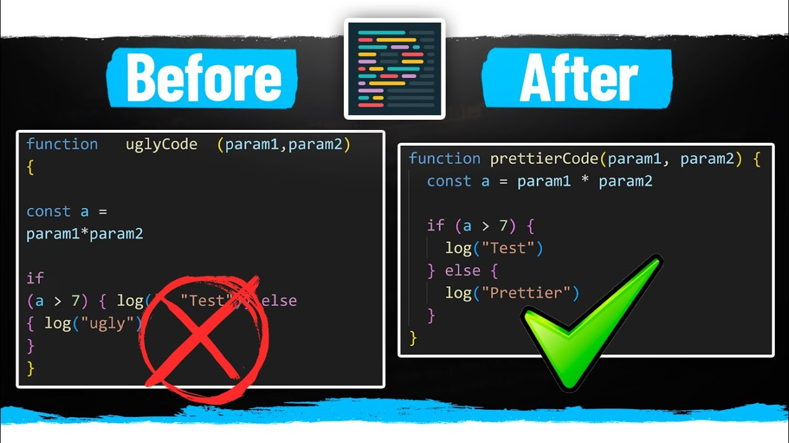
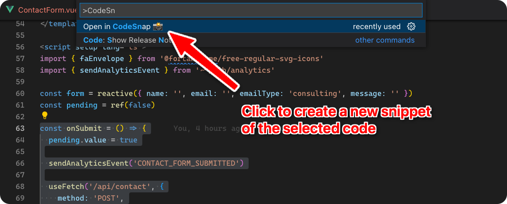
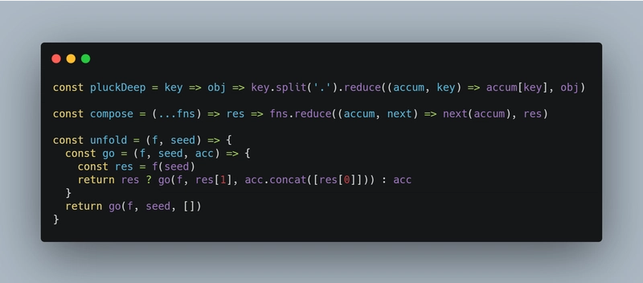

# Reflexión y Guía de Instalación de Extensiones

## 1. Prettier: El organizador de código

Mi primer problema era que mi código, aunque funcional, a veces se veía desordenado. Las sangrías no eran consistentes y perdía tiempo arreglándolo manualmente. Así descubrí **Prettier**.

### Pasos de Instalación

1.  **Abrir la vista de Extensiones:** Fui a la barra lateral y hice clic en el icono de Extensiones (o usé el atajo `Ctrl + Shift + X`).
2.  **Buscar la extensión:** En la barra de búsqueda, escribí `Prettier - Code formatter`.
3.  **Instalar:** Hice clic en el botón azul "Install" en la primera opción que apareció (la del autor `Prettier`).
4.  **Configurar como predeterminado (¡El paso clave!):** Para que funcionara automáticamente al guardar, abrí la paleta de comandos (`Ctrl + Shift + P`), busqué `Format Document` y cuando me preguntó qué formateador usar, elegí `Prettier`. ¡Ahora cada vez que guardo (`Ctrl + S`), la magia sucede!

### Dato Curioso que aprendí

Prettier es conocido como un formateador de código "dogmático" (*opinionated*). Esto significa que no tiene miles de opciones de configuración. Su objetivo es terminar con los debates sobre estilos de código en los equipos de trabajo, imponiendo un formato consistente para todos.

### Mi Descubrimiento

¡El cambio fue inmediato! Con **Prettier**, mi código ya no se ve desordenado, y me ahorro un tiempo valiosísimo que antes dedicaba a alinear llaves o corregir espacios.

*Este es un ejemplo del antes y el después. ¡Qué diferencia!*

---

## 2. CodeSnap: Capturas de código con estilo

Necesitaba compartir fragmentos de código para un pequeño tutorial que estaba escribiendo, pero una simple captura de pantalla no se veía profesional. Buscando soluciones, encontré **CodeSnap**.

### Pasos de Instalación

1.  **Ir a Extensiones:** De nuevo, abrí la pestaña de Extensiones (`Ctrl + Shift + X`).
2.  **Buscar la extensión:** Escribí `CodeSnap` en el buscador.
3.  **Instalar:** Hice clic en "Install" en la extensión creada por `adpyke`.
4.  **¡A usarla!:** Para probarla, seleccioné un trozo de mi código, abrí la paleta de comandos (`Ctrl + Shift + P`) y escribí `CodeSnap`. Inmediatamente se abrió una nueva pestaña con una imagen hermosa de mi código, lista para ser guardada.

### Dato Curioso que aprendí

CodeSnap es súper personalizable. No solo toma la foto, sino que respeta el tema y la fuente que tienes configurada en tu VSCode, haciendo que las capturas se sientan realmente "tuyas". Además, puedes hacer clic en la imagen para guardarla rápidamente.

### Mi Descubrimiento

Con **CodeSnap** pude tomar capturas estilizadas para documentar mejor mis prácticas. Es perfecto para añadir código a documentos, presentaciones o incluso para pedir ayuda mostrando el problema de forma clara y elegante.

| Sección para generar CodeSnap: | Ejemplo de un CodeSnap: |
| :--- | :--- |
|  | |

### 💡 Conclusión de mi Aprendizaje

Me di cuenta de que las extensiones cambian mucho mi experiencia de desarrollo. No son solo adornos; son herramientas poderosas que resuelven problemas reales. Con solo dos extensiones, mi VSCode se ha vuelto mucho más completo y adaptado a mis necesidades.