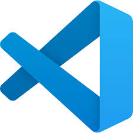
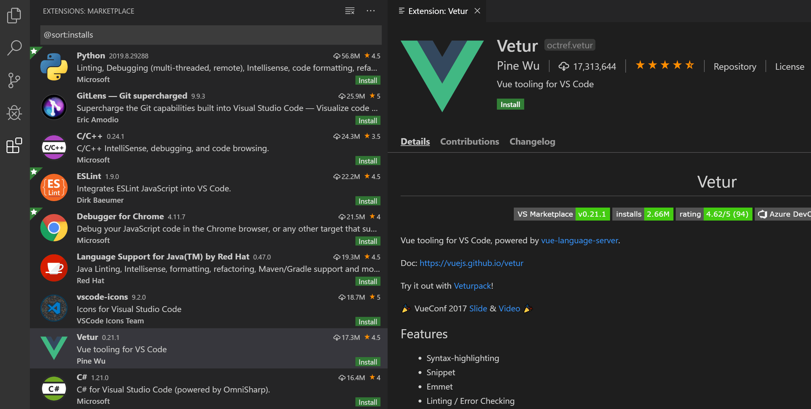
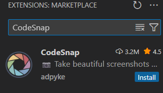

# 💻 Mi primer setup en VSCode

Ejemplo de cómo instalar extensiones y reflexionar sobre ellas.

### Pasos:

| Paso | Imagen |
| :--- | :--- |
| 1. Abrir VSCode. |  |
| 2. Ir a la sección de **Extensiones** (`Ctrl + Shift + X`). |  |
| 3. Instalar dos extensiones que considere útiles. |  |

### Ejemplo de extensiones instaladas
- **Prettier** → para formatear el código automáticamente.
- **CodeSnap** → para sacar capturas bonitas de código.

👉 reflexión en [reflexion.md](/actividades/ejercicios/01-IDEs/02-mi-primer-setup/Reflexion.md).
