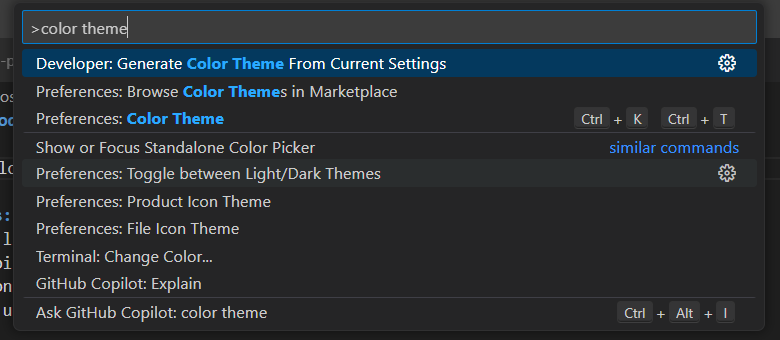
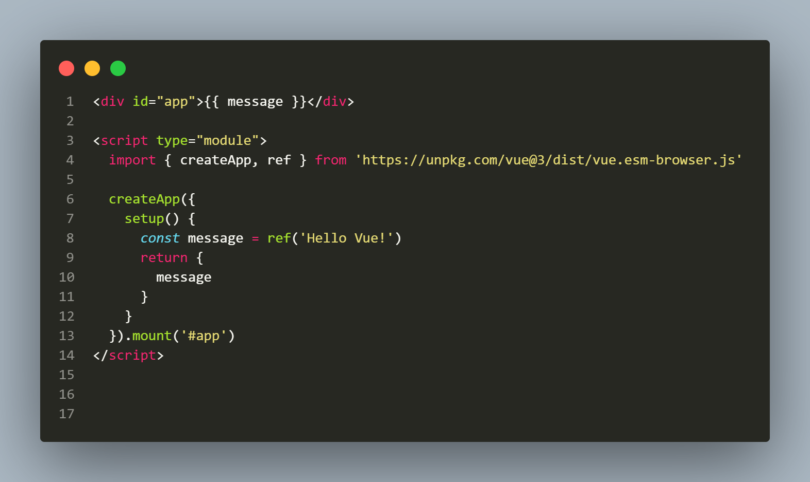
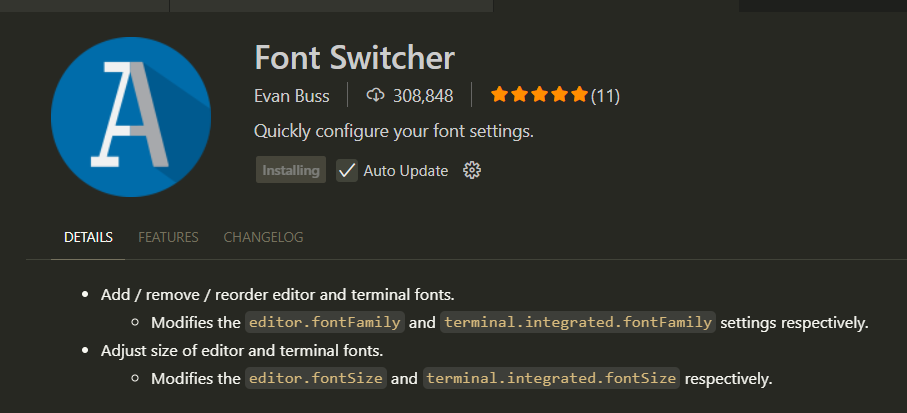
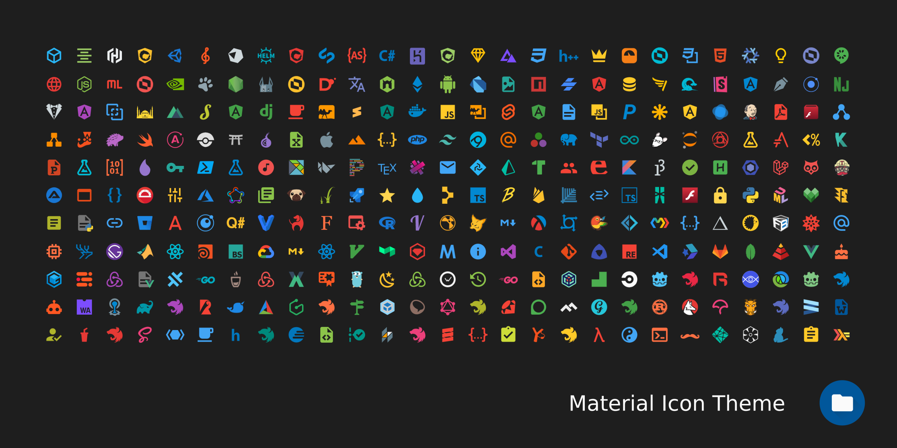

# 🎨 VSCode a mi estilo: Mi Viaje de Personalización

Después de entender el poder de las extensiones para añadir funcionalidades, sentí la curiosidad de hacer el entorno visualmente *mío*. El tema oscuro por defecto está bien, pero quería algo con más personalidad. Aquí documento cómo apliqué mis conocimientos previos para personalizar la apariencia de VSCode.

## 1. Adiós al Tema Oscuro, Hola Monokai

Lo primero que quise cambiar fueron los colores. Había oído hablar del clásico tema **Monokai** y decidí probarlo. El proceso fue sorprendentemente fácil usando la Paleta de Comandos.

### Pasos para cambiar el Tema de Color

| Paso | Captura / Resultado |
| :--- | :--- |
| 1. Abrir la **Paleta de Comandos**. Este es mi nuevo atajo favorito: `Ctrl + Shift + P`. |  |
| 2. Escribir `Color Theme` y seleccionar la opción `Preferences: Color Theme`. Al darle Enter, se despliega una lista con todos los temas instalados. | *Se puede previsualizar cada tema en tiempo real con solo navegar con las flechas.* |
| 3. Buscar y seleccionar **Monokai** en la lista. Hice clic y el cambio fue instantáneo en todo el editor. |  |

### Dato Curioso que aprendí

Los temas de color no solo cambian el fondo. Están diseñados científicamente para mejorar la legibilidad y reducir la fatiga visual. Cada color para las variables, funciones y texto se elige cuidadosamente para tener el contraste adecuado, ayudando a identificar errores más rápido.

### Mi Descubrimiento

El cambio a Monokai le dio una nueva vida a mi editor. Los colores vibrantes sobre el fondo oscuro hacen que el código resalte mucho más. Me di cuenta de que un buen tema de color hace que programar sea una experiencia más agradable.

## 2. Un Toque Extra: Fuentes e Iconos

Animado por el cambio de tema, decidí ir un paso más allá. ¿Podría cambiar la tipografía y los iconos de los archivos? **Aplicando lo que ya sabía sobre instalar extensiones**, la respuesta fue un rotundo sí.

### Pasos para cambiar Fuentes o Iconos

| Paso | Captura |
| :--- | :--- |
| 1. **Ir al Marketplace** de Extensiones (`Ctrl + Shift + X`), mi punto de partida para cualquier mejora en VSCode. | *Ya conocía este paso de la vez anterior.* |
| 2. **Buscar una extensión** para la personalización. Para las fuentes, busqué algo como "Font Switcher"; para los iconos, "Icon Theme". |  |
| 3. **Instalar y Activar**. Después de instalar un paquete de iconos (como *Material Icon Theme*), VSCode usualmente pregunta si quieres activarlo. Si no, se puede hacer manualmente desde `Preferences: File Icon Theme` en la Paleta de Comandos. | *¡El proceso es muy similar al de cambiar el tema de color!*  |

### Mi Descubrimiento

Personalizar estos detalles parece algo menor, pero el efecto es enorme. Cambiar los iconos de los archivos hace que la estructura del proyecto sea más visual y rápida de entender. Una nueva fuente puede hacer que el código sea más fácil de leer durante horas. He aprendido que tomarse el tiempo para configurar tu herramienta principal de trabajo realmente vale la pena.

### 💡 Conclusión de mi Aprendizaje

La personalización en VSCode va más allá de lo estético. Se trata de crear un entorno de desarrollo donde te sientas cómodo, productivo y a gusto. Cada cambio, desde un tema de color hasta una fuente, me ha hecho sentir más en control de mis herramientas. ¡Mi VSCode ahora sí que tiene mi estilo!