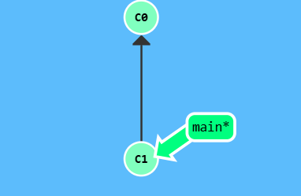
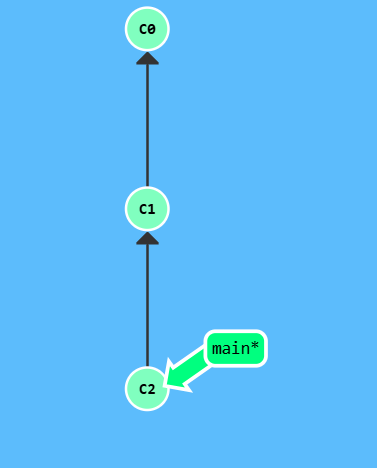
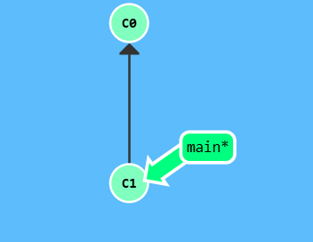
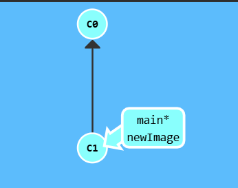
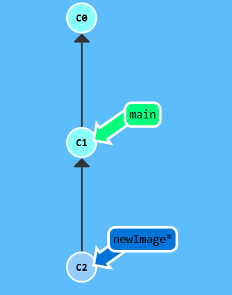
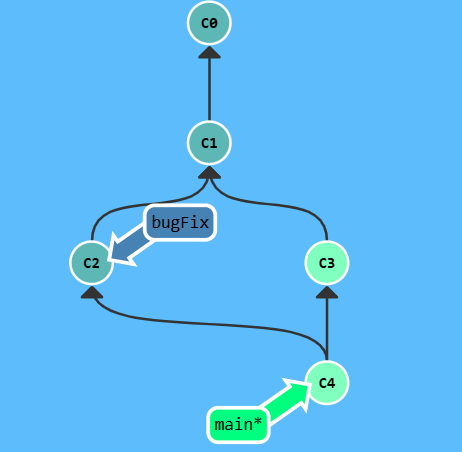
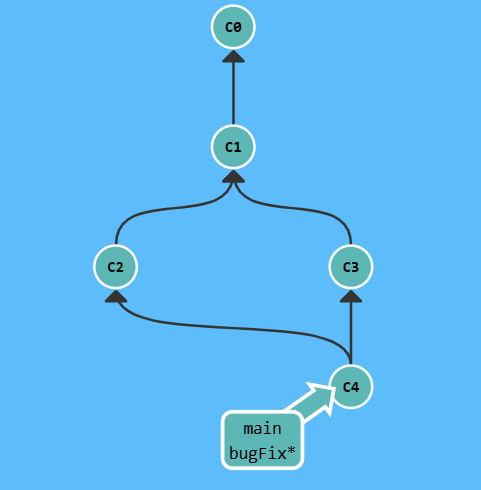

# 🌳 Aprendiendo ramas en [Learn Git Branching](https://learngitbranching.js.org/?locale=es_ES)

Este sitio me encantó porque te enseña Git como si fuera un videojuego.  Ves los commits como burbujas y puedes practicar comandos sin romper nada.

## Introducción a Git
### `git commit` 

| Paso | Imagen |
| :--- | :--- |
| A la derecha tenemos una visualización de un (pequeño) repositorio git. Hay dos commits: el commit inicial, C0, y un commit que lo sigue, C1, que podría tener algunos cambios interesantes.|  |
| Con el `git commit` acabamos de hacer cambios al repositorio y los guardamos como un commit. El commit que acabamos de crear tiene un padre, C1, que referencia al commit en el que se basó este. |  |

### `git branch` 

| Paso | Imagen |
| :--- | :--- |
| Ahora vamos a crear una rama nueva llamada newImage. `git branch newImage`|  |
| La rama `newImage` ahora referencia al commit C1. |  |

### `git checkout <commit>` .

| Paso | Imagen |
| :--- | :--- |
| Pongamos algo de trabajo en esta nueva rama, hagamos `git commit`...  pero tras haber hecho commit, ¡vaya! ¡La rama main avanzó, pero `newImage` no! Eso es porque no estábamos *en* la rama nueva, y por eso el asterisco (*) estaba en main. | |
| Digámosle a git que queremos hacer checkout a esa rama con `git checkout [name]` . Esto va a situarnos en esa rama antes de hacer un commit con nuestros cambios..... Ahora si ¡Ahí estamos! Nuestros cambios se registraron en nuestra nueva rama. | |

### `git merge` 

| Paso | Imagen |
| :--- | :--- |
| Aquí tenemos dos ramas, y cada una tiene un commit que le es único. Esto significa que ninguna de las ramas incluye "todo el trabajo" que hay en nuestro repositorio. Hagamos un merge para solucionar eso. Vamos a mergear la rama `bugFix` a `main`. | |
| Realizamos `git merge bugFix`. ¡Caramba! Antes de nada, main ahora apunta a un commit que tiene dos padres. Si sigues las flechas por el árbol de commits empezando desde main vas a cruzarte con cada commit del repositorio hasta llegar a la raíz. Esto significa que main ahora contiene todo el trabajo que hay en el repositorio. | |
| Además, ¿viste cómo cambiaron los colores de los commits? Para ayudar al aprendizaje, he incluido algunas convenciones de colores. Cada rama tiene un color propio. Cada commmit se vuelve del color resultante de mezclar los colores de todas las ramas que lo contienen.| Así que aquí vemos que el color de la rama main participa en la mezcla de todos los commits, pero que el de bugFix no. Arreglemos eso...|
| Hagamos merge de main a bugFix: `git checkout bugFix` ; `git merge main` . Como bugFix era un ancestro de main, git no tuvo que hacer ningún trabajo; simplemente movió bugFix al mismo commit al que estaba anexado main. Ahora todos los commits son del mismo color, lo que significa que cada rama contiene todo el trabajo que hay en el repositorio. ¡Genial!| |

