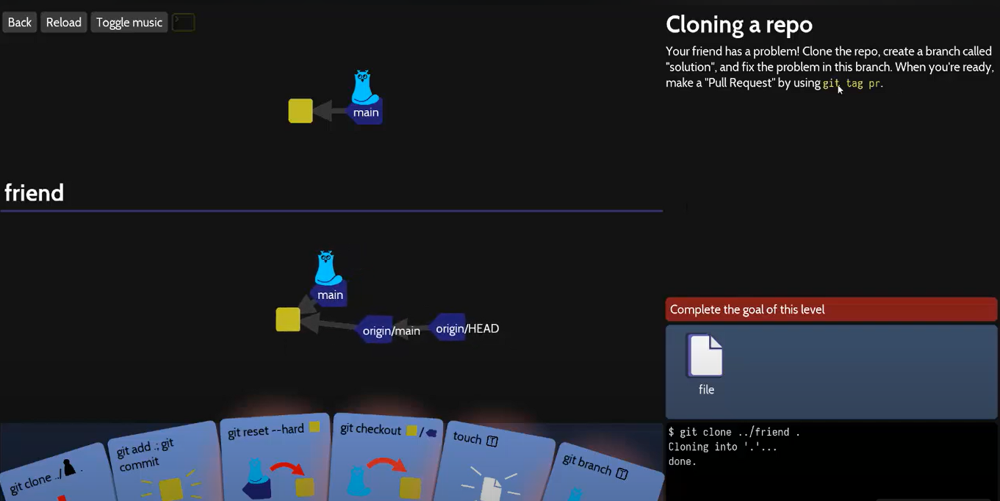
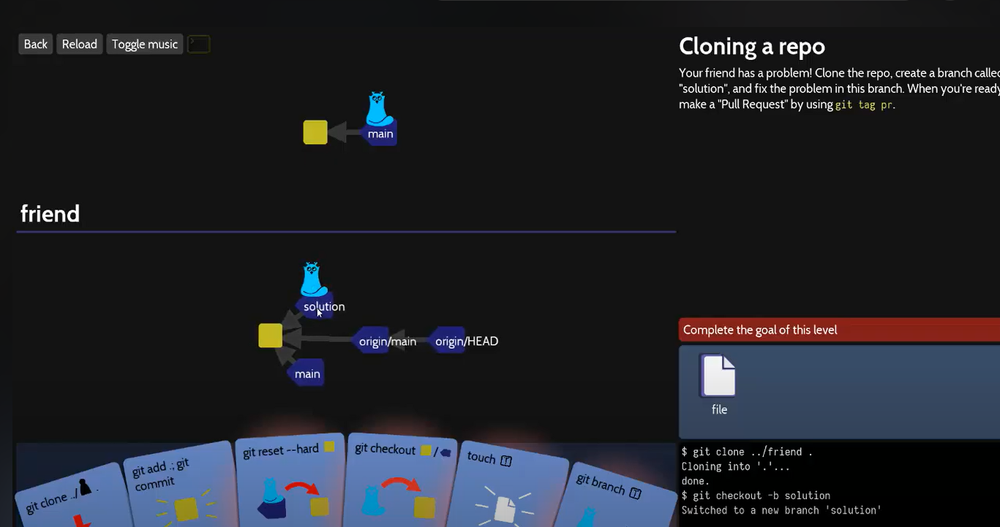

# 01 — Cloning 

**Contexto:** jugué el nivel de "Cloning a repo / workflows" en Oh My Git! donde el objetivo es entender clonación. Hice todo desde la interfaz de cartas y luego lo repetí en la terminal integrada.

| Paso | Imagen |
| :--- | :--- |
| 1. Abrí Oh My Git! → Levels → escogí el nivel de *Cloning / Workflows* | |
| 2. Usé la carta `git clone` arrastrándola al tablero, o en la terminal escribí:  `git clone ../friend .` |  |
| 3. Creé una rama llamada "solution" utilizando el comando `git checkout -b solution`  | |
 
Resultado observado: se crea la carpeta friend con commits visibles en la interfaz.
