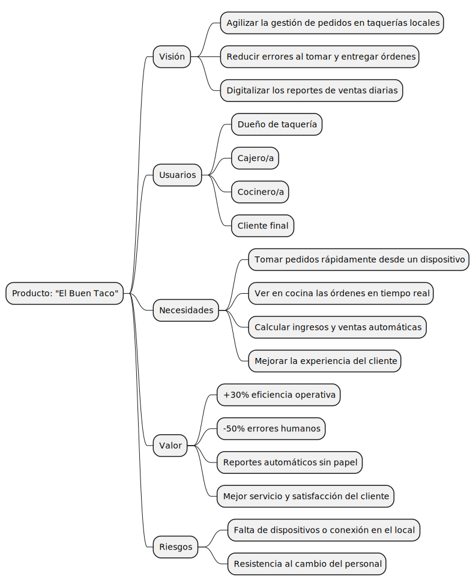
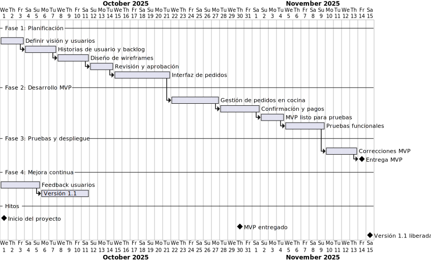
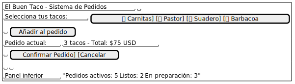

# Introducción al Proyecto con PlantUML
## Caso: "El Buen Taco"

Este ejercicio es una guía para representar la **introducción del proyecto** usando diferentes tipos de diagramas de PlantUML.  
---

## Archivos incluidos

| Archivo | Tipo de diagrama | Representa |
|----------|-----------------|-------------|
| `vision_board_mindmap.puml` | Mindmap | Product Vision Board |
| `user_story_map_json.puml` | JSON Visualizer | User Story Map |
| `release_plan_gantt.puml` | Gantt | Release Plan |
| `mockup_inicio.puml` | Wireframe (Salt) | Mockup inicial |

---

## Objetivo

Aprender a usar PlantUML para **planificar y visualizar un proyecto**, incluso antes de conocer los diagramas UML clásicos.

---

# 🧩 Diagramas UML con PlantUML

En esta carpeta se encuentran los distintos **tipos de diagramas UML y herramientas visuales** generados con **PlantUML**.  
Cada uno de ellos cuenta con su archivo fuente `.puml` (editable) y su correspondiente imagen `.svg` (renderizada automáticamente).

| Tipo de Diagrama | Visualización |
|------------------|---------------|
| **Mindmap – Mapa Mental** |  |
| **JSON Visualizer – Estructura de Datos** |  |
| **Gantt – Planificación de Proyecto** |  |
| **Mockup / Wireframe – Interfaz Usuario** |  |

