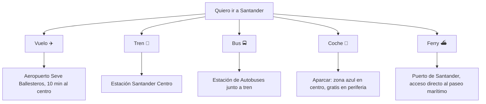

# 🌊 Guía Completa de Santander, España  
**Edición viajera moderna · Actualizado al 29 de octubre de 2025**

---

## 🖼 Portada

Santander es una ciudad elegante y luminosa en el norte de España, famosa por su bahía (considerada una de las más bellas del mundo), sus playas urbanas, su mezcla de tradición marinera y arquitectura burguesa señorial, y una gastronomía que gira en torno al mar Cantábrico. Es una ciudad que combina surf, palacios reales, pinchos, arte contemporáneo y paseos frente al mar.

---

## 📑 Tabla de contenidos

- [1. Introducción](#1-introducción)
- [2. Cómo llegar](#2-cómo-llegar)
  - [2.1 Opciones de transporte](#21-tabla-de-transporte)
  - [2.2 Mapa conceptual](#22-mapa-conceptual--mermaid)
- [3. Dónde alojarse](#3-dónde-alojarse)
- [4. Qué ver](#4-qué-ver)
  - [4.1 Lugares imprescindibles](#41-lugares-imprescindibles)
  - [4.2 Itinerarios sugeridos](#42-itinerarios-sugeridos)
- [5. Dónde comer](#5-dónde-comer)
- [6. Vida nocturna](#6-vida-nocturna)
- [7. De compras](#7-de-compras)
- [8. Consejos prácticos](#8-consejos-prácticos)
- [9. FAQ](#9-faq)

---

## 1. Introducción

### 🏰 Historia breve
- Santander tiene orígenes romanos y creció como puerto estratégico del Cantábrico.
- En el siglo XIX y principios del XX fue destino veraniego de la aristocracia española, incluida la familia real, que veraneaba en el Palacio de la Magdalena.
- En 1941 un gran incendio destruyó buena parte del casco histórico, por lo que su centro combina edificios clásicos y reconstrucción moderna.

### 🎭 Cultura
- Ciudad marinera: tradición pesquera, regatas, conserva de anchoas/sardinas.
- Ciudad culta: Festivales de música clásica y jazz, Centro Botín (arte contemporáneo), teatro y ópera.
- Ciudad universitaria: sede de la Universidad de Cantabria y de los cursos de la UIMP en verano.

### 🤓 Datos curiosos
- La bahía de Santander es una de las pocas bahías naturales de aguas profundas del norte de España, lo que la hizo puerto clave.
- Aquí se celebran regatas internacionales y campeonatos de surf.
- El clima es atlántico suave: raramente hiela, pero llueve bastante. Trae chubasquero, no solo gafas de sol 😎.

---

## 2. Cómo llegar

### 2.1 Tabla de transporte

| Medio               | Desde                 | Duración aprox.       | Costo estimado (€) | Notas                                                                 |
|---------------------|-----------------------|------------------------|--------------------|------------------------------------------------------------------------|
| ✈️ Avión            | Madrid (MAD)          | ~1h 10m                | 40 - 120           | Aeropuerto Seve Ballesteros-Santander, vuelos diarios low-cost/nacionales. |
| ✈️ Avión            | Barcelona (BCN)       | ~1h 20m                | 50 - 140           | Conexión directa varias veces por semana.                             |
| 🚆 Tren (ALVIA)     | Madrid (Chamartín)    | ~4h 00m - 4h 30m       | 30 - 70            | Cómodo, paisaje verde norte.                                          |
| 🚍 Bus larga distancia | Bilbao             | ~1h 30m                | 8 - 15             | Frecuente, útil si haces ruta norte (País Vasco ↔ Cantabria).         |
| 🚍 Bus larga distancia | Madrid             | ~5h 00m - 5h 30m       | 25 - 45            | Económico nocturno.                                                   |
| 🚗 Coche            | Madrid                | ~4h 00m - 4h 30m (A-67)| Peajes bajos       | Ojo puertos de montaña con niebla en otoño/invierno.                  |
| ⛴ Ferry             | Plymouth / Portsmouth (Reino Unido) | ~20h | 80 - 200 (pasajero) | Santander tiene conexión en ferry con Reino Unido. Sí, puedes venir en barco. |

> Nota: Precios y servicios basados en valores típicos de 2024-2025.

### 2.2 Mapa conceptual · Mermaid

---

## 3. Dónde alojarse

### 🏨 Opciones recomendadas

| Nombre                          | Zona / Barrio            | Tipo            | € por noche (doble) | Ideal para...                         | Nota rápida |
|--------------------------------|--------------------------|-----------------|---------------------|---------------------------------------|-------------|
| Eurostars Hotel Real *****     | Paseo Pérez Galdós       | Clásico lujo    | 180 - 300           | Parejas, aniversario, vistas bahía    | Icono histórico con estilo Belle Époque |
| Hotel Bahía ****              | Centro / Frente al puerto| Urbano elegante | 110 - 180           | Visitar a pie todo el centro          | Habitaciones con vista a la catedral/bahía |
| Silken Río Santander ****      | Playa del Sardinero      | Playa           | 100 - 160           | Playeros, familias                    | Cruzas y estás en la arena |
| Santander Central Hostel      | Centro                    | Hostel / budget | 25 - 40 (cama)      | Mochileros, gente joven               | Ambiente social y cocina compartida |
| Apartamentos Las Brisas       | Sardinero / Av. Reina V. | Apartamentos    | 90 - 150            | Estancias largas, familias            | Lavadora + cocina |
| Le Petit Boutique Hotel       | Segunda Playa Sardinero  | Boutique cozy   | 80 - 130            | Parejas, escapada romántica           | Estilo marinero blanco y madera |

### 💬 Reseñas estilo viajero

> "Me desperté con la bahía toda rosa al amanecer. Solo por esas vistas ya vale el viaje."  
> — Sobre el Eurostars Hotel Real

> "Ubicación perfecta: sales del hotel Bahía y estás literalmente frente al mar y a 2 minutos de pinchos."  
> — Sobre Hotel Bahía

> "El hostel no es ruidoso, camas cómodas y personal majísimo que te recomienda bares locales, no solo lo turístico."  
> — Sobre Santander Central Hostel

---

## 4. Qué ver

### 4.1 Lugares imprescindibles (10+)

| # | Lugar / Categoría | Descripción | Horarios | Precio aprox. |
|---|-------------------|-------------|----------|---------------|
| 1 | Palacio de la Magdalena 👑 | Antigua residencia de verano de la realeza española, en una península verde rodeada de mar. | Jardines abiertos todo el día. Visita interior: mañana/tarde franjas. | Jardines gratis, interior ~5-10€ |
| 2 | Playa del Sardinero 🏖 | Playa más famosa: arena dorada larga, paseo marítimo clásico, oleaje atlántico. | 24h | Gratis |
| 3 | Centro Botín 🖼 | Centro de arte contemporáneo diseñado por Renzo Piano, suspendido sobre el muelle. | 10:00-20:00 aprox. (varía temporada) | ~10€ entrada exposiciones |
| 4 | Paseo Pereda & Jardines de Pereda 🌅 | Paseo marítimo con palmeras, estatuas y vistas a la bahía. Perfecto para tarde dorada. | 24h | Gratis |
| 5 | Catedral de Santander 🏛 | Gótica con toques posteriores, reconstruida tras el incendio de 1941. Cripta del Cristo. | Mañana y tarde, cierra mediodía | Donativo/2-3€ |
| 6 | Faro de Cabo Mayor 🌅 | Acantilados espectaculares al norte de la ciudad, mirador salvaje sobre el Cantábrico. | 24h exterior | Gratis |
| 7 | Mercado de la Esperanza 🏛 | Mercado cubierto modernista (pescado fresco brutal). | Mañana (hasta ~14:00) | Gratis (pagar si comes 😋) |
| 8 | Playa de Mataleñas 🏖 | Cala preciosa entre acantilados, agua clara estilo "cantabria caribe". Bajada con escaleras. | 24h | Gratis |
| 9 | Barrio Pesquero 🏛🍤 | Zona tradicional de tabernas marineras para comer rabas (calamares fritos) y pescado a la plancha. | Mediodía y cena | Gratis pasear |
|10 | Museo Marítimo del Cantábrico 🏛 | Historia de la pesca, del mar Cantábrico y acuarios locales. | 10:00-19:00 aprox. | ~8€ |
|11 | Parque de la Magdalena 🏖🌅 | Senderos, vistas a la bahía, focas y pingüinos en pequeñas piscinas exteriores. Plan familiar top. | 24h exterior | Gratis |
|12 | Playa de la Magdalena / Los Bikinis 🏖 | Playitas tranquilas dentro de la bahía, aguas más calmadas. | 24h | Gratis |

---

### 4.2 Itinerarios sugeridos

#### 🗓 1 día express
- Mañana: Palacio de la Magdalena + paseo parque.
- Mediodía: Rabas en el Barrio Pesquero.
- Tarde: Centro Botín + Paseo Pereda al atardecer.
- Noche: Tapas en el centro.

#### 🗓 2 días
**Día 1:** Ruta express.  
**Día 2:** Playa del Sardinero + Faro de Cabo Mayor + cena de marisco.

#### 🗓 3 días
Añade excursión cercana: Cabárceno (parque de fauna en antigua mina), Santillana del Mar (pueblo medieval), o costa oriental (Noja, Laredo).

---

## 5. Dónde comer

### 🍽 Tabla de restaurantes / bares recomendados (8+)

| Nombre / Zona               | Tipo de comida                        | Precio | Ubicación aproximada        | Platos imperdibles |
|----------------------------|---------------------------------------|--------|-----------------------------|--------------------|
| Bodega del Riojano (Centro)| Cocina cántabra tradicional           | €€€    | Calle Río de la Pila        | Cocido montañés, bonito encebollado |
| Cañadío (Plaza Cañadío)    | Creativa / gastrobar / tapas de autor| €€€    | Zona Cañadío (movida nocturna)| Torrija caramelizada, rabas finas |
| La Bombi (Centro)          | Marisquería clásica                   | €€€€   | Cerca del Ayuntamiento      | Almejas a la marinera, lubina |
| El Machi (Barrio Pesquero) | Pescado fresco, rabas, menú marinero  | €€     | Barrio Pesquero             | Rabas, marmita de bonito |
| Casa Lita (Paseo Pereda)   | Pintxos barra infinita                | €€     | Frente al puerto            | Pincho de foie, brochetas de gambas |
| Deluz (Chalet Deluz)       | Km0, producto local, bistró elegante  | €€€    | Zona Sardinero residencial  | Steak tartar, verdura ecológica |
| Cadelo (Centro)            | Fusión creativa local + internacional | €€€    | Calle Bonifaz               | Tiradito de pescado cántabro |
| Restaurante El Serbal ★    | Alta cocina (estrella Michelin)       | €€€€   | Próx. a Sardinero           | Degustación mar Cantábrico |
| Chiringuito Playa Primera  | Casual playa / raciones               | €      | Playa del Sardinero         | Bocata de calamares, tortilla patata jugosa |

---

## 6. Vida nocturna

### 🍸 Bares & clubs

1. **Plaza de Cañadío** – zona de bares animada.
2. **Little Bobby Speakeasy** – coctelería elegante.
3. **La Santa** – bar musical de moda.
4. **Malaspina** – ambiente chill.
5. **RVBICON** – vinos y jazz en vivo.
6. **Clandestine Club** – club para bailar hasta tarde.

| Día        | Plan recomendado                                                   |
|------------|--------------------------------------------------------------------|
| Jueves     | Conciertos/jazz en RVBICON y cerveza artesanal tranquila.          |
| Viernes    | Ruta de bares por Cañadío + cóctel en Little Bobby.                |
| Sábado     | Tarde de vermut y rabas → Cena larga → Club (Clandestine).        |
| Domingo    | Paseo bahía + helado + vino relajado.                             |

---

## 7. De compras

### 🛍 Zonas comerciales
- **Calle Burgos / San Francisco / Cádiz:** tiendas locales.
- **Alameda de Oviedo:** marcas conocidas.
- **Mercado de la Esperanza:** conservas, anchoas, bonito del Cantábrico.

### 🐟 Productos locales
- Anchoas de Santoña.
- Quesos cántabros.
- Sobaos pasiegos y quesadas.
- Vermut artesano.

---

## 8. Consejos prácticos

> **⚠️ PELIGRO ACANTILADOS**  
> No acercarse al borde con viento fuerte o lluvia.

> **ℹ️ MAREA ALTA**  
> Algunas calas desaparecen con la marea alta.

> **👮 CONTROLES DE ALCOHOLEMIA**  
> Evita conducir después de salir por la noche.

  
💧 ¿Llueve mucho?

  Sí, clima atlántico. Lleva chaqueta impermeable ligera.

  
🚲 ¿Se puede ir en bici?

  Hay carril bici, pero cuestas fuera del paseo costero.

  
💳 ¿Tarjeta o efectivo?

  Todo acepta tarjeta, salvo bares muy pequeños.

---

## 9. FAQ

| Situación            | Frase útil                           | Significado |
|----------------------|--------------------------------------|-------------|
| Saludo informal      | "¡Buenas!"                           | Hola / qué tal |
| Pedir rabas          | "¿Me pones una de rabas, por favor?" | Dame calamares fritos |
| Pedir recomendación  | "¿Qué está saliendo hoy más fresco?" | Qué pescado es más fresco |
| Pedir la cuenta      | "¿Nos cobras cuando puedas?"         | Trae la cuenta |
| Clima                | "¿Crees que va a levantar?"          | ¿Parará de llover? |

| Categoría              | € aprox / día |
|------------------------|---------------|
| Alojamiento            | 60 - 120      |
| Comida                 | 35 - 55       |
| Transporte local       | 4 - 8         |
| Actividades            | 10 - 20       |
| Copas nocturnas        | 10 - 25       |
| **Total diario**       | **120 - 220** |

---

## 🧭 Resumen final

Santander combina mar, cultura, gastronomía y tranquilidad.  
Trae chubasquero, hambre y ganas de caminar junto al mar.
