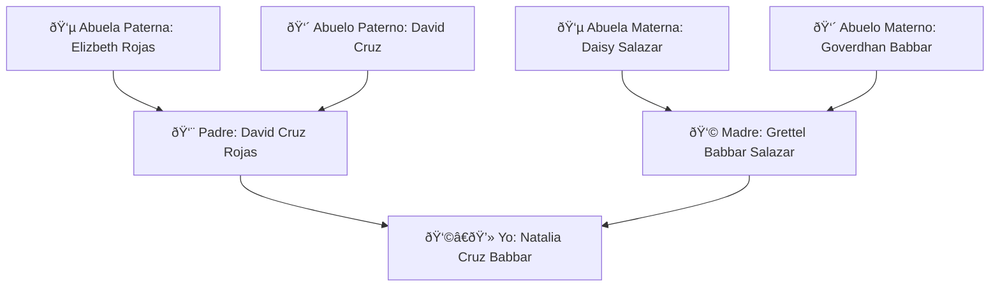

# 🌳 Ejercicio 5: Ãrbol Genealógico (Mermaid)

```mermaid
graph TD
    A[👵 Abuela Paterna: Elizbeth Rojas] --> C[👨 Padre: David Cruz Rojas]
    B[👴 Abuelo Paterno: David Cruz] --> C
    D[👵 Abuela Materna: Daisy Salazar] --> E[👩 Madre: Grettel Babbar Salazar]
    F[👴 Abuelo Materno: Goverdhan Babbar] --> E
    C --> G[👩â€ðŸ’» Yo: Natalia Cruz Babbar]
    E --> G
```