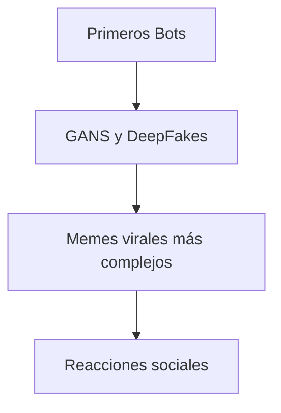

# 🤖 Historia de los Memes con IA

**Breadcrumb:** [Inicio](index.md) > Historia > Historia de los Memes con IA  
**Fecha de creación:** 22/10/2025 | **Última actualización:** 22/10/2025  
**Tiempo estimado de lectura:** 8 min  
**Etiquetas:** #historia #IA #memes #cultura

---

## 📑 Tabla de Contenidos
1. [Introducción](#introducción)
2. [Primeros experimentos de IA en memes](#primeros-experimentos-de-ia-en-memes)
3. [Redes Generativas y DeepFakes](#redes-generativas-y-deepfakes)
4. [IA en plataformas sociales](#ia-en-plataformas-sociales)
5. [Impacto inicial y viralidad](#impacto-inicial-y-viralidad)
6. [Conclusión](#conclusión)

---

## Introducción

Los memes siempre han sido una forma divertida de **expresión cultural**, pero con la llegada de la **Inteligencia Artificial (IA)**, su creación y difusión tomó un rumbo completamente nuevo. Desde simples bots en Twitter hasta complejas redes generativas que crean imágenes absurdas o paródicas, la IA comenzó a generar contenido humorístico que se compartía a velocidad vertiginosa. Este artículo explora cómo surgieron los **primeros memes con IA**, qué tecnologías se utilizaron y cómo la sociedad reaccionó a este fenómeno cultural.

La historia de los memes con IA nos muestra la **intersección entre creatividad humana y automatización tecnológica**, y cómo esta interacción ha moldeado nuevas formas de humor digital. Además, veremos ejemplos de plataformas populares, experimentos famosos y el impacto social que estos memes han tenido desde 2015 hasta la actualidad.

---

## Primeros experimentos de IA en memes

Los primeros memes generados por IA surgieron con bots sencillos que combinaban **imágenes populares con texto absurdo**. Estos experimentos demostraron que la automatización podía generar contenido viral sin intervención humana directa.  

Ejemplo de un bot de Twitter (2016)

Un bot llamado `@deepfunnybot` generaba imágenes de gatos con textos aleatorios, sorprendiendo a miles de usuarios y convirtiéndose en uno de los primeros fenómenos de meme-IA.

### Sub-secciones
- **Bots iniciales**: Scripts simples que combinaban texto e imágenes.  
- **Primeros virales**: Memes que alcanzaron miles de retweets.  
- **Lecciones aprendidas**: La importancia de la creatividad humana en la automatización.

---

## Redes Generativas y DeepFakes

Las **Redes Generativas Antagónicas (GANs)** permitieron a los sistemas de IA crear imágenes más complejas, mientras que los **DeepFakes** añadieron un nivel de realismo que podía engañar al ojo humano. Esto abrió una nueva era de memes sofisticados.

### Sub-secciones
- **GANs**: Generación de imágenes originales y absurdas.  
- **DeepFakes**: Videos humorísticos y parodias.  
- **Tendencias iniciales**: Uso en comunidades online.

---

## IA en plataformas sociales

Plataformas como **Reddit**, **Discord** y **X (Twitter)** adoptaron rápidamente los memes generados por IA. Los usuarios compartían imágenes de manera masiva, y los algoritmos de recomendación potenciaban la viralidad.

| Plataforma | Año de adopción | Popularidad | Emoji |
|------------|:--------------:|:-----------:|:-----:|
| Twitter/X  | 2016 | Alta | 🐦 |
| Reddit     | 2018 | Muy Alta | 👽 |
| Discord    | 2019 | Media | 💬 |

### Sub-secciones
- **Integración social**: Cómo los memes de IA se viralizaron.  
- **Comunidades**: Foros y canales especializados.  
- **Moderación**: Retos éticos y de contenido.

---

## Impacto inicial y viralidad

El impacto de los memes generados por IA se reflejó en la cultura digital: nuevos estilos de humor, referencias compartidas globalmente y la aparición de fenómenos virales inesperados.

Datos históricos

- 2016: Primeros memes virales con bots de Twitter  
- 2018: Expansión con GANs y DeepFakes  
- 2021: Explosión de memes en redes sociales  

### Sub-secciones
- **Reacción del público**: Asombro, risas y debates.  
- **Cobertura mediática**: Artículos y reportajes sobre memes-IA.  
- **Viralidad**: Cómo se propagaron globalmente.

---

## Conclusión

La historia de los memes con IA muestra cómo la **tecnología puede amplificar la creatividad** y cambiar la cultura digital. Desde bots sencillos hasta GANs y DeepFakes, los memes se han convertido en una forma legítima de expresión cultural.  
El aprendizaje de esta historia nos permite entender **el equilibrio entre automatización y humor humano**, y cómo la IA seguirá influyendo en la cultura meme.

---

## 🚨 Alertas

> **Nota:** Algunos memes generados por IA pueden contener contenido inesperado o inapropiado.  

> **Aviso:** Este artículo contiene ejemplos históricos que podrían no ser precisos al 100%.

---

## 🔗 Enlaces internos y relacionados

- [Cómo se crean los Memes con IA](articulo-2.md)  
- [Ética y Derechos de Autor](articulo-3.md)  
- [Impacto Cultural Global](articulo-4.md)  
- [Futuro de los Memes Inteligentes](articulo-5.md)  
- [Glosario de términos](glosario.md)

---

## 🔗 Enlaces externos

1. [DALL·E de OpenAI](https://openai.com/dall-e)  
2. [Midjourney](https://www.midjourney.com)  
3. [Artículo MIT Tech Review: AI Memes](https://www.technologyreview.com/ai-memes)

---

## 🔝 Navegación

[← Volver al index](index.md) | [Siguiente → Cómo se crean los Memes con IA](articulo-2.md)
