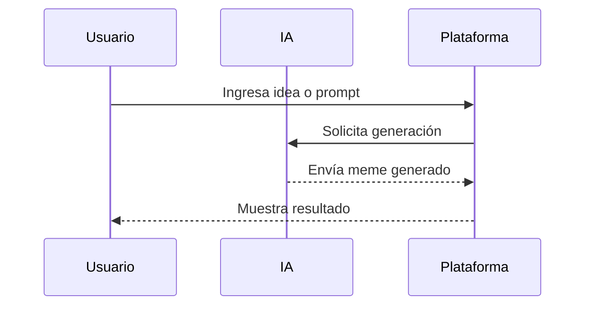

# 🎨 Cómo se crean los Memes con IA

**Breadcrumb:** [Inicio](index.md) > Creación > Cómo se crean los Memes con IA  
**Fecha de creación:** 22/10/2025 | **Última actualización:** 22/10/2025  
**Tiempo estimado de lectura:** 10 min  
**Etiquetas:** #creación #IA #memes #tutorial

---

## 📑 Tabla de Contenidos
1. [Introducción](#introducción)
2. [Herramientas y plataformas](#herramientas-y-plataformas)
3. [Proceso de generación](#proceso-de-generación)
4. [Prompts y personalización](#prompts-y-personalización)
5. [Errores comunes y soluciones](#errores-comunes-y-soluciones)
6. [Conclusión](#conclusión)

---

## Introducción

Crear memes con IA combina **creatividad humana** y **automatización tecnológica**. Con herramientas modernas, cualquier persona puede generar imágenes o videos graciosos a partir de texto o ideas. Este artículo guía sobre los **métodos, plataformas y pasos** necesarios para crear memes con IA, incluyendo ejemplos y buenas prácticas.  

---

## Herramientas y plataformas

Existen numerosas plataformas que permiten generar memes automáticamente con IA, cada una con características únicas.

| Herramienta | Tipo | Popularidad | Emoji |
|------------|:----:|:-----------:|:-----:|
| DALL·E | Imagen | Alta | 🎨 |
| Midjourney | Imagen | Muy Alta | 🖌️ |
| ChatGPT | Texto | Alta | 🧠 |
| Canva AI | Imagen y Texto | Media | 🖼️ |
| MemeBot | Meme específico | Media | 🤖 |

### Sub-secciones
- **Elección de la herramienta**: Según estilo y objetivo.  
- **Limitaciones**: Cada modelo tiene restricciones creativas.  
- **Compatibilidad**: Web, móvil o API.

Información adicional

Algunas herramientas permiten integrar prompts personalizados o usar imágenes de referencia para crear memes más específicos y realistas.

---

## Proceso de generación

El proceso de creación de memes con IA se puede dividir en **cinco pasos principales**:

### Sub-secciones
- **Definir idea**: Qué mensaje o chiste quieres transmitir.  
- **Escribir prompt**: Texto que guía a la IA.  
- **Revisión y edición**: Ajustes para mejorar humor y claridad.

---

## Prompts y personalización

Los **prompts** son la clave de la creatividad: describen la escena, personajes y estilo del meme. Una buena práctica es ser **claro y específico**, pero dejar espacio a la IA para sorprender.

### Sub-secciones
- **Prompt básico**: "Gato confundido mirando computadora"  
- **Prompt avanzado**: "Gato con sombrero de pirata viendo un tutorial de IA estilo caricatura"  
- **Uso de estilos**: Retro, pixel art, fotorealista, caricatura.

Ejemplo detallado

Prompt avanzado generado en Midjourney produjo un meme que combinaba humor absurdo y calidad visual sorprendente, viralizado en Discord y Reddit.

---

## Errores comunes y soluciones

Algunos problemas frecuentes al generar memes con IA incluyen:

| Error | Causa | Solución |
|-------|:-----:|:--------|
| Imagen distorsionada | Prompt confuso | Simplificar y ser específico |
| Texto ilegible | Tipografía no soportada | Usar captions separados |
| Meme sin humor | IA literal | Agregar contexto divertido |

### Sub-secciones
- **Pruebas y ajustes**: Iterar hasta obtener resultado óptimo.  
- **Revisión ética**: Evitar contenido ofensivo o sensible.  
- **Compartir correctamente**: Respetar derechos de autor y licencias.

---

## Conclusión

Crear memes con IA es **divertido y accesible**, pero requiere creatividad y comprensión de las herramientas. Los prompts y la personalización permiten que cada meme sea único, mientras que la revisión humana asegura humor y coherencia.  

---

## 🚨 Alertas

> **Advertencia:** Algunos memes generados pueden ser inapropiados; revisa antes de compartir.  

> **Nota:** La IA puede no interpretar correctamente el humor humano, es importante supervisar los resultados.

---

## 🔗 Enlaces internos y relacionados

- [Historia de los Memes con IA](articulo-1.md)  
- [Ética y Derechos de Autor](articulo-3.md)  
- [Impacto Cultural Global](articulo-4.md)  
- [Futuro de los Memes Inteligentes](articulo-5.md)  
- [Glosario de términos](glosario.md)

---

## 🔗 Enlaces externos

1. [DALL·E](https://openai.com/dall-e)  
2. [Midjourney](https://www.midjourney.com)  
3. [Canva AI](https://www.canva.com/)  

---

## 🔝 Navegación

[← Historia de los Memes con IA](articulo-1.md) | [Siguiente → Ética y Derechos de Autor](articulo-3.md)
