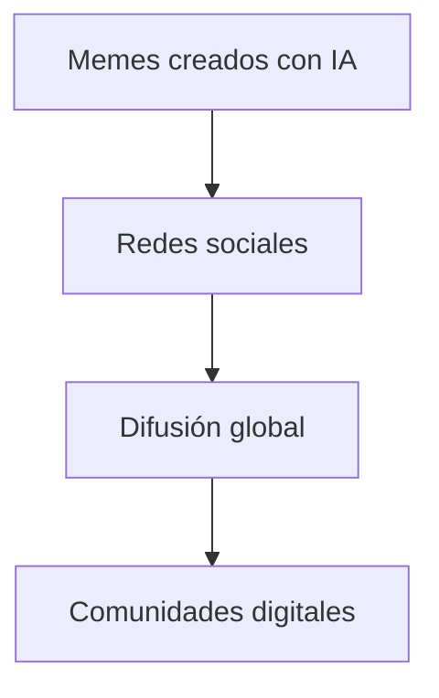
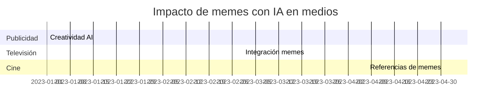

# 🌐 Impacto Cultural Global

**Breadcrumb:** [Inicio](index.md) > Impacto Cultural > Impacto Cultural Global  
**Fecha de creación:** 22/10/2025 | **Última actualización:** 22/10/2025  
**Tiempo estimado de lectura:** 10 min  
**Etiquetas:** #cultura #IA #memes #global

---

## 📑 Tabla de Contenidos
1. [Introducción](#introducción)
2. [Difusión global de memes con IA](#difusión-global-de-memes-con-ia)
3. [Transformación de la cultura digital](#transformación-de-la-cultura-digital)
4. [Memes y comunicación intercultural](#memes-y-comunicación-intercultural)
5. [Impacto en medios y entretenimiento](#impacto-en-medios-y-entretenimiento)
6. [Conclusión](#conclusión)

---

## Introducción

Los memes generados por **Inteligencia Artificial (IA)** no solo se han convertido en un fenómeno digital, sino que también han influido en la **cultura global**. Desde redes sociales hasta medios de comunicación, estos memes han alterado la forma en que la gente se comunica, comparte humor y percibe tendencias culturales. Este artículo explora cómo los memes de IA impactan la sociedad, fomentan la creatividad y crean un lenguaje visual común en diferentes países.

---

## Difusión global de memes con IA

La **viralidad internacional** de los memes con IA se ha visto potenciada por plataformas como Reddit, Discord y X (Twitter). La IA facilita la creación masiva de contenido, lo que permite que memes absurdos o sarcásticos se difundan rápidamente.

### Sub-secciones
- **Redes sociales clave**: Reddit, Discord, X.  
- **Velocidad de difusión**: Contenido que se vuelve viral en horas.  
- **Factores culturales**: Humor que trasciende fronteras.

Datos históricos

- 2018: Primeros memes virales generados por GANs en Europa  
- 2020: Popularización global de memes con IA en América y Asia  
- 2023: Creación de comunidades de memes IA multilingües

---

## Transformación de la cultura digital

Los memes con IA han cambiado la manera de **consumir y crear humor**. Ya no es solo un intercambio humano: la IA participa activamente en la construcción cultural.

### Sub-secciones
- **Lenguaje visual universal**: Imágenes y estilos compartidos globalmente.  
- **Creación colaborativa**: Humanos + IA generan contenido innovador.  
- **Estilo y estética**: Memes fotorealistas, surrealistas o caricaturescos.

---

## Memes y comunicación intercultural

Los memes generados por IA permiten que personas de distintas culturas se **comuniquen a través del humor** sin necesidad de traducción literal.

| Región | Ejemplo de meme viral | Plataforma |
|--------|--------------------|------------|
| América | Gato confundido con tutorial de IA | Reddit |
| Europa | Parodia política con DeepFake | X |
| Asia | Meme estilo anime generado por IA | Discord |
| África | Meme educativo con IA | WhatsApp |

### Sub-secciones
- **Humor compartido**: Cómo los memes cruzan barreras lingüísticas.  
- **Adaptación cultural**: IA aprende patrones de humor locales.  
- **Interacción social**: Comentarios y remixes de memes.

---

## Impacto en medios y entretenimiento

Los memes con IA influyen en **publicidad, cine, televisión y redes sociales**, generando contenido fresco y creativo.

### Sub-secciones
- **Marketing**: Uso de memes IA para campañas virales.  
- **Medios digitales**: Integración de memes en contenido audiovisual.  
- **Entretenimiento interactivo**: Juegos y apps con memes IA.

---

## Conclusión

El **impacto cultural global** de los memes con IA es evidente: crean un lenguaje compartido, fomentan la creatividad y transforman la comunicación digital. Los memes IA son un puente entre tecnología y cultura, mostrando cómo el humor puede trascender fronteras y unir comunidades alrededor del mundo.

---

## 🚨 Alertas

> **Aviso:** Algunos memes pueden reflejar estereotipos culturales; es importante contextualizarlos.  

> **Nota:** La IA puede generar contenido impredecible; supervisión humana recomendada.

---

## 🔗 Enlaces internos y relacionados

- [Historia de los Memes con IA](articulo-1.md)  
- [Cómo se crean los Memes con IA](articulo-2.md)  
- [Ética y Derechos de Autor](articulo-3.md)  
- [Futuro de los Memes Inteligentes](articulo-5.md)  
- [Glosario de términos](glosario.md)

---

## 🔗 Enlaces externos

1. [MIT Tech Review: AI Memes](https://www.technologyreview.com/ai-memes)  
2. [DeepFakes y cultura](https://www.sensity.ai/blog/deepfakes-ethics/)  
3. [Estudios sobre memes y globalización](https://www.pewresearch.org/internet/2022/05/17/memes-global/)  

---

## 🔝 Navegación

[← Ética y Derechos de Autor](articulo-3.md) | [Siguiente → Futuro de los Memes Inteligentes](articulo-5.md)
