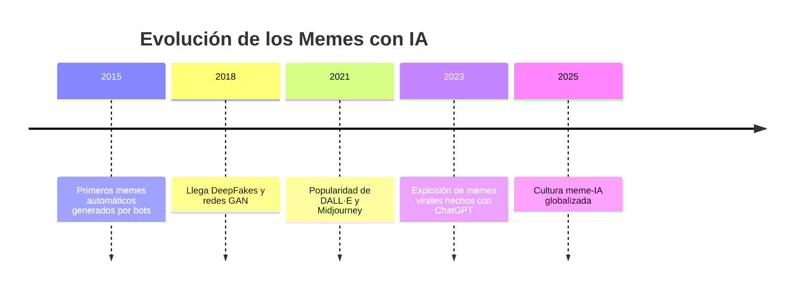
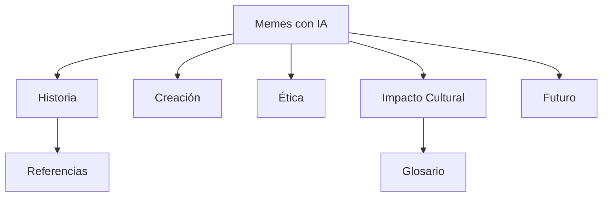

# 🧠🎭 Memes con Inteligencia Artificial  
### *Una exploración divertida del impacto cultural de los memes generados por IA*  

---

## 🧩 Descripción del Proyecto

Esta mini-Wiki analiza cómo la **Inteligencia Artificial (IA)** está transformando el mundo de los **memes**: su creación, difusión e impacto cultural.  
Desde generadores automáticos hasta los dilemas éticos de la creatividad digital, exploramos cómo el humor y la tecnología se combinan en la era de la automatización creativa.

Esta wiki forma parte del proyecto *AEC-MD*, y fue creada por **Javier Turcios** con un enfoque **divertido e informativo**, combinando datos reales, curiosidades y ejemplos que muestran cómo la cultura meme se ha adaptado a la era de la IA.

---

## 📚 Índice Visual de Artículos

| 🧾 Artículo | 💬 Descripción breve | 🔗 Enlace |
|:------------|:--------------------|:----------|
| 🤖 Historia de los Memes con IA | De los primeros bots hasta DALL·E | [Leer](articulo-1.md) |
| 🎨 Cómo se crean los Memes con IA | Herramientas y procesos creativos | [Leer](articulo-2.md) |
| ⚖️ Ética y Derechos de Autor | Humor, propiedad y responsabilidad | [Leer](articulo-3.md) |
| 🌐 Impacto Cultural Global | Cómo cambian la cultura y el humor | [Leer](articulo-4.md) |
| 🚀 Futuro de los Memes Inteligentes | Predicciones, tendencias y límites | [Leer](articulo-5.md) |

---

## 📊 Estadísticas del Proyecto

| Elemento | Cantidad |
|-----------|-----------:|
| Artículos Totales | 5 |
| Palabras aproximadas | 5,000 |
| Diagramas Mermaid | 10 |
| Tablas totales | 15 |
| Bloques colapsables | 15 |

---

## 🕓 Últimas Actualizaciones

- 🗓 **22/10/2025** — Añadido artículo sobre *Impacto Cultural Global*  
- 🗓 **20/10/2025** — Actualizado *Glosario* y *Referencias*  
- 🗓 **18/10/2025** — Revisión de *diagramas Mermaid*  
- 🗓 **15/10/2025** — Creación del *index.md*  

---

## 🗺️ Timeline General (Mermaid)

---

## 🧠 Mapa Conceptual de la Wiki

---

## 📈 Estadísticas Visuales

| Categoría | % de menciones en la Wiki | Emoji |
|:------------|:--------------------------:|:------:|
| Creatividad y Humor | 35% | 😂 |
| Tecnología y Modelos | 25% | 🤖 |
| Ética y Derechos | 15% | ⚖️ |
| Impacto Cultural | 20% | 🌍 |
| Futuro y Tendencias | 5% | 🚀 |

---

## 💡 Sabías que...

> 🧩 *El primer “meme con IA” reconocido se creó en 2016, cuando un bot de Twitter generó una imagen distorsionada de un gato con texto absurdo… y se volvió viral en cuestión de horas.*  

---

## ❓ Preguntas Frecuentes (FAQ)

🤔 ¿Qué es un meme generado con IA?

Es una imagen o video creado total o parcialmente por una inteligencia artificial.

😂 ¿Son realmente graciosos los memes de IA?

Depende del modelo… algunos son oro puro, otros son puro caos 😅

🧠 ¿Qué IA se usa para hacer memes?

Modelos como DALL·E, Midjourney o ChatGPT combinados con editores de texto e imagen.

⚖️ ¿Se pueden usar comercialmente?

Depende de la licencia del modelo y del contenido generado.

📱 ¿Dónde se comparten más?

En Reddit, X (Twitter), y comunidades de Discord dedicadas a arte generativo.

📸 ¿Qué es un DeepFake meme?

Un video alterado con IA para parodiar situaciones o personajes populares.

🚀 ¿El futuro del humor está en manos de las máquinas?

Quizás... pero todavía necesitamos humanos para reírnos de lo absurdo.

💬 ¿Los memes con IA aprenden del público?

Sí, algunos sistemas usan retroalimentación para mejorar su estilo.

📚 ¿Se estudian los memes con IA en universidades?

Sí, como parte de la cultura digital y la comunicación mediada por algoritmos.

🎓 ¿Esta Wiki está hecha con IA?

Exactamente… y con mucho humor humano 😁

---

## 👥 Contribuidores

- **Javier Turcios** — Creador, redactor y diseñador de la Wiki  

---

📘 *© 2025 Javier Turcios — Wiki educativa sobre cultura digital*  
🔗 [Glosario](glosario.md) | [Referencias](referencias.md) | [Volver arriba ↑](#🧠🎭-memes-con-inteligencia-artificial)

