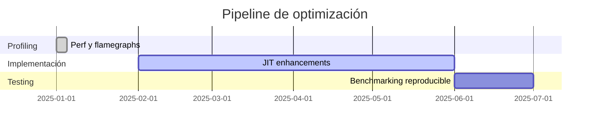

# 🚀 Emuladores modernos y optimizaciones

**Breadcrumb:** [Inicio](index.md) > Modernización > Emuladores modernos y optimizaciones  
**Creado:** 2025-07-05 · **Última actualización:** 2025-10-19  
**Tiempo estimado de lectura:** 13 min  
**Etiquetas:** `#JIT` `#optimizaciones` `#shaders` `#rendimiento`

---

## Tabla de contenidos
- [Introducción](#introducción)
- [Técnicas de optimización](#técnicas-de-optimizacion)
  - [JIT y cache de bloques](#jit-y-cache-de-bloques)
  - [Vectorización y SIMD](#vectorización-y-simd)
  - [Batch rendering y shaders](#batch-rendering-y-shaders)
- [Herramientas de perfilado](#herramientas-de-perfilado)
  - [Perf y flamegraphs](#perf-y-flamegraphs)
  - [Contadores de hardware](#contadores-de-hardware)
  - [Benchmarking reproducible](#benchmarking-reproducible)
- [Casos prácticos](#casos-prácticos)
  - [Acelerar emulación de PS2/GC](#acelerar-emulación-de-ps2gc)
  - [Multithreading y bloqueo](#multithreading-y-bloqueo)
  - [Compromisos en precisión vs velocidad](#compromisos-en-precisión-vs-velocidad)
- [Conclusiones y recomendaciones](#conclusiones-y-recomendaciones)
- [Notas y referencias](#notas-y-referencias)

---

## Introducción

La emulación moderna se beneficia de décadas de investigación en compiladores, optimización y gráficos. Los emuladores contemporáneos emplean recompiladores dinámicos (JIT), técnicas de vectorización (SIMD), y aceleración GPU mediante shaders. Este artículo resume patrones de optimización usados en proyectos reales y aborda las tensiones entre precisión y rendimiento. Se incluyen ejemplos, mermaid diagramas y tablas comparativas.

---

## Técnicas de optimización

### JIT y cache de bloques
- Detectar bloques básicos, traducirlos a código nativo y almacenarlos en cache.
- Evitar recompilaciones innecesarias mediante invalidación selectiva.

### Vectorización y SIMD
- Usar instrucciones SIMD para operaciones paralelas (p. ej. mezcla de samples de audio).

### Batch rendering y shaders
- Agrupar operaciones gráficas por scanline y usar shaders en host para replicar blending y color math.

---

## Herramientas de perfilado

### Perf y flamegraphs
- Identificar hot paths y optimizar rutinas críticas.

### Contadores de hardware
- Medir miss de cache, branch mispredictions y otras métricas.

### Benchmarking reproducible
- Ensayar con ROMs de prueba y registrar resultados.

---

## Casos prácticos

### Acelerar emulación de PS2/GC
- Técnicas: recompilación de microVU, uso intensivo de multicore y offload de GPU.

### Multithreading y bloqueo
- Emulación multihilo de subsistemas (render/audio) con sincronización basada en eventos.

### Compromisos en precisión vs velocidad
- Algunos modos 'high-performance' sacrificarán detalles temporales; mantener opción 'accurate' para investigación.

---

## Diagramas Mermaid

Conceptual:

Proceso (gantt para tareas):

---

## Tablas

Comparativa (alineación mixta):

| Optimización | Impacto | Complejidad | Riego de regresión |
|:---|---:|---:|---:|
| JIT | Alto | Alta | Medio |
| SIMD | Medio | Media | Bajo |
| Multithread | Medio | Alta | Alto |
| Shaders | Alto | Media | Bajo |

Datos (5 filas):

| Técnica | Ejemplo | Mejora medida | Requiere | Nota |
|---|---|---:|---|---|
| JIT | Recompiler blocks | +200% | Infraestructura | Invalidez por self-modifying |
| SIMD | Audio mixing | +30% | Soporte CPU | Great for sample ops |
| Shader mapping | PPU color math | +40% | GPU | Mantener precisión |
| Batch render | Scanline batching | +20% | Redesign renderer | Reduce draw calls |
| Threading | Audio/Render split | +10% | Sync primitives | Beware races |

Resumen:

| Recomendación | Prioridad |
|---|---|
| Implementar JIT incremental | Alta |
| Añadir profiling y flamegraphs | Alta |
| Mantener modo 'accurate' | Media |

---

## Bloques colapsables

Información adicional

Listado de micro-optimizaciónes (alocación, pools, evitación de malloc/free en hot path).

Ejemplo detallado

Código de ejemplo: cache simple de bloques JIT en pseudocódigo y estrategia de invalidación.

Datos históricos / Contexto

Evolución de optimizaciones desde la década de 2000 hasta 2025.

---

## Alertas

### ⚠️ Alerta de regresión
- Introducir optimizaciones sin tests puede romper compatibilidad. Siempre ejecutar suites de regresión.

### ⚠️ Alerta de seguridad
- JIT que genera código dinámico debe validar entradas para evitar vectores de ejecución arbitraria.

---

## Citas

> "Optimizar emulación es un ejercicio de balance entre fiabilidad y velocidad." — Documento de ingeniería

> "Los flamegraphs muestran aquello que no sospechabas que consumía CPU." — Post técnico

> "Los shaders permiten delegar carga compleja de PPU al GPU moderno." — Blog dev

---

## Enlaces internos 
- [Arquitectura técnica](articulo-2.md)
- [Emulación NES/SNES](articulo-3.md)
- [Historia](articulo-1.md)
- [Legalidad y ética](articulo-5.md)
- [Glosario](glosario.md)

## Enlaces externos 
- https://github.com/itchio/itch (ejemplos de packaging performance)
- https://en.wikipedia.org/wiki/Just-in-time_compilation
- https://research.fb.com/ (ejemplos de optimización)

---

## Notas y referencias
Ver [referencias.md](referencias.md) para bibliografía completa.

---

### Navegación
← Anterior: [Artículo 3](articulo-3.md) · Siguiente → [Artículo 5](articulo-5.md) · ↑ [Volver arriba](index.md)