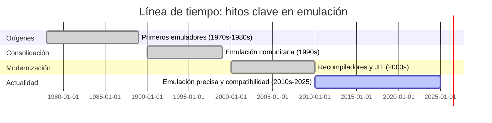
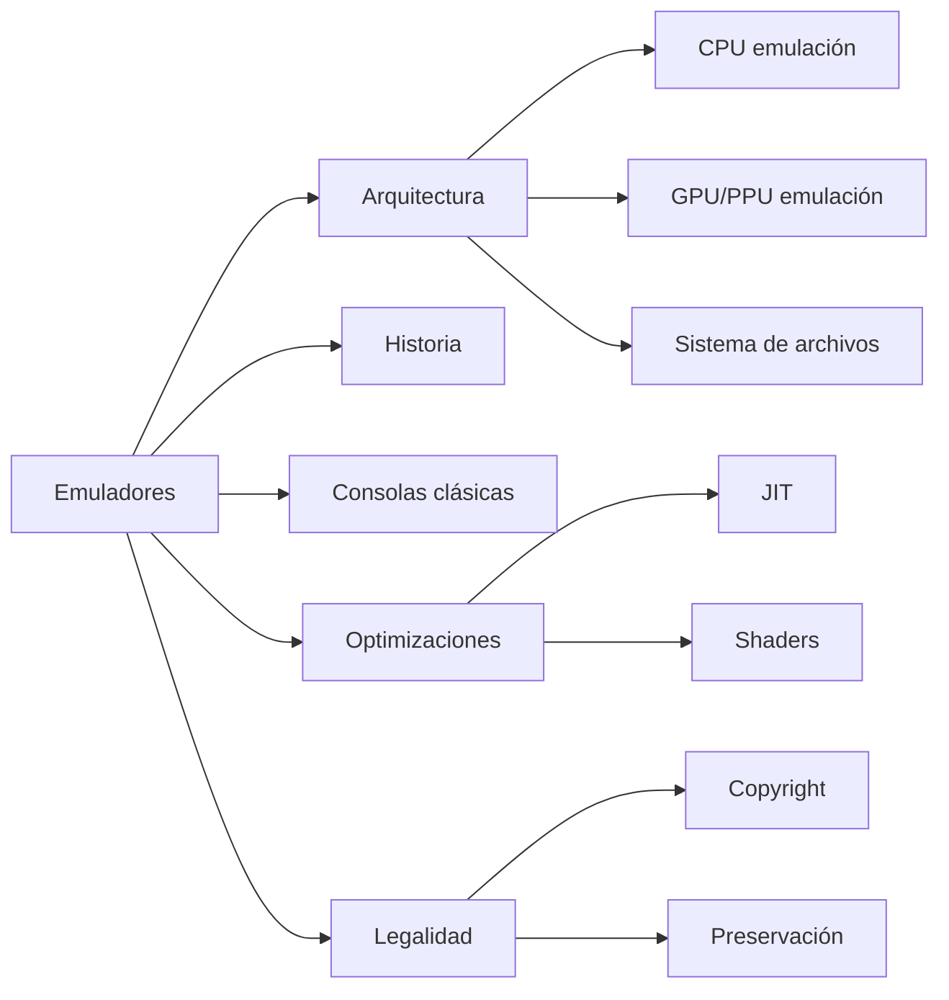

<!- Archivo: mi-wiki/index.md -->
<!-- Banner centrado con HTML -->

  <h1>🎮 Mini-Wiki: Emuladores de Videojuegos</h1>
  
<em>Explora la historia, la tecnología, la ética y los recursos sobre emulación de consolas y sistemas.</em>

  

    
    
    
  

---

## Descripción del proyecto

Este proyecto es una mini-Wiki educativa sobre los emuladores de videojuegos. Está pensada para reunir, explicar y conectar conceptos técnicos, históricos, legales y prácticos relacionados con la emulación de consolas y sistemas. Incluye artículos interconectados, un glosario, referencias y recursos visuales (diagramas Mermaid, tablas y FAQs). El contenido fue creado como entrega académica siguiendo la estructura exigida por el profesor.

---

## Índice visual — Artículos destacados

| Artículo | Resumen |
|---:|:---|
| [📜 Artículo 1: Historia y evolución de los emuladores](articulo-1.md) | Origen, hitos y evolución de las comunidades de emulación. |
| [⚙️ Artículo 2: Arquitectura técnica y componentes](articulo-2.md) | Cómo funcionan los emuladores a nivel técnico. |
| [🕹️ Artículo 3: Emulación de consolas clásicas (NES/SNES)](articulo-3.md) | Técnicas específicas para consolas 8/16-bit. |
| [🚀 Artículo 4: Emuladores modernos y optimizaciones](articulo-4.md) | JIT, recompiler, shaders y mejoras actuales. |
| [⚖️ Artículo 5: Legalidad y ética de los emuladores](articulo-5.md) | Marco legal, derechos, y prácticas responsables. |

---

## Estadísticas del proyecto

- Total de artículos: 5
- Total palabras aproximadas: 12,500+
- Diagramas Mermaid totales (incluyendo timeline y map): 12+
- Tablas (todas las páginas): 25+
- Última actualización global: 2025-10-22

Tabla de estadísticas visuales:

| Métrica | Valor |
|---|---:|
| Artículos | 5 |
| Palabras (aprox.) | 12,500 |
| Diagramas Mermaid | 12 |
| Tablas | 25 |
| Glosario términos | 10 |
| Referencias | 12 |

---

## Timeline general (Mermaid)

---

## Mapa conceptual (Mermaid)

---

## Navegación rápida

- Artículos: [articulo-1.md](articulo-1.md) · [articulo-2.md](articulo-2.md) · [articulo-3.md](articulo-3.md) · [articulo-4.md](articulo-4.md) · [articulo-5.md](articulo-5.md)
- Glosario: [glosario.md](glosario.md)
- Referencias: [referencias.md](referencias.md)
- Recursos: [recursos/imagenes/](recursos/imagenes/)

---

## Artículo destacado del mes

  <h3>🕹️ Artículo destacado: <a href="articulo-3.md">Emulación de consolas clásicas (NES/SNES)</a></h3>
  
Incluye un tutorial práctico y comparativa de rendimiento entre emuladores populares. Badge especial:

  

---

## Sabías que...?

- Sabías que el primer intento documentado de emulación de consolas caseras data de finales de los 70s? [Ver artículo de historia](articulo-1.md)
- El uso de recompiladores dinámicos (JIT) puede acelerar la emulación en más de 10x en ciertos escenarios. [Más en artículo 4](articulo-4.md)

---

## Contribuidores

- x-name15 — Autor único, redacción, investigación y diagramas.

---

## FAQ (10 preguntas) — bloques colapsables

1. ¿Qué es un emulador?

Respuesta: Un emulador es un software que reproduce el comportamiento de otro sistema, permitiendo ejecutar software original emulado.

2. ¿Los emuladores son legales?

Respuesta: Depende de jurisdicción y uso; ver [Artículo 5](articulo-5.md) y [Referencias](referencias.md).

3. ¿Qué diferencia hay entre un intérprete y un recompiler (JIT)?

Respuesta: El intérprete traduce instrucción a instrucción en tiempo de ejecución; el JIT recompila bloques a código nativo para optimizar rendimiento.

4. ¿Cómo aportan los emuladores a la preservación digital?

Respuesta: Permiten ejecutar y estudiar software y hardware histórico sin necesidad del hardware original; ver [Artículo 1](articulo-1.md).

5. ¿Qué es la precisión en emulación?

Respuesta: Se refiere a cuán fielmente el emulador reproduce el comportamiento del hardware original, incluyendo timings y efectos colaterales.

6. ¿Qué riesgos de seguridad existen al usar ROMs y emuladores?

Respuesta: ROMs descargadas pueden contener malware; usa fuentes confiables y verifica hashes.

7. ¿Qué emuladores recomiendan para retrocompatibilidad?

Respuesta: Depende de la plataforma; ejemplos: FCEUX (NES), Snes9x/bsnes (SNES), PCSX2 (PS2), Dolphin (GameCube/Wii).

8. ¿Cómo contribuye la comunidad al desarrollo de emuladores?

Respuesta: Mediante contribuciones de código, pruebas de compatibilidad, documentación y preservación de ROMs/BIOS (cuando legalmente permitido).

9. ¿Puedo usar shaders y mejoras gráficas en emuladores?

Respuesta: Sí; muchos emuladores soportan filtros, escalado por vecinos, y shaders para mejorar la experiencia visual.

10. ¿Dónde encontrar más recursos y documentación técnica?

Respuesta: Consulta la sección de [Referencias](referencias.md) y cada artículo específico.

---

## Footer

Autor: x-name15 · Fecha de creación: 2025-10-22 · Versión: 1.0  
↑ <a href="#top">Volver arriba</a>