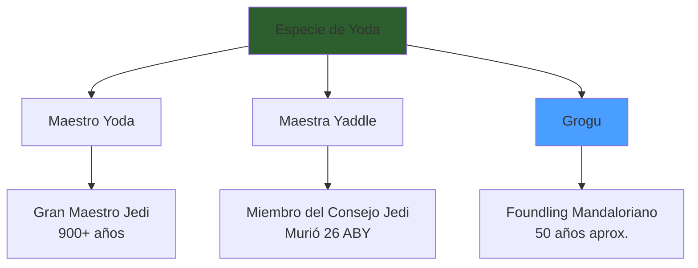
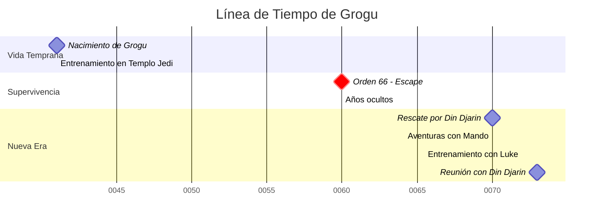
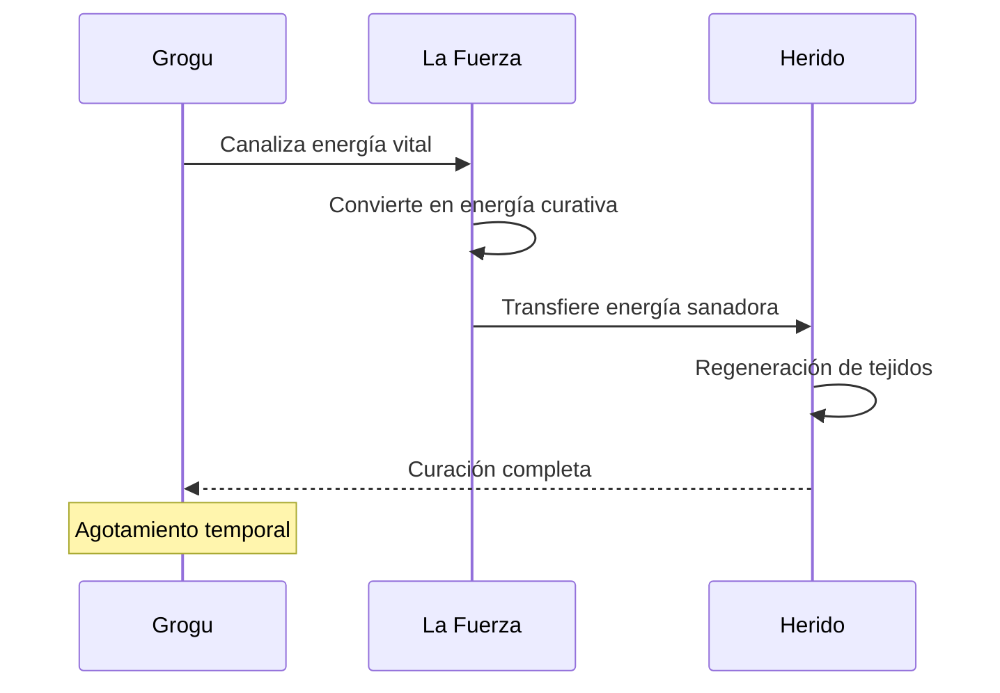
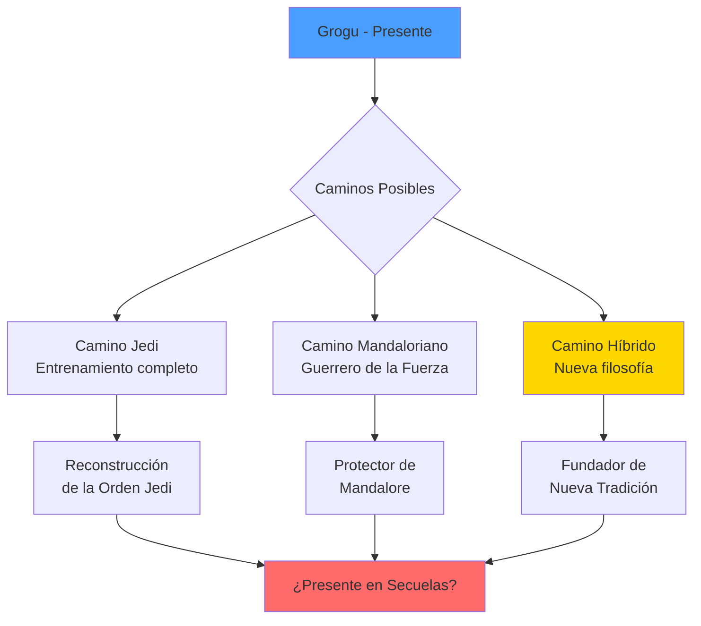

# 👶 Grogu (Baby Yoda): El Fenómeno Cultural de Star Wars

**Breadcrumb:** [🏠 Inicio](index.md) > [📚 Personajes](categoria-personajes.md) > Grogu

---

**📅 Fecha de creación:** 22 de octubre de 2025  
**🔄 Última actualización:** 22 de octubre de 2025  
**⏱️ Tiempo de lectura:** 15 minutos  
**🏷️ Etiquetas:** `Grogu` `Baby Yoda` `The Mandalorian` `La Fuerza` `Cultura Pop` `Star Wars`

---

## 📑 Tabla de Contenidos

1. [Introducción](#introducción)
2. [Origen y Descubrimiento de Grogu](#origen-y-descubrimiento-de-grogu)
   - [El Misterio de su Especie](#el-misterio-de-su-especie)
   - [Rescate en Arvala-7](#rescate-en-arvala-7)
   - [Conexión con el Templo Jedi](#conexión-con-el-templo-jedi)
3. [Poderes y Habilidades en la Fuerza](#poderes-y-habilidades-en-la-fuerza)
   - [Manifestaciones Tempranas](#manifestaciones-tempranas)
   - [Capacidades de Curación](#capacidades-de-curación)
   - [Entrenamiento y Potencial](#entrenamiento-y-potencial)
4. [Relación con Din Djarin](#relación-con-din-djarin)
   - [El Vínculo Padre-Hijo](#el-vínculo-padre-hijo)
   - [Momentos Clave de su Relación](#momentos-clave-de-su-relación)
   - [Impacto en el Código Mandaloriano](#impacto-en-el-código-mandaloriano)
5. [Impacto Cultural y Mediático](#impacto-cultural-y-mediático)
   - [Fenómeno en Redes Sociales](#fenómeno-en-redes-sociales)
   - [Merchandising y Comercialización](#merchandising-y-comercialización)
   - [Influencia en la Cultura Popular](#influencia-en-la-cultura-popular)
6. [Simbolismo y Temáticas](#simbolismo-y-temáticas)
7. [Futuro de Grogu en el Canon](#futuro-de-grogu-en-el-canon)
8. [Referencias y Notas](#referencias-y-notas)

---

## Introducción

**Grogu**, conocido popularmente como **"Baby Yoda"**, emergió como uno de los personajes más icónicos y queridos del universo *Star Wars* desde su primera aparición en noviembre de 2019 en la serie *The Mandalorian*. Este pequeño ser de **50 años de edad** pertenece a la misma **especie misteriosa** que el legendario **Maestro Yoda**, una de las razas más enigmáticas de la galaxia de la que aún no se conoce el nombre oficial.

La aparición de Grogu no solo revitalizó la franquicia de *Star Wars*, sino que desencadenó un **fenómeno cultural sin precedentes** en la era del streaming. Su diseño adorable, combinado con poderosas habilidades en la Fuerza y una personalidad entrañable, capturó los corazones de millones de espectadores alrededor del mundo. El personaje se convirtió en un **símbolo de esperanza e inocencia** en un universo marcado por décadas de conflicto galáctico y oscuridad.

Lo que hace particularmente fascinante a Grogu es la **dualidad de su existencia**: por un lado, es un infante vulnerable que necesita protección constante; por otro, posee un poder latente en la Fuerza que rivaliza con el de los Jedi más experimentados. Esta contradicción crea una narrativa rica y compleja que explora temas de **identidad, protección, legado** y el **verdadero significado de la familia**. Su viaje junto a Din Djarin, el Mandaloriano, no es solo una historia de supervivencia, sino una exploración profunda de cómo las conexiones emocionales trascienden las barreras culturales y las diferencias de especie[1].

Además, Grogu representa un **puente temporal** entre las diferentes eras de *Star Wars*: nacido durante la época de la República Galáctica, sobrevivió a la Orden 66 y la purga Jedi, y ahora navega por los turbulentos años posteriores a la caída del Imperio. Su existencia plantea preguntas fundamentales sobre el futuro de la Fuerza y los Jedi en la galaxia, convirtiendo cada episodio de su historia en una pieza clave del rompecabezas narrativo del universo expandido de *Star Wars*.

> [!NOTE]
> El nombre "Grogu" no fue revelado hasta el episodio 13 de *The Mandalorian*, titulado "The Jedi", donde Ahsoka Tano establece una conexión con él a través de la Fuerza.

---

## Origen y Descubrimiento de Grogu

### El Misterio de su Especie

La **especie de Grogu** permanece como uno de los secretos mejor guardados del universo *Star Wars*. A lo largo de décadas de contenido canónico y de leyendas, solo se han identificado **tres miembros confirmados** de esta raza: el Maestro Yoda, la Maestra Jedi Yaddle, y ahora Grogu. Esta rareza extrema ha dado lugar a innumerables teorías y especulaciones entre los fans[2].

<strong>📖 Información adicional: Características de la Especie</strong>

Las características conocidas de la especie de Grogu incluyen:

- **Longevidad extrema**: Pueden vivir más de 900 años
- **Envejecimiento lento**: Un individuo de 50 años aún está en su infancia
- **Sensibilidad natural a la Fuerza**: Todos los miembros conocidos son usuarios potentes
- **Estatura pequeña**: Generalmente no superan los 70 cm de altura en edad adulta
- **Orejas grandes y expresivas**: Característica física distintiva
- **Piel verde o verde-marrón**: Pigmentación característica
- **Tres dedos en cada mano**: Anatomía única

La razón del secretismo sobre esta especie podría estar relacionada con su poderosa conexión con la Fuerza, protegiendo así su mundo natal de aquellos que buscarían explotarlos.

### Rescate en Arvala-7

El **descubrimiento de Grogu** por parte de Din Djarin ocurrió en el planeta desértico de **Arvala-7**, donde el cazarrecompensas había sido contratado por un remanente del Imperio para "recuperar" un activo de alto valor. Lo que el Mandaloriano esperaba ser una misión rutinaria se convirtió en el momento que cambiaría su vida para siempre.

| **Aspecto** | **Detalles** |
|-------------|-------------|
| **Planeta** | Arvala-7 |
| **Cliente** | Remanente Imperial (El Cliente) |
| **Compensación** | Beskar puro |
| **Guardián** | IG-11 (droide asesino) |
| **Estado al encontrarlo** | Cápsula de levitación, solo y vulnerable |
| **Edad estimada** | 50 años |

> [!WARNING]
> El Imperio buscaba a Grogu por razones relacionadas con sus experimentos de clonación y su conexión con la Fuerza, como se revelaría más adelante en la serie.

### Conexión con el Templo Jedi

Gracias a la visión proporcionada por **Ahsoka Tano** a través de la Fuerza, se reveló que Grogu fue **entrenado en el Templo Jedi de Coruscant** durante los últimos años de la República Galáctica. Múltiples maestros Jedi lo instruyeron, aunque sus recuerdos de esta época están fragmentados debido a su temprana edad y los eventos traumáticos posteriores.

<strong>🎓 Ejemplo detallado: La Orden 66 y la Supervivencia de Grogu</strong>

Durante la **Orden 66**, cuando el Emperador Palpatine ordenó la ejecución de todos los Jedi, el Templo Jedi de Coruscant fue asaltado por las tropas clon del **501º** lideradas por Darth Vader (anteriormente Anakin Skywalker). 

Según se reveló en *The Mandalorian*, **alguien sacó a Grogu del Templo** antes de que fuera asesinado. Las teorías de los fans incluyen:

1. **Mace Windu**: Algunos especulan que el Maestro Windu sobrevivió y pudo haber rescatado a Grogu
2. **Kelleran Beq**: Aparece en flashbacks rescatando a Grogu durante el asalto
3. **Otros Jedi supervivientes**: Posiblemente maestros no identificados

Lo que es seguro es que Grogu fue **ocultado durante décadas**, manteniéndose lejos del alcance del Imperio y los Inquisidores que cazaban a los Jedi supervivientes.

---

## Poderes y Habilidades en la Fuerza

### Manifestaciones Tempranas

A pesar de su corta edad y **entrenamiento incompleto**, Grogu ha demostrado habilidades extraordinarias en la Fuerza que sorprenden incluso a usuarios experimentados. Sus poderes se manifiestan de manera instintiva, especialmente cuando está en peligro o cuando intenta proteger a aquellos que ama.

| **Habilidad** | **Primera Aparición** | **Nivel de Dominio** | **Descripción** |
|---------------|----------------------|----------------------|-----------------|
| **Telequinesis** | Episodio 2, Temp. 1 | ⭐⭐⭐⭐ | Levitación de criaturas grandes (Mudhorn) |
| **Curación de la Fuerza** | Episodio 7, Temp. 1 | ⭐⭐⭐⭐⭐ | Curación de heridas mortales |
| **Protección con la Fuerza** | Episodio 8, Temp. 1 | ⭐⭐⭐ | Detención de fuego de lanzallamas |
| **Estrangulamiento de la Fuerza** | Episodio 7, Temp. 1 | ⭐⭐ | Usado instintivamente contra Cara Dune |
| **Conexión Mental** | Episodio 5, Temp. 2 | ⭐⭐⭐⭐ | Comunicación telepática con Ahsoka |

### Capacidades de Curación

Una de las habilidades más **raras y valiosas** que posee Grogu es la **Curación de la Fuerza**, un poder que muy pocos Jedi dominaron en la historia de la Orden. Esta capacidad le permite transferir su propia energía vital para sanar heridas graves, desde quemaduras hasta envenenamientos mortales[3].

> **"La capacidad de curar con la Fuerza es una de las manifestaciones más nobles del lado luminoso."**  
> — *Archivos del Templo Jedi*

> [!CAUTION]
> El uso de la Curación de la Fuerza consume enormemente la energía de Grogu, dejándolo exhausto y vulnerable después de cada uso. Esto sugiere que, aunque poderoso, aún no ha aprendido a controlar eficientemente este poder.

### Entrenamiento y Potencial

El **potencial latente** de Grogu en la Fuerza es **extraordinario**. Ahsoka Tano comentó que su poder era comparable al de maestros Jedi veteranos, a pesar de su edad infantil. Luke Skywalker, tras evaluarlo, decidió tomarlo como aprendiz, reconociendo que podría convertirse en uno de los usuarios de la Fuerza más poderosos de la galaxia.

<strong>📚 Datos históricos: Comparación con Otros Usuarios de la Fuerza</strong>

### Tabla Comparativa de Poder en la Fuerza

| **Usuario** | **Edad al mostrar poderes** | **Entrenamiento formal** | **Poder destacado** |
|-------------|---------------------------|-------------------------|---------------------|
| **Anakin Skywalker** | 9 años | Extensivo (Obi-Wan) | Precognición, pilotaje |
| **Luke Skywalker** | 19 años | Parcial (Yoda, Obi-Wan) | Telekinesis, visiones |
| **Rey** | 19 años | Autodidacta inicialmente | Conexiones de Fuerza |
| **Grogu** | 50 años | Parcial (múltiples maestros) | Curación, telequinesis |
| **Maestro Yoda** | Desconocido | Extensivo | Maestría completa |

Grogu destaca por manifestar poderes avanzados con **mínimo entrenamiento formal reciente**, sugiriendo que su conexión con la Fuerza es especialmente profunda.

---

## Relación con Din Djarin

### El Vínculo Padre-Hijo

La relación entre **Grogu** y **Din Djarin** (el Mandaloriano) trasciende la típica dinámica protector-protegido para convertirse en un **vínculo paterno-filial** auténtico y profundo. Inicialmente contratado para entregar a Grogu al remanente Imperial, Din tomó la decisión moral de rescatarlo, desafiando tanto a su gremio de cazarrecompensas como al Imperio mismo[1].

Este vínculo se fortalece a lo largo de sus aventuras, donde Din evoluciona de un guerrero solitario y desapegado a una **figura paterna protectora** dispuesta a sacrificar todo por Grogu. Por su parte, Grogu encuentra en Din no solo un guardián, sino el **hogar y la familia** que perdió durante la Orden 66.

> [!TIP]
> La relación entre Din y Grogu es central para el mensaje de *The Mandalorian* sobre cómo la familia va más allá de los lazos de sangre. En la cultura mandaloriana, los "foundlings" (niños adoptados) son considerados hijos legítimos.

### Momentos Clave de su Relación

| **Episodio/Momento** | **Evento** | **Impacto en la Relación** |
|---------------------|-----------|---------------------------|
| **Temp. 1, Ep. 2** | Grogu usa la Fuerza para salvar a Din del Mudhorn | Din reconoce que Grogu es especial |
| **Temp. 1, Ep. 3** | Din rescata a Grogu del Cliente | Compromiso de protección |
| **Temp. 1, Ep. 8** | Grogu detiene el fuego de lanzallamas para salvar a Din | Protección mutua establecida |
| **Temp. 2, Ep. 8** | Despedida con Luke Skywalker | Separación devastadora pero necesaria |
| **Libro de Boba Fett** | Grogu elige la armadura de Din sobre el sable láser | Prioriza la relación sobre el entrenamiento Jedi |
| **Temp. 3** | Din adopta formalmente a Grogu | Vínculo padre-hijo oficializado |

### Impacto en el Código Mandaloriano

La presencia de Grogu **transformó fundamentalmente** la vida de Din Djarin y su interpretación del **Código Mandaloriano**. Din, quien anteriormente seguía las reglas de su credo con rigidez absoluta (incluyendo nunca quitarse el casco), comenzó a cuestionar y evolucionar su comprensión de lo que significa ser mandaloriano.

> **"Este es el camino."**  
> — *Credo Mandaloriano, reinterpretado a través del amor paternal*

---

## Impacto Cultural y Mediático

### Fenómeno en Redes Sociales

Grogu se convirtió en un **fenómeno viral instantáneo** tras el estreno de *The Mandalorian* en Disney+. Su aparición sorpresa (mantenida en secreto absoluto por Lucasfilm) generó millones de memes, fan arts y discusiones en plataformas como Twitter, Instagram, Reddit y TikTok[2].

| **Plataforma** | **Impacto** | **Métricas Aproximadas** |
|---------------|------------|-------------------------|
| **Twitter** | #BabyYoda trending mundial | 50+ millones de tweets en la primera semana |
| **Instagram** | Fan art y memes | 5+ millones de publicaciones con hashtag |
| **Reddit** | Comunidades dedicadas | r/BabyYoda con 200k+ miembros |
| **TikTok** | Videos virales | 10+ billones de visualizaciones |
| **YouTube** | Reacciones y análisis | Miles de videos con millones de vistas |

### Merchandising y Comercialización

El impacto comercial de Grogu fue **sin precedentes**. A pesar del secretismo inicial que retrasó la producción de mercancía, la demanda fue tan alta que Disney y sus socios de licenciamiento se apresuraron a lanzar productos:

- **Juguetes y peluches**: Ventas que superaron los $500 millones en el primer año
- **Ropa y accesorios**: Líneas completas en tiendas como Target, Walmart y Hot Topic
- **Coleccionables**: Figuras de alta calidad de Hot Toys, Funko Pops, Lego
- **Productos para el hogar**: Desde tazas hasta mantas y decoración

<strong>📊 Información adicional: Comparación de Impacto Comercial</strong>

### Tabla Comparativa de Merchandising de Personajes de Star Wars

| **Personaje** | **Año de Lanzamiento** | **Ventas Primer Año (estimado)** | **Longevidad Comercial** |
|--------------|----------------------|------------------------------|------------------------|
| **Darth Vader** | 1977 | $100M (ajustado a inflación) | 45+ años |
| **Yoda** | 1980 | $50M (ajustado) | 40+ años |
| **BB-8** | 2015 | $200M | 8+ años |
| **Grogu** | 2019 | $500M+ | 5+ años (y contando) |
| **Porgs** | 2017 | $150M | 3 años aprox. |

Grogu demostró un poder comercial que rivaliza y supera a íconos establecidos de la franquicia.

### Influencia en la Cultura Popular

Más allá del merchandising, Grogu se integró profundamente en la **cultura popular global**:

- **Referencias en otros medios**: Apariciones y referencias en programas de televisión, películas y videojuegos
- **Parodias y homenajes**: SNL, The Simpsons, y otros programas le dedicaron sketches
- **Influencia en el diseño**: Su estética influyó en el diseño de personajes en otras producciones
- **Lenguaje cotidiano**: Expresiones como "This is the way" se popularizaron globalmente

---

## Simbolismo y Temáticas

Grogu representa múltiples capas de **simbolismo** dentro del universo *Star Wars* y en un contexto cultural más amplio:

### Tabla de Análisis Simbólico

| **Símbolo** | **Representación** | **Conexión Narrativa** |
|-------------|-------------------|----------------------|
| **🌟 Esperanza** | Nueva generación de usuarios de la Fuerza | Futuro post-Imperio |
| **👶 Inocencia** | Pureza en un universo corrompido | Contraste con la violencia |
| **🔄 Continuidad** | Legado de Yoda y los Jedi | Puente entre eras |
| **❤️ Amor Incondicional** | Familia elegida vs. biológica | Relación con Din Djarin |
| **⚖️ Balance** | Luz y oscuridad en equilibrio | Potencial sin corromper |

> **"En los ojos de Grogu vemos reflejado lo mejor de lo que la Fuerza puede ser: compasión, protección y esperanza para el futuro."**  
> — *Análisis narrativo de The Mandalorian*

El personaje también plantea preguntas filosóficas sobre **naturaleza vs. crianza**: ¿será Grogu definido por su entrenamiento Jedi, por su crianza mandaloriana, o forjará su propio camino único?

---

## Futuro de Grogu en el Canon

El futuro narrativo de Grogu está **lleno de posibilidades** y presenta interrogantes fascinantes para los fans:

### Teorías y Especulaciones

1. **Fundación de una Nueva Orden**: Grogu podría establecer una orden que fusione las filosofías Jedi y Mandalorianas
2. **Encuentro con los Primeros Jedi**: Conexión con Ahsoka y su búsqueda de Thrawn
3. **Confrontación con el Lado Oscuro**: Pruebas que definirán su camino
4. **Legado de Yoda**: Descubrir más sobre su especie y origen
5. **Papel en la Ascensión de la Primera Orden**: Su ubicación durante los eventos de las secuelas

> [!NOTE]
> Dave Filoni y Jon Favreau, creadores de *The Mandalorian*, han confirmado que tienen planes a largo plazo para Grogu que conectan con la narrativa más amplia del universo Star Wars.

### Tabla de Posibles Apariciones Futuras

| **Proyecto** | **Probabilidad** | **Rol Potencial** | **Impacto en el Canon** |
|-------------|-----------------|------------------|----------------------|
| **The Mandalorian S4+** | ⭐⭐⭐⭐⭐ | Protagonista | Alto - Historia principal |
| **Ahsoka (serie)** | ⭐⭐⭐⭐ | Aparición especial | Medio - Conexión con búsqueda |
| **Película de Filoni** | ⭐⭐⭐⭐⭐ | Rol importante | Muy Alto - Evento culminante |
| **Rangers of the New Republic** | ⭐⭐⭐ | Cameo o referencia | Bajo - Conexión tangencial |
| **Proyectos post-Secuelas** | ⭐⭐ | Maestro anciano | Muy Alto - Revelación mayor |

---

## Referencias y Notas

### Notas al Pie

[1] Favreau, Jon & Filoni, Dave. *The Mandalorian* (Serie de televisión). Lucasfilm/Disney+, 2019-presente. La relación entre Din Djarin y Grogu se desarrolla como tema central a lo largo de las tres temporadas disponibles.

[2] Hidalgo, Pablo. *Star Wars: The Mandalorian - The Ultimate Visual Guide*. DK Publishing, 2020. Proporciona información canónica detallada sobre la especie de Grogu y su rol en el universo Star Wars.

[3] "Force Healing" - *Star Wars: The Rise of Skywalker Visual Dictionary*. DK Publishing, 2019. Documenta la rareza de esta habilidad entre usuarios de la Fuerza.

### Fuentes Adicionales

- **StarWars.com** - Databank oficial sobre Grogu: https://www.starwars.com/databank/grogu
- **Wookieepedia** - Entrada enciclopédica completa: https://starwars.fandom.com/wiki/Grogu
- **The Mandalorian Season 1-3** - Material fuente primario disponible en Disney+

---

## 🔗 Navegación

[← Artículo Anterior: Origen de la República](articulo2.md) | [Siguiente Artículo: Las Guerras Clon →](articulo4.md)

[↑ Volver arriba](#-grogu-baby-yoda-el-fenómeno-cultural-de-star-wars)
*"Este es el camino."*

