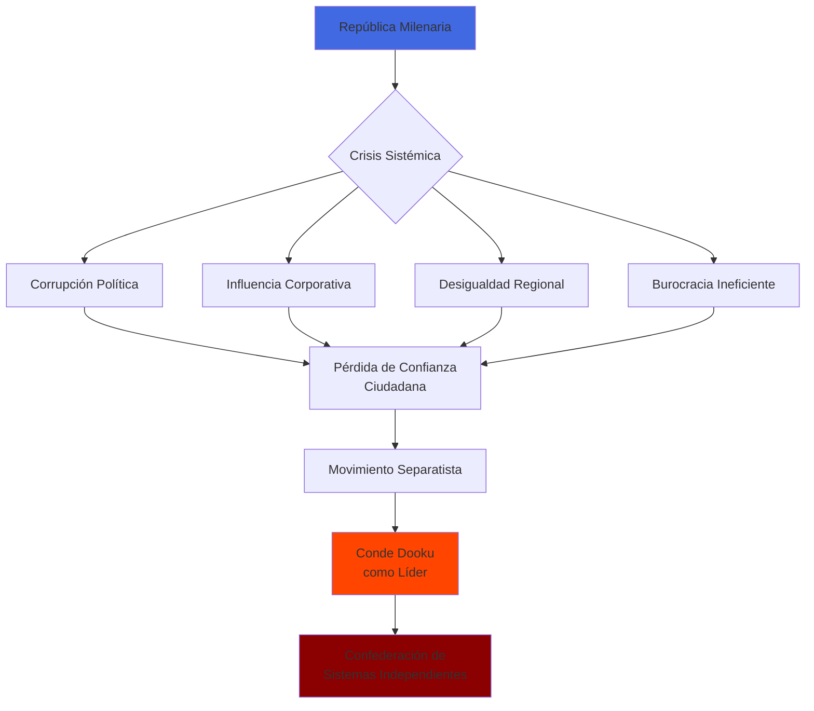
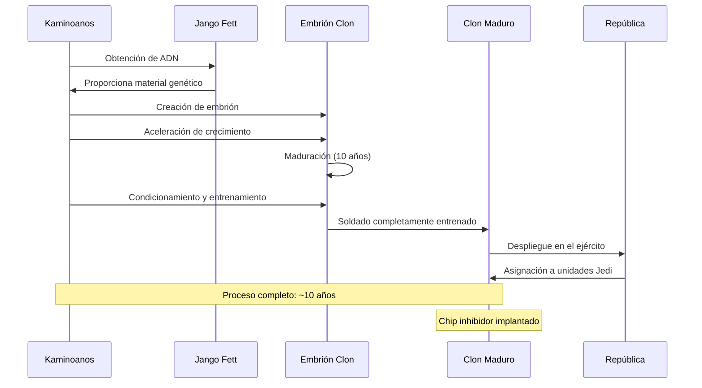
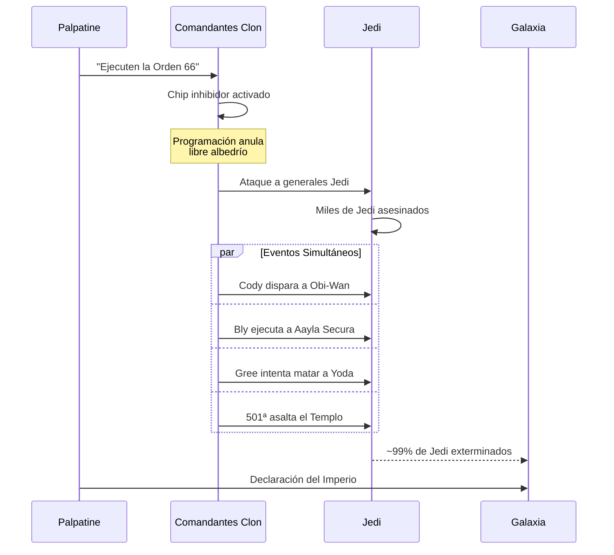

# ⚔️ Las Guerras Clon: El Conflicto que Destruyó la República

**Breadcrumb:** [🏠 Inicio](index.md) > [📚 Eventos Históricos](categoria-eventos.md) > Las Guerras Clon

---

**📅 Fecha de creación:** 22 de octubre de 2025  
**🔄 Última actualización:** 22 de octubre de 2025  
**⏱️ Tiempo de lectura:** 18 minutos  
**🏷️ Etiquetas:** `Guerras Clon` `República Galáctica` `Separatistas` `Jedi` `Palpatine` `Orden 66` `Guerra Galáctica`

---

## 📑 Tabla de Contenidos

1. [Introducción](#introducción)
2. [Orígenes y Causas del Conflicto](#orígenes-y-causas-del-conflicto)
   - [Crisis Política en la República](#crisis-política-en-la-república)
   - [El Ascenso del Conde Dooku](#el-ascenso-del-conde-dooku)
   - [Formación de la Confederación Separatista](#formación-de-la-confederación-separatista)
3. [El Gran Ejército de la República](#el-gran-ejército-de-la-república)
   - [Los Soldados Clon: Creación y Entrenamiento](#los-soldados-clon-creación-y-entrenamiento)
   - [Jedi como Generales](#jedi-como-generales)
   - [Armamento y Tecnología Republicana](#armamento-y-tecnología-republicana)
4. [El Ejército Droide Separatista](#el-ejército-droide-separatista)
   - [Tecnología Droide y Variantes](#tecnología-droide-y-variantes)
   - [Líderes Militares Separatistas](#líderes-militares-separatistas)
   - [Financiación Corporativa](#financiación-corporativa)
5. [Batallas y Campañas Principales](#batallas-y-campañas-principales)
   - [La Primera Batalla de Geonosis](#la-primera-batalla-de-geonosis)
   - [Christophsis y el Frente Exterior](#christophsis-y-el-frente-exterior)
   - [El Asedio de Mandalore](#el-asedio-de-mandalore)
6. [La Conspiración Sith y el Plan de Palpatine](#la-conspiración-sith-y-el-plan-de-palpatine)
   - [Darth Sidious: El Maestro de Ajedrez](#darth-sidious-el-maestro-de-ajedrez)
   - [Manipulación de Ambos Bandos](#manipulación-de-ambos-bandos)
   - [La Orden 66](#la-orden-66)
7. [Consecuencias y Legado](#consecuencias-y-legado)
   - [Nacimiento del Imperio Galáctico](#nacimiento-del-imperio-galáctico)
   - [Extinción de la Orden Jedi](#extinción-de-la-orden-jedi)
   - [Impacto en la Galaxia](#impacto-en-la-galaxia)
8. [Referencias y Notas](#referencias-y-notas)

---

## Introducción

Las **Guerras Clon** representan uno de los **conflictos más devastadores** en la historia de la galaxia conocida, un cataclismo de tres años que marcó el fin de mil años de paz bajo la **República Galáctica** y dio nacimiento al opresivo **Imperio Galáctico**. Este conflicto, que transcurrió entre el **22 ABY y el 19 ABY** (Antes de la Batalla de Yavin), enfrentó al **Gran Ejército de la República** —compuesto por millones de soldados clon genéticamente idénticos y dirigidos por los Jedi— contra el **Ejército Droide Separatista**, una vasta fuerza automatizada financiada por corporaciones y liderada por el Conde Dooku.

Lo que la galaxia desconocía era que toda la guerra había sido **orquestada meticulosamente** desde las sombras por **Darth Sidious** (el Senador Supremo Palpatine), un Lord Sith que controlaba ambos bandos del conflicto con el objetivo final de destruir a los Jedi, consolidar su poder absoluto y transformar la democracia en dictadura. Las Guerras Clon no fueron simplemente un enfrentamiento militar entre dos facciones ideológicas, sino una **trampa elaborada** diseñada para cumplir una antigua venganza Sith que había estado preparándose durante un milenio[1].

El conflicto se caracterizó por batallas masivas en miles de sistemas estelares, desde los desiertos áridos de **Geonosis** donde comenzó todo, hasta los bosques de **Kashyyyk**, las llanadas nevadas de **Rhen Var**, y las torres urbanas de **Coruscant**. Millones de seres —tanto orgánicos como sintéticos— perecieron en los combates, y sistemas enteros fueron devastados por el fuego cruzado entre la República y los Separatistas. Planetas que habían prosperado durante generaciones quedaron reducidos a escombros, economías fueron destruidas, y poblaciones civiles sufrieron horrores inimaginables.

Para la **Orden Jedi**, las Guerras Clon representaron su mayor desafío en mil años y, paradójicamente, su perdición final. Forzados a abandonar su rol tradicional como pacificadores y diplomáticos para convertirse en **generales de guerra**, los Jedi se encontraron comprometiendo sus principios fundamentales. El propio concepto de liderar un ejército de clones —seres criados específicamente para el combate sin elección propia— planteaba dilemas éticos profundos que muchos Jedi enfrentaron con creciente incomodidad. Sin saberlo, cada victoria militar los acercaba más a su extinción programada.

Este artículo explora en detalle los orígenes políticos y ocultos del conflicto, examina las fuerzas militares de ambos bandos, analiza las batallas más significativas, revela la conspiración Sith que lo orquestó todo, y evalúa las consecuencias duraderas que transformaron la galaxia para siempre. A través de este análisis comprensivo, podemos entender cómo una república democrática milenaria fue destruida no por la fuerza bruta, sino por la manipulación calculada y la traición desde dentro[2].

> [!NOTE]
> El término "Guerras Clon" deriva del uso de soldados clonados por la República, aunque irónicamente, estos clones fueron la herramienta que destruyó a aquellos que los comandaban.

---

## Orígenes y Causas del Conflicto

### Crisis Política en la República

La **República Galáctica**, tras mil años de existencia relativamente pacífica, comenzó a mostrar signos de **corrupción sistémica** y disfunción burocrática en sus últimas décadas. El **Senado Galáctico**, que alguna vez fue un cuerpo deliberativo efectivo, se había convertido en un pantano de intereses corporativos, sobornos y parálisis política. Las decisiones que antes tomaban semanas ahora requerían años de debate interminable y comités sin fin[1].

Varios factores contribuyeron a esta crisis:

- **Expansión descontrolada**: La República abarcaba millones de sistemas, haciéndola imposible de gobernar eficientemente
- **Influencia corporativa**: Mega-corporaciones como la Federación de Comercio ejercían poder desproporcionado
- **Desigualdad económica**: Los mundos del Núcleo prosperaban mientras los del Borde Exterior sufrían abandono
- **Corrupción endémica**: Senadores compraban votos abiertamente, normalizing la falta de ética
- **Debilidad ejecutiva**: El Canciller Supremo carecía de poder real para implementar reformas

> [!WARNING]
> La crisis de la República fue exacerbada deliberadamente por Darth Sidious, quien manipuló eventos como el Bloqueo de Naboo para crear caos y justificar poderes de emergencia.

### El Ascenso del Conde Dooku

**Conde Dooku**, nacido como miembro de la nobleza de **Serenno**, fue alguna vez uno de los **Jedi más respetados** de la Orden, habiendo sido aprendiz del propio Maestro Yoda y maestro de **Qui-Gon Jinn**. Sin embargo, su creciente desilusión con la República y la percibida complacencia de los Jedi lo llevaron a abandonar la Orden aproximadamente **diez años antes** del estallido de las Guerras Clon.

Lo que pocos sabían era que Dooku había sido **seducido por el lado oscuro** y se había convertido en el aprendiz de Darth Sidious, adoptando el nombre Sith de **Darth Tyranus**. Su rol era doble: públicamente, sería el carismático líder político que uniría sistemas descontentos contra la República; secretamente, sería el comandante militar que aseguraría que la guerra sirviera los propósitos de su maestro[2].

<strong>📖 Información adicional: La Filosofía Política de Dooku</strong>

### Ideología del Movimiento Separatista

El Conde Dooku presentaba argumentos convincentes para la secesión:

1. **Autonomía local vs. Gobierno centralizado**: Los sistemas deberían gobernarse a sí mismos sin interferencia de Coruscant
2. **Meritocracia vs. Democracia corrupta**: El gobierno debería estar en manos de los competentes, no de políticos comprados
3. **Libre comercio vs. Regulación burocrática**: Las corporaciones deberían operar sin restricciones republicanas
4. **Renovación vs. Tradición estancada**: Las instituciones antiguas debían ser reemplazadas por sistemas modernos

Aunque muchos de estos argumentos resonaban con legitimidad, Dooku en realidad no creía en ninguno de ellos. Era pura retórica diseñada para reclutar aliados mientras cumplía la agenda Sith de destrucción y dominación.

### Formación de la Confederación Separatista

En **24 ABY**, Dooku formó oficialmente la **Confederación de Sistemas Independientes** (CSI), también conocida como el **Movimiento Separatista**. Lo que comenzó como un pequeño grupo de sistemas descontentos creció exponencialmente hasta incluir **miles de planetas y sectores enteros**.

| **Fecha** | **Evento** | **Sistemas Adheridos** | **Impacto** |
|-----------|-----------|----------------------|-------------|
| **24 ABY** | Fundación de la CSI | ~50 sistemas | Inicio del movimiento |
| **23 ABY** | Crisis de Eriadu | ~500 sistemas | Primera crisis seria |
| **22 ABY** | Declaración de Raxus | ~1,000 sistemas | Crisis constitucional |
| **22 ABY** | Batalla de Geonosis | ~10,000+ sistemas | Inicio de la guerra |
| **21 ABY** | Expansión máxima | ~15,000+ sistemas | Control de 1/3 de la galaxia |

---

## El Gran Ejército de la República

### Los Soldados Clon: Creación y Entrenamiento

El descubrimiento del **Gran Ejército de la República** en **Kamino** por Obi-Wan Kenobi fue uno de los misterios más perturbadores de los primeros días de la guerra. Un ejército de **millones de soldados idénticos**, todos clonados del cazarrecompensas mandaloriano **Jango Fett**, había sido secretamente comisionado una década antes supuestamente por el Maestro Jedi **Sifo-Dyas** (quien había muerto misteriosamente poco después)[3].

Los **kaminoanos**, maestros en tecnología de clonación, habían creado soldados superiores en todos los aspectos:

- **Maduración acelerada**: Alcanzaban madurez física en 10 años
- **Condicionamiento**: Obediencia absoluta y lealtad programada
- **Entrenamiento intensivo**: Desde "nacimiento" hasta despliegue
- **Modificación genética**: Reducción de independencia, aumento de obediencia
- **Especialización**: Diferentes unidades para roles específicos

> [!CAUTION]
> Cada soldado clon tenía un **chip biológico inhibidor** implantado en su cerebro durante el desarrollo embrionario. Este chip contenía la Orden 66 y otras órdenes de contingencia que anularían su libre albedrío cuando fueran activadas.

<strong>🎖️ Ejemplo detallado: Unidades de Élite del Ejército Clon</strong>

### Tabla de Unidades Especializadas

| **Unidad** | **Comandante** | **Jedi Asignado** | **Especialización** | **Batallas Notables** |
|-----------|---------------|------------------|---------------------|---------------------|
| **501ª Legión** | Capitán Rex | Anakin Skywalker | Asalto pesado | Teth, Umbara, Coruscant |
| **212º Batallón** | Comandante Cody | Obi-Wan Kenobi | Infantería de línea | Utapau, Christophsis |
| **41º Cuerpo de Élite** | Comandante Gree | Luminara Unduli | Reconocimiento | Kashyyyk, Alzoc III |
| **104º Batallón "Wolfpack"** | Comandante Wolffe | Plo Koon | Operaciones especiales | Abregado, Khorm |
| **327º Cuerpo Estelar** | Comandante Bly | Aayla Secura | Combate planetario | Felucia, Quell |
| **Guardia Coruscant** | Comandante Fox | Ninguno (Palpatine) | Seguridad urbana | Coruscant, protección senatorial |

Cada unidad desarrolló identidad única mediante decoración de armaduras, tácticas especializadas y tradiciones propias, demostrando que incluso seres genéticamente idénticos desarrollaban individualidad.

### Jedi como Generales

La decisión de convertir a los **Jedi en generales militares** fue una de las transformaciones más profundas y problemáticas de las Guerras Clon. Los Jedi, tradicionalmente **guardianes de la paz y diplomáticos**, nunca habían sido entrenados para la guerra a gran escala. Sin embargo, sus habilidades con la Fuerza, sus capacidades de liderazgo y su dedicación a proteger la República los convirtieron en los comandantes lógicos del ejército clon.

Esta transformación tuvo consecuencias profundas:

- **Dilema ético**: Liderar ejércitos contradecía sus principios de paz
- **Conexión con la Fuerza**: El lado oscuro se fortalecía con cada batalla
- **Agotamiento**: Miles de Jedi murieron en combate
- **Pérdida de perspectiva**: Se enfocaron en tácticas militares sobre sabiduría espiritual
- **Manipulación**: Fueron alejados de sus roles tradicionales deliberadamente

> **"Los Jedi son guardianes de la paz, no soldados."**  
> — *Mace Windu, expresando sus reservas sobre el rol militar de los Jedi*

### Armamento y Tecnología Republicana

| **Categoría** | **Ejemplos Principales** | **Ventajas** | **Limitaciones** |
|--------------|------------------------|--------------|------------------|
| **Infantería** | Rifles bláster DC-15A/S | Precisión, fiabilidad | Requiere soldados entrenados |
| **Vehículos Terrestres** | AT-TE, AT-RT, AT-AP | Movilidad todo-terreno | Vulnerables a artillería |
| **Naves Estelares** | Destructores Venator, Y-wings | Superioridad espacial | Costosos de producir |
| **Artillería** | Cañones turbolaser, SPHA-T | Poder de fuego masivo | Poco móviles |
| **Apoyo** | LAAT/i gunships, Arc-170 | Versatilidad táctica | Tripulaciones especializadas |

---

## El Ejército Droide Separatista

### Tecnología Droide y Variantes

El **Ejército Droide Separatista** representaba un enfoque radicalmente diferente a la guerra: **automatización total**. Las corporaciones que financiaban a los Separatistas, particularmente la **Tecno Unión**, la **Alianza Corporativa** y la **Federación de Comercio**, contribuyeron con vastas flotas de droides de combate que podían ser producidos en masa y desplegados sin preocupación por bajas.

```mermaid
flowchart LR
    A[Confederación Separatista] --> B[Droides de Infantería]
    A --> C[Droides Especializados]
    A --> D[Vehículos de Combate]
    A --> E[Naves de Guerra]
    
    B --> B1[B1 Battle Droid]
    B --> B2[B2 Super Battle Droid]
    B --> B3[Droideka]
    
    C --> C1[Droides Comando BX]
    C --> C2[Droides Asesinos IG]
    C --> C3[Droides Tácticos T-Series]
    
    D --> D1[AAT Tank]
    D --> D2[MTT Transport]
    D --> D3[Spider Droid]
    
    E --> E1[Fragatas Providence]
    E --> E2[Dreadnoughts Lucrehulk]
    E --> E3[Cazas Vulture]
    
    style A fill:#8b0000
    style B2 fill:#4a4a4a
    style E2 fill:#2d2d2d
```

<strong>🤖 Información adicional: Ventajas y Desventajas de los Ejércitos Droides</strong>

### Análisis Comparativo: Droides vs. Clones

**Ventajas de los Droides:**
- **Producción ilimitada**: Podían fabricarse en cantidades masivas rápidamente
- **Sin moral**: No experimentaban miedo, duda o deserción
- **Mantenimiento simple**: Reparables y reemplazables fácilmente
- **No requieren sustento**: Sin necesidad de alimentos, descanso o pago
- **Programables**: Actualizaciones tácticas instantáneas

**Desventajas de los Droides:**
- **Falta de creatividad**: Seguían programación, no podían improvisar efectivamente
- **Vulnerabilidad a EMPs**: Pulsos electromagnéticos los desactivaban masivamente
- **Inteligencia limitada**: Los B1 especialmente eran torpes y predecibles
- **Dependencia de control**: Muchos modelos requerían señal de nave de control
- **Falta de iniciativa**: Sin liderazgo, las unidades droides eran inefectivas

Esta dualidad estratégica —calidad y entrenamiento versus cantidad y prescindibilidad— definió gran parte del carácter táctico de las Guerras Clon.

### Líderes Militares Separatistas

Más allá del Conde Dooku, la Confederación contaba con **líderes militares** especializados, muchos de ellos no humanos o cibernéticos:

| **Líder** | **Rol** | **Especialidad** | **Destino Final** |
|-----------|---------|------------------|-------------------|
| **General Grievous** | Comandante Supremo | Tácticas agresivas, combate Jedi | Muerto por Obi-Wan en Utapau |
| **Asajj Ventress** | Asesina/Comandante | Combate con sables, infiltración | Abandonó la Confederación |
| **Almirante Trench** | Comandante Naval | Estrategia espacial | Muerto en Anaxes |
| **General Kalani** | Comandante Táctico Droide | Coordinación de batalla | Sobrevivió a la guerra |
| **Wat Tambor** | Forgemaster (Tecno Unión) | Tecnología de armamento | Ejecutado por Darth Vader |

### Financiación Corporativa

> [!NOTE]
> La Confederación Separatista fue única en la historia galáctica como una facción militar financiada casi enteramente por **corporaciones privadas** que buscaban proteger sus intereses económicos frente a la regulación republicana.

---

## Batallas y Campañas Principales

### La Primera Batalla de Geonosis

La **Batalla de Geonosis** (22 ABY) marcó el **inicio oficial** de las Guerras Clon y representó el primer despliegue masivo del ejército clon. Cuando Obi-Wan Kenobi, Anakin Skywalker y la Senadora Amidala fueron capturados en Geonosis tras descubrir los planes Separatistas, el Maestro **Mace Windu** lideró un equipo de rescate de **212 Jedi**.

```mermaid
gantt
    title Línea Temporal de la Batalla de Geonosis
    dateFormat HH:mm
    axisFormat %H:%M
    
    section Rescate Jedi
    Llegada de los Jedi          :milestone, m1, 14:00, 0m
    Batalla en la Arena          :crit, 14:00, 30m
    Cerco de droides             :crit, 14:30, 20m
    
    section Intervención Clon
    Llegada de Yoda y Clones     :milestone, m2, 14:50, 0m
    Despliegue de LAAT Gunships  :active, 14:50, 15m
    Rescate de Jedi sobrevivientes :15:05, 10m
    
    section Batalla Terrestre
    Asalto a fábricas droides    :15:15, 45m
    Combate de Dooku vs Yoda     :crit, 16:00, 10m
    Escape de Dooku              :milestone, m3, 16:10, 0m
    
    section Resultado
    Victoria Republicana Táctica :16:10, 20m
    Evacuación Separatista       :16:10, 30m
```

**Resultados de la Batalla:**
- **Bajas Jedi**: 179 muertos de los 212 desplegados (~84% de bajas)
- **Bajas clones**: Aproximadamente 3,000-5,000 en el primer día
- **Victoria táctica**: La República capturó Geonosis temporalmente
- **Victoria estratégica Separatista**: Los líderes escaparon, la guerra comenzó

<strong>⚔️ Ejemplo detallado: El Duelo en el Hangar de Geonosis</strong>

### Anakin y Obi-Wan vs. Conde Dooku

Uno de los momentos más significativos de Geonosis fue el **duelo de sables láser** entre el Conde Dooku y los Jedi Anakin Skywalker y Obi-Wan Kenobi en un hangar secreto.

**Secuencia del combate:**

1. **Anakin ataca impulsivamente** → Dooku lo neutraliza con Relámpagos de la Fuerza
2. **Obi-Wan enfrenta a Dooku solo** → Duelo de esgrima clásica (Forma II Makashi)
3. **Dooku hiere a Obi-Wan** → Cortes en brazo y pierna, lo incapacita
4. **Anakin se recupera y combate** → Duelo de dos sables (prestado de Obi-Wan)
5. **Dooku corta el brazo de Anakin** → El joven Jedi pierde su extremidad derecha
6. **Llegada del Maestro Yoda** → Dooku huye tras no poder derrotar a su antiguo maestro

Este duelo demostró la **superioridad de Dooku** como espadachín y su poder en el lado oscuro, pero también reveló el potencial bruto de Anakin, cuya rabia y agresión casi igualan al Conde Sith. Fue un presagio de lo que vendría.

### Christophsis y el Frente Exterior

La **Batalla de Christophsis** temprano en la guerra se convirtió en un ejemplo clásico de la lucha por los **mundos del Borde Exterior**. Este planeta cristalino, rico en recursos, fue sitiado por fuerzas Separatistas bajo el mando de **Whorm Loathsom**.

Anakin Skywalker y Obi-Wan Kenobi dirigieron la defensa, marcando también la **primera misión** del aprendiz Padawan de Anakin, **Ahsoka Tano**. La batalla demostró tanto la resiliencia del ejército clon como la importancia de la astucia táctica sobre la fuerza bruta.

### El Asedio de Mandalore

El **Asedio de Mandalore** representa uno de los **capítulos finales** y más trágicos de las Guerras Clon. Ocurriendo **simultáneamente** con la Batalla de Coruscant y la Orden 66, este asedio vio a **Ahsoka Tano** (ya no parte de la Orden Jedi) y la **501ª Legión** bajo el mando del Capitán Rex enfrentarse a **Maul** y sus fuerzas en Mandalore.

Lo que hace este asedio particularmente devastador es que **culminó justo cuando la Orden 66 fue ejecutada**, convirtiendo a los aliados clones de Ahsoka en sus ejecutores programados. Este evento simboliza la traición final a los Jedi y el fin definitivo de las Guerras Clon.

---

## La Conspiración Sith y el Plan de Palpatine

### Darth Sidious: El Maestro de Ajedrez

**Darth Sidious** (Senador Supremo Palpatine) ejecutó la conspiración más elaborada en la historia galáctica registrada. Durante más de una década, manipuló eventos galácticos con una precisión asombrosa, controlando **ambos lados del conflicto** simultáneamente[1].

> **"Todo está procediendo según lo previsto."**  
> — *Darth Sidious, durante múltiples puntos clave de las Guerras Clon*

```mermaid
flowchart TD
    A[Darth Sidious/Palpatine] --> B[Identidad República:<br/>Canciller Supremo]
    A --> C[Identidad Separatista:<br/>Lord Sith]
    
    B --> D[Control del Senado]
    B --> E[Poderes de Emergencia]
    B --> F[Comando del Ejército Clon]
    
    C --> G[Control de Dooku]
    C --> H[Dirección de Grievous]
    C --> I[Manipulación Separatista]
    
    D --> J[Acumulación de Poder]
    E --> J
    F --> J
    G --> J
    H --> J
    I --> J
    
    J --> K[Orden 66]
    K --> L[Imperio Galáctico]
    
    style A fill:#4b0000
    style L fill:#1a1a1a
    style K fill:#ff0000
```

### Manipulación de Ambos Bandos

La **genialidad diabólica** del plan de Sidious radicaba en cómo controlaba el conflicto completo:

| **Aspecto** | **Lado República** | **Lado Separatista** | **Resultado para Sidious** |
|------------|-------------------|---------------------|---------------------------|
| **Liderazgo** | Canciller Supremo electo | Maestro Sith de Dooku | Control total de la guerra |
| **Militar** | Comando del ejército clon | Dirección de estrategia droide | Controlaba victorias y derrotas |
| **Económico** | Presupuesto de guerra inflado | Financiación corporativa | Enriquecimiento personal |
| **Político** | Poderes de emergencia expandidos | Crisis constante justificando poder | Destrucción de democracia |
| **Jedi** | Los agotaba en guerra | Los cazaba con Dooku/Grievous | Debilitamiento para Orden 66 |

> [!WARNING]
> Cada batalla, cada victoria, cada derrota fue **coreografiada** por Sidious para servir sus objetivos finales. No había aspectos del conflicto que escaparan a su control.

<strong>📜 Datos históricos: La Regla de Dos y la Venganza Sith</strong>

### Contexto Histórico de la Conspiración

Las Guerras Clon fueron la **culminación de mil años de planificación Sith** desde la implementación de la **Regla de Dos** por **Darth Bane**. Tras ser casi exterminados por los Jedi en antiguas guerras, los Sith adoptaron una estrategia de paciencia:

**Regla de Dos**: Solo dos Sith existen a la vez (maestro y aprendiz)
- **Propósito**: Evitar guerras intestinas Sith
- **Estrategia**: Infiltración en lugar de confrontación directa
- **Objetivo**: Venganza paciente contra los Jedi

**Línea Sith hasta Sidious** (parcial):
1. Darth Bane → Darth Zannah
2. _(Múltiples generaciones)_
3. Darth Tenebrous → Darth Plagueis
4. Darth Plagueis → Darth Sidious
5. Darth Sidious → Darth Maul → Darth Tyranus → Darth Vader

Sidious fue el Sith que finalmente **cumplió la venganza milenaria**, destruyendo a los Jedi y conquistando la galaxia que una vez los había derrotado.

### La Orden 66

La **Orden 66** fue el mecanismo final de la conspiración, una orden de contingencia programada en los **chips inhibidores** de todos los soldados clon que, cuando fuera activada, los obligaría a ejecutar a sus generales Jedi como traidores a la República.

**Secuencia de la Orden 66:**

**Estadísticas de la Orden 66:**
- **Jedi estimados pre-Orden 66**: ~10,000
- **Jedi sobrevivientes confirmados**: <100
- **Tasa de mortalidad**: >99%
- **Duración del evento principal**: <24 horas galácticas
- **Sistemas afectados simultáneamente**: Miles

> [!CAUTION]
> La Orden 66 no fue una decisión militar, sino una **ejecución programada** activada por un solo comando. Los clones no eligieron traicionar a los Jedi; fueron obligados por programación neural implantada desde su creación.

---

## Consecuencias y Legado

### Nacimiento del Imperio Galáctico

Con los Jedi destruidos y la amenaza Separatista "neutralizada" (Sidious ordenó a Darth Vader asesinar al Consejo Separatista en Mustafar), Palpatine declaró la **reorganización de la República en el Primer Imperio Galáctico**, nombrándose a sí mismo **Emperador**.

El Senado, aunque técnicamente existente, se convirtió en un cuerpo meramente ceremonial. La **democracia galáctica** que había existido durante mil años fue reemplazada por una **dictadura autoritaria** en cuestión de horas[2].

### Extinción de la Orden Jedi

La **Orden Jedi**, que había sido la columna vertebral moral y espiritual de la República durante milenios, fue casi completamente aniquilada. El **Templo Jedi de Coruscant** fue asaltado por la 501ª Legión bajo el mando de Darth Vader, y los archivos Jedi fueron saqueados o destruidos.

| **Aspecto** | **Antes de la Orden 66** | **Después de la Orden 66** |
|------------|------------------------|---------------------------|
| **Población Jedi** | ~10,000 | <100 sobrevivientes |
| **Templo Jedi** | Centro espiritual activo | Palacio Imperial |
| **Consejo Jedi** | 12 maestros gobernantes | Todos muertos |
| **Rol en la sociedad** | Respetados guardianes | Proscritos y cazados |
| **Archivos** | Miles de años de conocimiento | Destruidos o saqueados |

### Impacto en la Galaxia

Las consecuencias de las Guerras Clon resonaron durante generaciones:

- **Económico**: Billones de créditos gastados, economías destruidas
- **Demográfico**: Miles de millones de bajas (orgánicas y sintéticas)
- **Político**: Fin de la democracia, inicio del totalitarismo
- **Cultural**: Generación traumatizada por la guerra
- **Tecnológico**: Avances militares a costa del desarrollo pacífico
- **Espiritual**: Pérdida de los Jedi como guía moral

> **"Así es como muere la libertad... con atronadores aplausos."**  
> — *Senadora Padmé Amidala, al presenciar la transformación de la República en Imperio*

---

## Referencias y Notas

### Notas al Pie

[1] Lucas, George. *Star Wars: Episode II - Attack of the Clones* (Film). Lucasfilm, 2002. Película que muestra el inicio de las Guerras Clon y la conspiración Sith detrás del conflicto.

[2] Lucas, George. *Star Wars: Episode III - Revenge of the Sith* (Film). Lucasfilm, 2005. Conclusión de las Guerras Clon, ejecución de la Orden 66 y ascenso del Imperio.

[3] Filoni, Dave. *Star Wars: The Clone Wars* (Serie animada). Lucasfilm/Cartoon Network/Disney+, 2008-2020. Exploración detallada de batallas, personajes y eventos entre los episodios II y III.

### Fuentes Adicionales

- **Luceno, James** - *Star Wars: Darth Plagueis*. Del Rey Books, 2012. Novela que detalla los orígenes de la conspiración Sith.
- **Traviss, Karen** - *Star Wars Republic Commando Series*. Del Rey Books, 2004-2009. Exploración de la perspectiva de los soldados clon.
- **StarWars.com** - Clone Wars Campaign Guide: https://www.starwars.com/databank/the-clone-wars
- **Wookieepedia** - The Clone Wars: https://starwars.fandom.com/wiki/Clone_Wars

---

## 🔗 Navegación

[← Artículo Anterior: Grogu (Baby Yoda)](articulo3.md) | [Siguiente Artículo: El Imperio Galáctico →](articulo1.md)

[↑ Volver arriba](#️-las-guerras-clon-el-conflicto-que-destruyó-la-república)

---

## 📚 Ver También

- [⚔️ La Orden Jedi y la Fuerza](articulo1.md)
- [🏛️ Origen de la República Galáctica](articulo2.md)
- [👶 Grogu y la Era Post-Imperio](articulo3.md)
- [😈 Darth Sidious: El Emperador](articulo-palpatine.md)
- [🌑 La Orden 66 en Detalle](articulo-orden66.md)

---

**© 2025 Kevin Ponce - Enciclopedia Star Wars**  
*"La guerra no hace grande a nadie." - Maestro Yoda*
