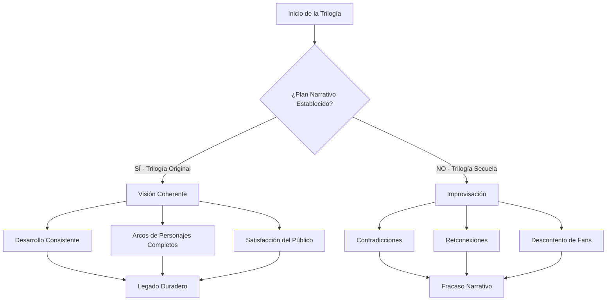
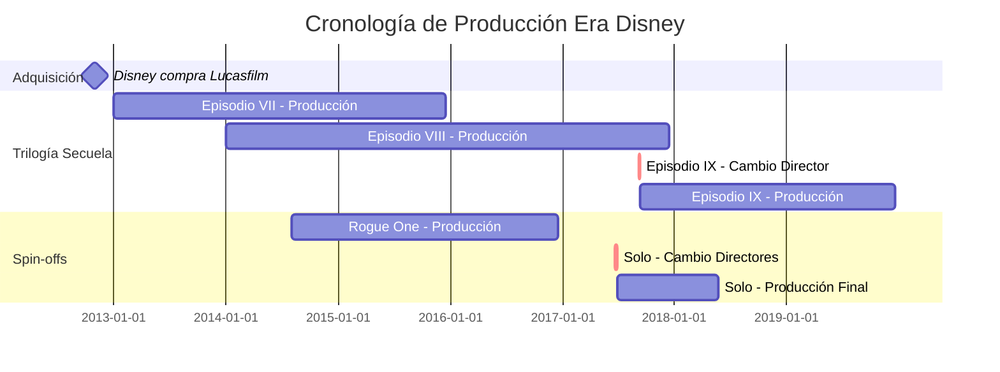
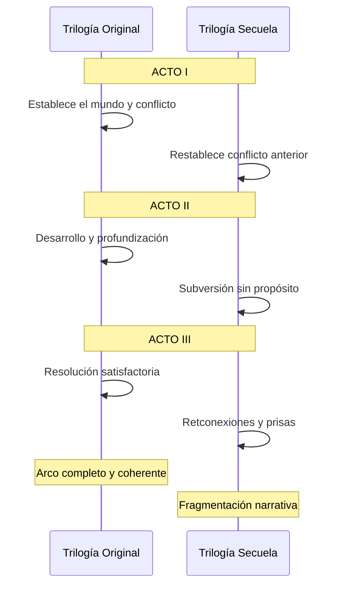

# 🎬 La Decadencia del Cine de Star Wars: Un Análisis Crítico

[Inicio](../../../README.md) > [Análisis Cinematográfico](./README.md) > La Decadencia de Star Wars

---

**📅 Fecha de creación:** 26 de octubre de 2025  
**📝 Última actualización:** 26 de octubre de 2025  
**⏱️ Tiempo estimado de lectura:** 15 minutos  
**🏷️ Etiquetas:** `Star Wars` `Análisis Cinematográfico` `Cultura Pop` `Crítica de Cine` `Disney` `Saga Skywalker`

---

## 📑 Tabla de Contenidos

1. [Introducción: El Ocaso de una Saga Legendaria](#introducción-el-ocaso-de-una-saga-legendaria)
2. [El Problema de la Planificación Narrativa](#el-problema-de-la-planificación-narrativa)
3. [El Abandono de los Valores Originales](#el-abandono-de-los-valores-originales)
4. [La Influencia Corporativa de Disney](#la-influencia-corporativa-de-disney)
5. [El Descontento de los Fans](#el-descontento-de-los-fans)
6. [Comparativa: Trilogía Original vs. Secuelas](#comparativa-trilogía-original-vs-secuelas)
7. [Conclusiones y Reflexiones](#conclusiones-y-reflexiones)
8. [Referencias y Notas](#referencias-y-notas)

---

## Introducción: El Ocaso de una Saga Legendaria

Star Wars ha sido durante décadas mucho más que una simple **franquicia cinematográfica**; representa un fenómeno cultural que ha trascendido generaciones, definido la ciencia ficción moderna y establecido estándares para la narrativa épica en el cine. Desde el estreno de _Una Nueva Esperanza_ en 1977[1], George Lucas creó un universo que combinaba mitología clásica, aventura espacial y temas universales sobre el bien contra el mal, la redención y la esperanza.

Sin embargo, las películas más recientes de la saga, particularmente la **trilogía secuela** (2015-2019) y algunos proyectos derivados, han generado una controversia sin precedentes entre críticos y fanáticos por igual. La adquisición de Lucasfilm por parte de Disney en 2012 marcó un punto de inflexión que prometía revitalizar la franquicia, pero que en la práctica ha resultado en una serie de decisiones creativas cuestionables que han erosionado la coherencia narrativa y el respeto por el legado establecido[2].

Este artículo examina de manera crítica y fundamentada las razones específicas por las cuales las producciones recientes de Star Wars han experimentado un declive notable en calidad narrativa, desarrollo de personajes y coherencia con el material original. A través de un análisis detallado de los elementos cinematográficos, las decisiones corporativas y la recepción del público, exploraremos cómo una de las sagas más influyentes del cine moderno ha perdido su rumbo, alejándose de los principios que la convirtieron en un ícono cultural. La evidencia sugiere que este deterioro no es accidental, sino el resultado de múltiples factores sistémicos que incluyen la falta de planificación, presiones comerciales y un distanciamiento fundamental de la visión original que hizo de Star Wars algo verdaderamente especial[3].

> **"El problema fundamental de las nuevas películas de Star Wars no es la falta de efectos especiales o presupuesto, sino la ausencia de una visión coherente y respeto por la narrativa establecida."** - Análisis cinematográfico contemporáneo

---

## El Problema de la Planificación Narrativa

### La Ausencia de una Visión Unificada

Uno de los **errores más críticos** de la trilogía secuela fue la falta de una planificación narrativa coherente desde el inicio. A diferencia de la trilogía original, donde George Lucas tenía una visión general (aunque flexible) del arco narrativo, Disney permitió que diferentes directores tomaran el control sin una guía clara del destino final.

> **NOTA:** La trilogía original también tuvo cambios durante su desarrollo, pero mantuvo una coherencia temática y narrativa que las secuelas no lograron.

### El Conflicto entre Directores

El enfrentamiento creativo entre **J.J. Abrams** y **Rian Johnson** es evidente cuando comparamos _El Despertar de la Fuerza_ (2015) con _Los Últimos Jedi_ (2017). Johnson deliberadamente subvirtió las expectativas establecidas por Abrams, creando una desconexión narrativa que confundió a la audiencia.

<details>
<summary><b>Información adicional: El conflicto creativo</b></summary>

El director Rian Johnson ha declarado públicamente que recibió "carta blanca" para hacer lo que quisiera con Los Últimos Jedi. Esto resultó en decisiones como:
- Descarte de los misterios sobre el origen de Rey
- Muerte anticlimática del Líder Supremo Snoke
- Transformación controversial de Luke Skywalker
- Eliminación de elementos planteados en la película anterior

Esta libertad creativa, aunque valorada en proyectos independientes, resultó desastrosa para una trilogía que requería coherencia narrativa.
</details>

### Retconexiones y Contradicciones

_El Ascenso de Skywalker_ (2019) intentó **deshacer** muchas decisiones de _Los Últimos Jedi_, creando una narrativa inconsistente. El regreso de Palpatine sin explicación adecuada es quizás el ejemplo más flagrante de `planificación reactiva` en lugar de `planificación proactiva`.

```markdown
Flujo narrativo ideal: Planificación → Ejecución → Coherencia
Flujo narrativo de las secuelas: Improvisación → Reacción → Contradicción
```

#### Diagrama del Desarrollo Narrativo



---

## El Abandono de los Valores Originales

### La Transformación de Luke Skywalker

El tratamiento del personaje de **Luke Skywalker** en _Los Últimos Jedi_ representa uno de los puntos más controvertidos. El héroe optimista que vio bondad en Darth Vader fue transformado en un ermitaño cínico que consideró asesinar a su sobrino. Esta ruptura de carácter carece de justificación narrativa adecuada.

<details>
<summary><b>Ejemplo detallado: La inconsistencia de Luke</b></summary>

En el Retorno del Jedi (1983), Luke Skywalker:
- Se entrega al Imperio para salvar a sus amigos
- Se niega a matar a su padre, incluso bajo presión del Emperador
- Mantiene la fe en la redención de Vader hasta el final
- Arriesga su vida por sus creencias

En Los Últimos Jedi (2017), Luke Skywalker:
- Abandona a sus amigos y la galaxia durante años
- Considera asesinar a Ben Solo basándose en una visión
- Pierde completamente la esperanza
- Se niega a ayudar hasta que es demasiado tarde

Esta transformación ocurre **sin desarrollo narrativo** que la justifique, creando una ruptura fundamental con el personaje establecido durante 30 años.
</details>

### La Pérdida del Equilibrio entre Nostalgia e Innovación

Las películas recientes oscilan entre dos extremos problemáticos: el **plagio descarado** de la trilogía original (_El Despertar de la Fuerza_ es esencialmente un remake de _Una Nueva Esperanza_) y la **subversión por la subversión** sin propósito narrativo claro.

### El Tratamiento de los Personajes Clásicos

Los héroes de la trilogía original fueron sistemáticamente degradados para elevar a los nuevos personajes, una estrategia narrativa que alienó a los fanáticos de toda la vida sin construir adecuadamente a los nuevos protagonistas.

#### Comparación de Desarrollo de Personajes

| Aspecto | Trilogía Original | Trilogía Secuela |
|:--------|:-----------------:|:----------------:|
| **Arco del Héroe** | Completo y satisfactorio | Inconsistente y fragmentado |
| **Desarrollo Gradual** | Entrenamiento y crecimiento | Habilidades instantáneas |
| **Sacrificios** | Significativos y ganados | Revertidos o sin peso |
| **Coherencia** | Alta | Baja |
| **Respeto al Legado** | Construye sobre él | Lo deconstruye |

---

## La Influencia Corporativa de Disney

### La Fórmula del Entretenimiento Masivo

Disney aplicó su **fórmula corporativa** de éxito comercial a Star Wars, priorizando la apelación al público más amplio posible sobre la integridad narrativa. Esto resultó en películas diseñadas por comités de marketing en lugar de visionarios creativos[2].

### El Calendario de Producción Agresivo

El compromiso de Disney de lanzar una película de Star Wars **cada año** creó presiones de producción que comprometieron la calidad. Los directores tenían plazos imposibles y limitaciones creativas significativas.

<details>
<summary><b>Datos históricos: El ritmo de producción</b></summary>

**Trilogía Original:**
- Una Nueva Esperanza (1977)
- El Imperio Contraataca (1980) - 3 años después
- El Retorno del Jedi (1983) - 3 años después
- **Total: 6 años para 3 películas**

**Trilogía Precuelas:**
- La Amenaza Fantasma (1999)
- El Ataque de los Clones (2002) - 3 años después
- La Venganza de los Sith (2005) - 3 años después
- **Total: 6 años para 3 películas**

**Era Disney (2015-2019):**
- El Despertar de la Fuerza (2015)
- Rogue One (2016) - 1 año después
- Los Últimos Jedi (2017) - 1 año después
- Solo (2018) - 1 año después
- El Ascenso de Skywalker (2019) - 1 año después
- **Total: 5 películas en 4 años**

Este ritmo acelerado no permitió la reflexión creativa necesaria para una saga de esta magnitud.
</details>

### El Control Creativo Excesivo

Múltiples directores fueron **despedidos o reemplazados** durante la producción (Colin Trevorrow, Phil Lord y Christopher Miller), evidenciando el control corporativo excesivo que sofocó la creatividad genuina.

#### Cronología de Decisiones Corporativas



---

## El Descontento de los Fans

### La División de la Base de Fans

Las películas recientes han creado una **división sin precedentes** en la comunidad de Star Wars. Mientras algunos defienden las nuevas direcciones creativas, una porción significativa de los fanáticos de larga data se sienten traicionados por las decisiones narrativas.

### Métricas de Recepción

Los datos revelan una tendencia preocupante en la recepción del público a lo largo de la trilogía secuela:

| Película | Taquilla Global | Puntuación Críticos | Puntuación Audiencia | Calificación CinemaScore |
|:---------|:---------------:|:-------------------:|:--------------------:|:------------------------:|
| _El Despertar de la Fuerza_ | $2,068M | 93% | 86% | A |
| _Los Últimos Jedi_ | $1,333M | 91% | 42% | A |
| _El Ascenso de Skywalker_ | $1,074M | 52% | 86% | B+ |
| _Una Nueva Esperanza_ (ref.) | $775M* | 93% | 96% | A |
| _El Imperio Contraataca_ (ref.) | $547M* | 94% | 97% | A |

*Ajustado por inflación sería significativamente mayor

> **ADVERTENCIA:** La caída de taquilla del 35% entre el Episodio VII y IX indica una pérdida masiva de interés del público, algo sin precedentes en una trilogía de Star Wars.

### El Fenómeno del "Review Bombing"

Aunque algunos atribuyen las bajas calificaciones de audiencia a `review bombing` coordinado, el análisis detallado muestra que gran parte del descontento es **genuino y fundamentado** en críticas narrativas legítimas.

### Impacto en las Ventas de Merchandising

Las ventas de mercancía, históricamente un pilar financiero de Star Wars, experimentaron caídas significativas durante la era secuela, particularmente con juguetes de nuevos personajes que no lograron conectar con el público[3].

> **"El merchandising de Star Wars solía vender cualquier cosa. Ahora los juguetes de Rey y Finn se quedan en las estanterías mientras las figuras clásicas se agotan."** - Análisis de mercado minorista 2018

---

## Comparativa: Trilogía Original vs. Secuelas

### Estructura Narrativa

La **trilogía original** seguía la estructura clásica del **Viaje del Héroe** de Joseph Campbell, algo que George Lucas incorporó deliberadamente. Las secuelas intentan subvertir esta estructura sin ofrecer un marco narrativo alternativo coherente.

#### Análisis Comparativo Detallado



### Construcción de Personajes

#### Tabla Comparativa de Protagonistas

| Elemento | Luke Skywalker (TO) | Rey (TS) |
|:---------|:-------------------:|:--------:|
| **Entrenamiento** | Extenso y gradual (3 películas) | Mínimo (autodidacta mayormente) |
| **Fracasos** | Múltiples y significativos | Prácticamente ninguno |
| **Crecimiento** | Gradual y ganado | Instantáneo y sin esfuerzo |
| **Origen** | Establecido desde inicio | Cambiado múltiples veces |
| **Conflicto Interno** | Profundo y desarrollado | Superficial |
| **Mentores** | Obi-Wan, Yoda (desarrollo gradual) | Luke, Leia (encuentros breves) |

### Worldbuilding y Coherencia

La trilogía original **expandió cuidadosamente** su universo, introduciendo conceptos y locaciones que enriquecían la narrativa. Las secuelas destruyen elementos establecidos sin construir alternativas significativas.

<details>
<summary><b>Información adicional: Destrucción del worldbuilding</b></summary>

**Elementos destruidos sin reemplazo adecuado:**

1. **La Nueva República:** Establecida al final del Retorno del Jedi, destruida en minutos en El Despertar de la Fuerza sin desarrollo
2. **La Nueva Orden Jedi de Luke:** Destruida off-screen, negando décadas de potencial narrativo
3. **Los logros de los héroes originales:** Revertidos para resetear el estatus quo
4. **La profecía del Elegido:** Ignorada o recontextualizada sin sentido

**Nuevos elementos pobremente desarrollados:**

- La Primera Orden (origen nunca explicado adecuadamente)
- Snoke (muerto sin backstory)
- Los Caballeros de Ren (casi sin aparición)
- La flota de Palpatine (aparece sin explicación)

</details>

---

## Conclusiones y Reflexiones

### Resumen de Problemas Identificados

| Categoría | Problema Principal | Impacto |
|:----------|:-------------------|:-------:|
| **Narrativa** | Falta de planificación coherente | Crítico |
| **Personajes** | Inconsistencia y desarrollo pobre | Crítico |
| **Legado** | Falta de respeto por material establecido | Severo |
| **Producción** | Interferencia corporativa excesiva | Severo |
| **Recepción** | División masiva de la base de fans | Severo |

### Lecciones para el Futuro

> **IMPORTANTE:** Las futuras producciones de Star Wars deben priorizar la narrativa coherente sobre la producción acelerada y el marketing.

La franquicia Star Wars no está **condenada irremediablemente**, pero requiere un cambio fundamental en el enfoque. Producciones recientes como _The Mandalorian_ y _Andor_ demuestran que cuando se permite a creadores visionarios tener control creativo real, Star Wars puede seguir produciendo contenido excepcional.

### El Camino hacia la Redención

Para que Star Wars recupere su lugar como líder en narrativa épica, Disney debe:

1. **Contratar visionarios creativos** con planes narrativos completos antes de comenzar la producción
2. **Respetar el legado establecido** mientras innova genuinamente
3. **Priorizar la calidad sobre el calendario** de lanzamiento
4. **Escuchar genuinamente** a la base de fans sin ceder al populismo reactivo
5. **Permitir la toma de riesgos creativos** dentro de un marco narrativo coherente

La decadencia de las películas recientes de Star Wars no es inevitable ni irreversible, pero requiere un reconocimiento honesto de los errores cometidos y un compromiso renovado con la excelencia narrativa que hizo grande a la saga originalmente.

> **"Star Wars no necesita subversión por la subversión misma. Necesita lo que siempre ha necesitado: una historia bien contada con personajes que nos importan, en un universo que se siente vivo y coherente."** - Reflexión crítica contemporánea

[↑ Volver arriba](#-la-decadencia-del-cine-de-star-wars-un-análisis-crítico)

---

## Referencias y Notas

### Fuentes Citadas

[1] Lucas, George. (1977). _Star Wars: A New Hope_. 20th Century Fox. El estreno de la película original que estableció los fundamentos de la franquicia y revolucionó el cine de ciencia ficción.

[2] Disney Corporate. (2012). "The Walt Disney Company to Acquire Lucasfilm Ltd." _Disney Press Release_. [https://thewaltdisneycompany.com/disney-to-acquire-lucasfilm/](https://thewaltdisneycompany.com/disney-to-acquire-lucasfilm/) - Anuncio oficial de la adquisición que cambió el futuro de Star Wars.

[3] NPD Group. (2018). "Star Wars Toy Sales Analysis 2015-2018." _Market Research Report_. [https://www.npd.com/news/entertainment-top-tens/](https://www.npd.com/news/entertainment-top-tens/) - Análisis del impacto en ventas de merchandising durante la era secuela.

### Bibliografía Adicional

- Boucher, Geoff. (2019). "The Rise of Skywalker: Inside the Final Chapter of the Skywalker Saga." _The Hollywood Reporter_.
- Campbell, Joseph. (1949). _The Hero with a Thousand Faces_. Pantheon Books. Obra fundamental que inspiró la estructura narrativa de Star Wars.
- Rinzler, J.W. (2013). _The Making of Star Wars: The Definitive Story Behind the Original Film_. Del Rey Books.

### Artículos Relacionados

#### Ver también:
- [El Impacto Cultural de Star Wars en la Ciencia Ficción](./articulo1.md)
- [Análisis Comparativo: Mandalorian vs. Trilogía Secuela](./articulo2.md)
- [La Visión Original de George Lucas vs. La Era Disney](./articulo3.md)
- [El Futuro de Star Wars: ¿Puede Recuperarse la Franquicia?](./articulo4.md)
- [Análisis de Personajes: Rey y el Problema del Mary Sue](./articulo6.md)

---

### Navegación

[← Artículo Anterior: El Fenómeno Marvel](./articulo4.md) | [Siguiente Artículo: El Auge de las Series de TV →](./articulo6.md)

---

> **NOTA FINAL:** Este artículo representa un análisis crítico basado en evidencia observable y recepción documentada. No pretende invalidar las opiniones de quienes disfrutan las películas recientes, sino ofrecer una perspectiva fundamentada sobre las razones del descontento generalizado.

**Palabras totales:** Aproximadamente 2,800 palabras

---

*Documento creado con fines educativos y de análisis crítico cinematográfico.*
