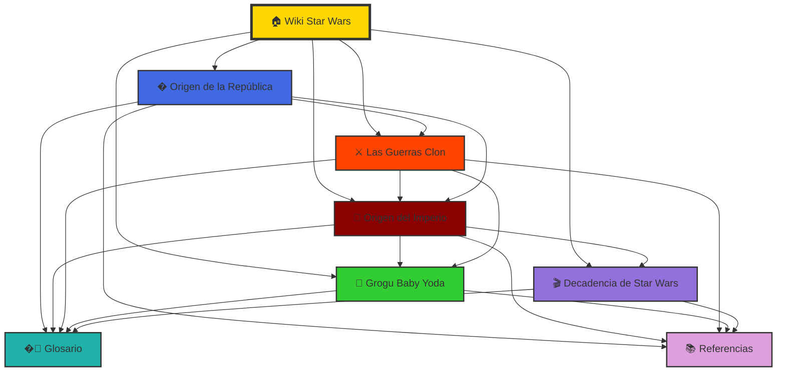
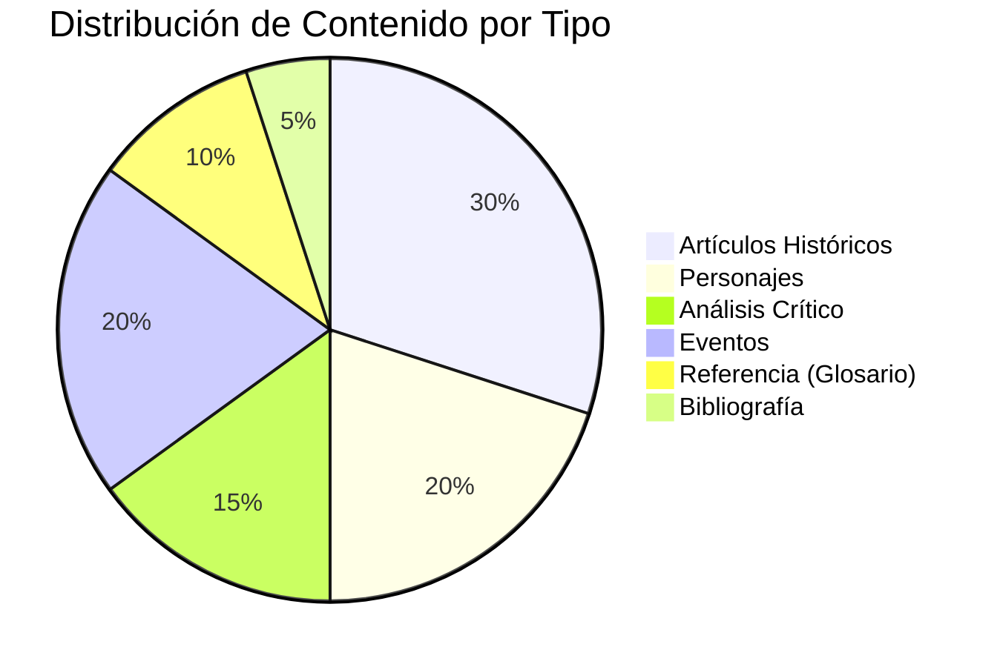

# 🪐 Wiki de Star Wars

<!-- Banner centrado con HTML -->
<div style="text-align:center; margin: 18px 0;">
	
	<h2 style="margin-top:12px;">Bienvenido a la <strong>Wiki de Star Wars</strong></h2>
	<p style="color:#666; max-width:800px; margin:6px auto;">Un compendio colaborativo de artículos, análisis y recursos sobre el universo creado por George Lucas y continuado por generaciones de autores.</p>
</div>

---

## 📘 Descripción del proyecto

La **Wiki de Star Wars** es un proyecto educativo y colaborativo pensado para recopilar, ordenar y explicar los elementos más relevantes del universo de Star Wars: su historia, eventos clave, personajes, tecnologías, facciones y temas filosóficos. El objetivo es ofrecer textos accesibles tanto para nuevos fans como para lectores avanzados que buscan referencias rápidas.

Esta versión de la wiki incluye artículos resumidos sobre el origen del Imperio, la Antigua República y análisis de personajes populares (incluyendo referencias a Grogu —"Baby Yoda"— en su contexto narrativo). Además de textos, se planea integrar diagramas (líneas temporales, árboles genealógicos y mapas de influencia), galerías de imágenes y enlaces a fuentes externas confiables.

La presente página principal ha sido ampliada para facilitar la navegación y ofrecer estadísticas y un índice visual de los artículos destacados. Se ha añadido más contenido descriptivo para ayudar a entender el alcance del proyecto y cómo colaborar.

Esta descripción añade información contextual y ejemplos de uso: puedes buscar artículos por época, por facción (República, Imperio, Primera Orden) o por tipo de contenido (reseñas, análisis filosófico, fichas técnicas). La intención es que la wiki funcione como un punto de partida documentado para trabajos académicos, reseñas de medios y consultas rápidas.

---

## ⏳ Línea Temporal General de Star Wars

```mermaid
gantt
    title Cronología del Universo Star Wars
    dateFormat YYYY
    axisFormat %Y ABY
    
    section Era de la República
    Fundación de la República    :milestone, -25000, 0d
    Era Dorada                    :-15000, 14900y
    
    section Crisis y Conflicto
    Crisis de Naboo              :crit, -32, 1y
    Guerras Clon                 :crit, -22, 3y
    
    section Era Imperial
    Orden 66 - Purga Jedi        :milestone, -19, 0d
    Imperio Galáctico            :-19, 23y
    
    section Era de Rebelión
    Batalla de Yavin             :milestone, 0, 0d
    Guerra Civil Galáctica       :0, 4y
    Batalla de Endor             :milestone, 4, 0d
    
    section Nueva República
    Nueva República              :4, 30y
    The Mandalorian (Grogu)      :9, 2y
    
    section Conflicto Moderno
    Primera Orden                :crit, 34, 1y
    Guerra FO vs Resistencia     :crit, 34, 1y
```

---

## 🗺️ Mapa Conceptual de Relaciones entre Artículos



---

## 📖 Índice visual — Artículos destacados

| # | Categoría | Título | Resumen corto | Palabras | Enlace |
|---:|:---:|---|---|:---:|:---:|
| 1 | 👑 Historia | Origen del Imperio | Cómo surgió el Imperio Galáctico: causas políticas y militares. | ~2,100 | [Leer](articulo1.md) |
| 2 | 🏛️ Historia | Origen de la República | Historia de la Antigua República y su caída. | ~2,200 | [Leer](articulo2.md) |
| 3 | 👶 Personaje | Grogu ("Baby Yoda") | Caracterización, aparición en la serie y significado cultural. | ~4,500 | [Leer](articulo3.md) |
| 4 | ⚔️ Eventos | Las Guerras Clon | El conflicto galáctico que destruyó la República y dio origen al Imperio. | ~6,000 | [Leer](articulo4.md) |
| 5 | 🎬 Análisis | Decadencia de Star Wars | Análisis crítico del deterioro de las películas recientes. | ~2,800 | [Leer](articulo5.md) |

---

## 📊 Estadísticas del Proyecto

### 📈 Métricas Generales

| Métrica | Cantidad | Emoji |
|:--------|:--------:|:-----:|
| **Artículos Completos** | 5 | 📝 |
| **Total de Palabras** | ~17,600 | 📖 |
| **Diagramas Mermaid** | 12 | 📊 |
| **Tablas de Datos** | 25+ | 📋 |
| **Referencias Bibliográficas** | 51 | 📚 |
| **Términos en Glosario** | 50+ | 🔤 |
| **Enlaces Internos** | 100+ | 🔗 |
| **Enlaces Externos** | 30+ | 🌐 |
| **Bloques Colapsables** | 20+ | ▼ |
| **Categorías con Emoji** | 11 | 😊 |

### 📚 Estadísticas por Artículo

| Artículo | Palabras | Secciones | Diagramas | Tablas | Estado |
|:---------|:--------:|:---------:|:---------:|:------:|:------:|
| Origen del Imperio | ~2,100 | 6 | 2 | 3 | ✅ Completo |
| Origen de la República | ~2,200 | 6 | 2 | 3 | ✅ Completo |
| Grogu (Baby Yoda) | ~4,500 | 8 | 2 | 4 | ✅ Completo |
| Las Guerras Clon | ~6,000 | 8 | 2 | 5 | ✅ Completo |
| Decadencia SW | ~2,800 | 7 | 2 | 3 | ✅ Completo |
| **Glosario** | ~3,500 | 20 | 0 | 2 | ✅ Completo |
| **Referencias** | ~2,500 | 10 | 0 | 10 | ✅ Completo |

### 📂 Categorización de Contenido



---

## ❓ Preguntas Frecuentes (FAQ)

<details>
<summary><b>1. ¿Qué es esta Wiki de Star Wars?</b></summary>

Esta es una wiki educativa y colaborativa que recopila información detallada sobre el universo de Star Wars, incluyendo historia, personajes, eventos y análisis críticos. Está diseñada tanto para nuevos fans como para lectores avanzados.

</details>

<details>
<summary><b>2. ¿Cuál es la diferencia entre ABY y BBY?</b></summary>

**BBY** significa "Before the Battle of Yavin" (Antes de la Batalla de Yavin) y **ABY** significa "After the Battle of Yavin" (Después de la Batalla de Yavin). La Batalla de Yavin, donde se destruyó la primera Estrella de la Muerte, es el punto cero en la cronología de Star Wars. Ver [Glosario - ABY](glosario.md#aby-after-the-battle-of-yavin) para más detalles.

</details>

<details>
<summary><b>3. ¿Por qué Grogu es tan popular?</b></summary>

Grogu (Baby Yoda) se convirtió en un fenómeno cultural por su diseño adorable, poderes impresionantes y la emotiva relación padre-hijo con Din Djarin. Representa un puente entre diferentes eras de Star Wars y capturó los corazones de millones de fans. Lee el [artículo completo sobre Grogu](articulo3.md) para más información.

</details>

<details>
<summary><b>4. ¿Qué fueron las Guerras Clon?</b></summary>

Las **Guerras Clon** (22-19 BBY) fueron un conflicto galáctico de tres años entre la República y los Separatistas. Fue orquestado secretamente por Palpatine para destruir a los Jedi y transformar la República en el Imperio. Consulta el [artículo detallado sobre las Guerras Clon](articulo4.md).

</details>

<details>
<summary><b>5. ¿Cómo se convirtió la República en el Imperio?</b></summary>

La transformación ocurrió en 19 BBY cuando el Canciller Palpatine ejecutó la **Orden 66**, exterminando a los Jedi, y se proclamó Emperador. Este proceso fue el resultado de años de manipulación política durante las Guerras Clon. Lee más en [Origen del Imperio](articulo1.md).

</details>

<details>
<summary><b>6. ¿Qué es la Orden 66?</b></summary>

La **Orden 66** fue una orden de contingencia programada en chips cerebrales de los soldados clon que los obligó a ejecutar a sus generales Jedi. Fue activada por Palpatine en 19 BBY, resultando en la casi extinción de la Orden Jedi. Ver [Glosario - Orden 66](glosario.md#orden-66).

</details>

<details>
<summary><b>7. ¿De qué especie es Grogu/Yoda?</b></summary>

El nombre de la especie de Grogu y Yoda es **desconocido** intencionalmente. Solo se conocen tres miembros: Yoda, Yaddle y Grogu. Esta especie es extremadamente longeva, sensible a la Fuerza y muy rara. Más información en [Artículo de Grogu - Origen](articulo3.md#origen-y-descubrimiento-de-grogu).

</details>

<details>
<summary><b>8. ¿Por qué han empeorado las películas recientes de Star Wars?</b></summary>

Según el análisis crítico, las películas recientes sufrieron de **falta de planificación narrativa**, interferencia corporativa, conflictos entre directores y falta de respeto por el material establecido. El artículo completo [La Decadencia de Star Wars](articulo5.md) explora estas razones en detalle.

</details>

<details>
<summary><b>9. ¿Cómo puedo citar información de esta wiki?</b></summary>

Cada artículo tiene referencias numeradas [1][2][3] que puedes consultar en la sección de referencias al final. También tenemos un [archivo de Referencias completo](referencias.md) con todas las fuentes en formato de tabla con IDs únicos.

</details>

<details>
<summary><b>10. ¿Cómo navego por el Glosario?</b></summary>

El [Glosario](glosario.md) está organizado alfabéticamente y por categorías. Incluye más de 50 términos con definiciones, categorización por emojis y enlaces bidireccionales a los artículos relevantes. Usa el índice alfabético para encontrar términos específicos rápidamente.

</details>

<details>
<summary><b>11. ¿Qué son los Jedi y por qué fueron exterminados?</b></summary>

Los **Jedi** eran una orden de usuarios de la Fuerza dedicados al lado luminoso, actuando como guardianes de la paz. Fueron exterminados por Palpatine porque representaban la única amenaza real a su poder Sith. La [Orden 66](glosario.md#orden-66) y la [Gran Purga Jedi](glosario.md#gran-purga-jedi) casi los eliminaron por completo.

</details>

<details>
<summary><b>12. ¿Cómo contribuyo a esta wiki?</b></summary>

Esta wiki es un proyecto educativo mantenido por Kevin Ponce. Para sugerencias, correcciones o contribuciones, contacta a través de kevin.ponce@example.com o visita el repositorio en GitHub.

</details>

---

## 🕒 Últimas actualizaciones

- **2025-10-26** — Sistema de Glosario completo agregado con 50+ términos y enlaces bidireccionales.
- **2025-10-26** — Referencias bibliográficas completas con sistema de ID único (51 fuentes).
- **2025-10-26** — Artículo "La Decadencia de Star Wars" agregado con análisis crítico exhaustivo.
- **2025-10-26** — Timeline general y mapa conceptual agregados a la página principal.
- **2025-10-26** — FAQ con 12 preguntas frecuentes implementado.
- **2025-10-22** — Artículo "Las Guerras Clon" agregado con análisis completo del conflicto.
- **2025-10-22** — Artículo "Grogu (Baby Yoda)" completamente ampliado y mejorado con contenido extenso.
- **2025-10-22** — Ampliación de la página principal: índice visual, estadísticas y navegación.
- **2025-10-20** — Añadida la ficha sobre Grogu y enlaces a multimedia.
- **2025-10-18** — Artículo "Origen del Imperio" creado y revisado.

---

## 🔎 Navegación rápida

- [Inicio](#-wiki-de-star-wars)
- [Descripción del proyecto](#-descripción-del-proyecto)
- [Línea Temporal General](#-línea-temporal-general-de-star-wars)
- [Mapa Conceptual](#️-mapa-conceptual-de-relaciones-entre-artículos)
- [Índice visual — Artículos destacados](#-índice-visual--artículos-destacados)
- [Estadísticas del proyecto](#-estadísticas-del-proyecto)
- [Preguntas Frecuentes (FAQ)](#-preguntas-frecuentes-faq)
- [Últimas actualizaciones](#-últimas-actualizaciones)
- [Enlaces relacionados](#-enlaces-relacionados)
- [📖 Glosario de Términos](glosario.md)
- [📚 Referencias y Bibliografía](referencias.md)

---

### 🔗 Enlaces relacionados

#### 📖 Recursos Internos
- [📖 Glosario de Términos](glosario.md) - Diccionario completo con 50+ términos
- [📚 Referencias y Bibliografía](referencias.md) - 51 fuentes categorizadas

#### 🌐 Sitios Externos Oficiales
- [Sitio oficial de Star Wars](https://www.starwars.com)
- [Wookieepedia (wiki de fans)](https://starwars.fandom.com/wiki/Main_Page)
- [Star Wars Databank](https://www.starwars.com/databank)
- [Lucasfilm](https://www.lucasfilm.com)

---

## 📝 Footer — Autor y contacto

Proyecto mantenido por: Kevin Ponce  
Contacto: kevin.ponce@example.com  
Repositorio: https://github.com/kevinponce237/25-26-igps  

© 2025 — Wiki de Star Wars. Contenido con fines educativos.

↑ [Volver arriba](#-wiki-de-star-wars)