# 🪐 Wiki de Star Wars

<div align="center">


</div>

<!-- Banner centrado con HTML -->
<div style="text-align:center; margin: 18px 0;">
	
	<h2 style="margin-top:12px;">Bienvenido a la <strong>Wiki de Star Wars</strong></h2>
	<p style="color:#666; max-width:800px; margin:6px auto;">Un compendio colaborativo de artículos, análisis y recursos sobre el universo creado por George Lucas y continuado por generaciones de autores.</p>
</div>

---

## 🌟 Artículo Destacado del Mes - Octubre 2025

<div style="border: 3px solid #FFD700; padding: 20px; border-radius: 10px; background: linear-gradient(135deg, #1a1a1a 0%, #2d2d2d 100%);">

### 🛡️ [El Camino del Mandaloriano](articulo-destacado-mes.md)


**"This is the Way"** — Un análisis profundo del código de honor mandaloriano, explorando cómo Din Djarin navega entre tradición ancestral y compasión humana. Descubre los paralelos con filosofías del mundo real, el significado del beskar sagrado, y cómo una frase se convirtió en fenómeno cultural global.

**📊 Contenido Especial:**
- ⚔️ Análisis del código y sus principios
- 🛡️ El significado del beskar más allá del metal
- 👨‍👦 La evolución de Din Djarin como padre
- 🌍 Paralelos con Bushido, código caballeresco y más
- 📈 Impacto cultural de "This is the Way"

**🔥 Incluye:** 5 diagramas Mermaid | 8 tablas comparativas | 3 bloques expandibles

[📖 **Leer Artículo Completo →**](articulo-destacado-mes.md)

</div>

---

## 💡 ¿Sabías que...?

<details>
<summary><b>🎬 Curiosidades de Star Wars que te sorprenderán</b></summary>

### Datos Curiosos de la Galaxia

1. **🎭 El nombre "Yoda" casi fue diferente**  
   George Lucas originalmente consideró llamarlo "Buffy", pero lo descartó por sonar demasiado "alegre" para un sabio de 900 años.

2. **👶 Grogu fue un secreto absoluto**  
   Ni siquiera los ejecutivos de Disney+ vieron a "Baby Yoda" antes del estreno del primer episodio de The Mandalorian. Jon Favreau insistió en el secreto total para preservar la sorpresa.

3. **🗡️ Los sables de luz originalmente iban a ser para todos**  
   En los primeros borradores de 1974, Lucas imaginaba que cualquier soldado podría usar un sable de luz, no solo los Jedi. Se cambió para hacerlos más "especiales".

4. **🎨 El icónico scroll amarillo fue accidental**  
   El texto de apertura amarillo se usó originalmente porque era el único color que se veía bien contra el espacio estrellado en las cámaras de 1977.

5. **🦎 Yoda casi fue interpretado por un mono**  
   Antes de decidirse por un títere, se consideró entrenar a un mono para usar una máscara de Yoda y caminar con un bastón. Afortunadamente, prevaleció la cordura.

6. **⚔️ Las Guerras Clon se mencionaron 28 años antes de ser mostradas**  
   Obi-Wan menciona las Guerras Clon en 1977 (*Una Nueva Esperanza*), pero no las vimos hasta 2002 (*El Ataque de los Clones*).

7. **🌌 "Star Wars" no iba a llamarse así**  
   Títulos alternativos incluían "Adventures of Luke Starkiller" y "The Star Wars" (con artículo). Se simplificó justo antes del lanzamiento.

8. **👑 Palpatine tiene 4 actores diferentes**  
   En el canon actual: Clive Revill (voz, ESB), Ian McDiarmid (cuerpo, ESB-presente), Marjorie Eaton (hologram original ESB, reemplazada), y Tim Curry (rechazado para las precuelas).

9. **🎵 El tema de la Marcha Imperial no estaba en la primera película**  
   El icónico tema de Darth Vader fue compuesto por John Williams para *El Imperio Contraataca* (1980), no para la película original.

10. **📺 The Mandalorian salvó a Star Wars**  
    Después de la controversial trilogía secuela, The Mandalorian (2019) restauró la fe de los fans y probó que Star Wars podía funcionar en formato serie.

</details>

<details>
<summary><b>🔢 Estadísticas Fascinantes</b></summary>

- **🎬 Películas en canon:** 12 (trilogía original + precuelas + secuelas + spin-offs)
- **📺 Series animadas:** 5 principales (Clone Wars, Rebels, Resistance, Bad Batch, Visions)
- **📺 Series live-action:** 6 (Mandalorian, Boba Fett, Obi-Wan, Andor, Ahsoka, Skeleton Crew)
- **📚 Libros canon:** 300+ desde 2014
- **🎮 Videojuegos canon:** 20+ títulos
- **🌍 Idiomas del universo:** 70+ idiomas ficticios creados
- **👥 Especies inteligentes:** 1000+ documentadas en canon
- **🌌 Galaxia conocida:** 3.2 millones de planetas habitados (Legends)
- **💰 Taquilla total:** $10.3 mil millones (todas las películas combinadas)
- **📺 Vistas Mandalorian:** 100+ millones de cuentas en su primera temporada

</details>

<details>
<summary><b>🎬 Detrás de Cámaras</b></summary>

### Secretos de Producción

- **R2-D2** era operado por Kenny Baker, un actor de 1.12m de altura que pasaba horas dentro del droide en condiciones difíciles.
- **Chewbacca** requería 4 horas de maquillaje diario y el traje pesaba 8 libras (el actor Peter Mayhew medía 2.21m).
- **El Halcón Milenario** fue inspirado por una hamburguesa parcialmente comida que George Lucas vio durante un almuerzo creativo.
- **Grogu** requiere 3 puppeteers simultáneos para operar sus ojos, orejas y cuerpo en cada toma.
- **Los sonidos de sables de luz** son una combinación de un proyector de cine antiguo y la interferencia de un televisor.

</details>

---

## 📘 Descripción del proyecto

La **Wiki de Star Wars** es un proyecto educativo y colaborativo pensado para recopilar, ordenar y explicar los elementos más relevantes del universo de Star Wars: su historia, eventos clave, personajes, tecnologías, facciones y temas filosóficos. El objetivo es ofrecer textos accesibles tanto para nuevos fans como para lectores avanzados que buscan referencias rápidas.

Esta versión de la wiki incluye artículos resumidos sobre el origen del Imperio, la Antigua República y análisis de personajes populares (incluyendo referencias a Grogu —"Baby Yoda"— en su contexto narrativo). Además de textos, se planea integrar diagramas (líneas temporales, árboles genealógicos y mapas de influencia), galerías de imágenes y enlaces a fuentes externas confiables.

La presente página principal ha sido ampliada para facilitar la navegación y ofrecer estadísticas y un índice visual de los artículos destacados. Se ha añadido más contenido descriptivo para ayudar a entender el alcance del proyecto y cómo colaborar.

Esta descripción añade información contextual y ejemplos de uso: puedes buscar artículos por época, por facción (República, Imperio, Primera Orden) o por tipo de contenido (reseñas, análisis filosófico, fichas técnicas). La intención es que la wiki funcione como un punto de partida documentado para trabajos académicos, reseñas de medios y consultas rápidas.

---

## ⏳ Línea Temporal General de Star Wars

```mermaid
gantt
    title Cronología del Universo Star Wars
    dateFormat YYYY
    axisFormat %Y ABY
    
    section Era de la República
    Fundación de la República    :milestone, -25000, 0d
    Era Dorada                    :-15000, 14900y
    
    section Crisis y Conflicto
    Crisis de Naboo              :crit, -32, 1y
    Guerras Clon                 :crit, -22, 3y
    
    section Era Imperial
    Orden 66 - Purga Jedi        :milestone, -19, 0d
    Imperio Galáctico            :-19, 23y
    
    section Era de Rebelión
    Batalla de Yavin             :milestone, 0, 0d
    Guerra Civil Galáctica       :0, 4y
    Batalla de Endor             :milestone, 4, 0d
    
    section Nueva República
    Nueva República              :4, 30y
    The Mandalorian (Grogu)      :9, 2y
    
    section Conflicto Moderno
    Primera Orden                :crit, 34, 1y
    Guerra FO vs Resistencia     :crit, 34, 1y
```

---

## 🗺️ Mapa Conceptual de Relaciones entre Artículos

```mermaid
graph TB
    A[🏠 Wiki Star Wars]
    
    A --> B[� Origen de la República]
    A --> C[👑 Origen del Imperio]
    A --> D[⚔️ Las Guerras Clon]
    A --> E[👶 Grogu Baby Yoda]
    A --> F[🎬 Decadencia de Star Wars]
    
    B --> D
    D --> C
    B --> C
    
    C --> E
    C --> F
    
    D --> E
    
    B --> G[�📖 Glosario]
    C --> G
    D --> G
    E --> G
    F --> G
    
    B --> H[📚 Referencias]
    C --> H
    D --> H
    E --> H
    F --> H
    
    style A fill:#FFD700,stroke:#333,stroke-width:4px
    style B fill:#4169E1,stroke:#333,stroke-width:2px
    style C fill:#8B0000,stroke:#333,stroke-width:2px
    style D fill:#FF4500,stroke:#333,stroke-width:2px
    style E fill:#32CD32,stroke:#333,stroke-width:2px
    style F fill:#9370DB,stroke:#333,stroke-width:2px
    style G fill:#20B2AA,stroke:#333,stroke-width:2px
    style H fill:#DDA0DD,stroke:#333,stroke-width:2px
```



---

## 📖 Índice visual — Artículos destacados

| # | Categoría | Título | Resumen corto | Palabras | Enlace |
|---:|:---:|---|---|:---:|:---:|
| ⭐ | 🌟 Especial | **El Camino del Mandaloriano** | **DESTACADO:** Análisis del código de honor mandaloriano y "This is the Way" | ~5,500 | [**Leer**](articulo-destacado-mes.md) |
| 1 | 👑 Historia | Origen del Imperio | Cómo surgió el Imperio Galáctico: causas políticas y militares. | ~2,100 | [Leer](articulo1.md) |
| 2 | 🏛️ Historia | Origen de la República | Historia de la Antigua República y su caída. | ~2,200 | [Leer](articulo2.md) |
| 3 | 👶 Personaje | Grogu ("Baby Yoda") | Caracterización, aparición en la serie y significado cultural. | ~4,500 | [Leer](articulo3.md) |
| 4 | ⚔️ Eventos | Las Guerras Clon | El conflicto galáctico que destruyó la República y dio origen al Imperio. | ~6,000 | [Leer](articulo4.md) |
| 5 | 🎬 Análisis | Decadencia de Star Wars | Análisis crítico del deterioro de las películas recientes. | ~2,800 | [Leer](articulo5.md) |

---

## 📊 Estadísticas del Proyecto

### 📈 Métricas Generales

| Métrica | Cantidad | Emoji |
|:--------|:--------:|:-----:|
| **Artículos Completos** | 6 | 📝 |
| **Artículos Destacados** | 1 | ⭐ |
| **Total de Palabras** | ~23,000 | 📖 |
| **Diagramas Mermaid** | 17 | 📊 |
| **Tablas de Datos** | 33+ | 📋 |
| **Referencias Bibliográficas** | 51 | 📚 |
| **Términos en Glosario** | 50+ | 🔤 |
| **Enlaces Internos** | 150+ | 🔗 |
| **Enlaces Externos** | 35+ | 🌐 |
| **Bloques Colapsables** | 30+ | ▼ |
| **Categorías con Emoji** | 11 | 😊 |
| **Badges Personalizados** | 15+ | 🏅 |

### 📚 Estadísticas por Artículo

| Artículo | Palabras | Secciones | Diagramas | Tablas | Estado |
|:---------|:--------:|:---------:|:---------:|:------:|:------:|
| **🌟 El Camino Mandaloriano** | ~5,500 | 10 | 5 | 8 | ⭐ **DESTACADO** |
| Origen del Imperio | ~2,100 | 6 | 2 | 3 | ✅ Completo |
| Origen de la República | ~2,200 | 6 | 2 | 3 | ✅ Completo |
| Grogu (Baby Yoda) | ~4,500 | 8 | 2 | 4 | ✅ Completo |
| Las Guerras Clon | ~6,000 | 8 | 2 | 5 | ✅ Completo |
| Decadencia SW | ~2,800 | 7 | 2 | 3 | ✅ Completo |
| **Glosario** | ~3,500 | 20 | 0 | 2 | ✅ Completo |
| **Referencias** | ~2,500 | 10 | 0 | 10 | ✅ Completo |

### 📂 Categorización de Contenido

```mermaid
pie title Distribución de Contenido por Tipo
    "Artículos Históricos" : 30
    "Personajes" : 20
    "Análisis Crítico" : 15
    "Eventos" : 20
    "Referencia (Glosario)" : 10
    "Bibliografía" : 5
```



---

## ❓ Preguntas Frecuentes (FAQ)

<details>
<summary><b>1. ¿Qué es esta Wiki de Star Wars?</b></summary>

Esta es una wiki educativa y colaborativa que recopila información detallada sobre el universo de Star Wars, incluyendo historia, personajes, eventos y análisis críticos. Está diseñada tanto para nuevos fans como para lectores avanzados.

</details>

<details>
<summary><b>2. ¿Cuál es la diferencia entre ABY y BBY?</b></summary>

**BBY** significa "Before the Battle of Yavin" (Antes de la Batalla de Yavin) y **ABY** significa "After the Battle of Yavin" (Después de la Batalla de Yavin). La Batalla de Yavin, donde se destruyó la primera Estrella de la Muerte, es el punto cero en la cronología de Star Wars. Ver [Glosario - ABY](glosario.md#aby-after-the-battle-of-yavin) para más detalles.

</details>

<details>
<summary><b>3. ¿Por qué Grogu es tan popular?</b></summary>

Grogu (Baby Yoda) se convirtió en un fenómeno cultural por su diseño adorable, poderes impresionantes y la emotiva relación padre-hijo con Din Djarin. Representa un puente entre diferentes eras de Star Wars y capturó los corazones de millones de fans. Lee el [artículo completo sobre Grogu](articulo3.md) para más información.

</details>

<details>
<summary><b>4. ¿Qué fueron las Guerras Clon?</b></summary>

Las **Guerras Clon** (22-19 BBY) fueron un conflicto galáctico de tres años entre la República y los Separatistas. Fue orquestado secretamente por Palpatine para destruir a los Jedi y transformar la República en el Imperio. Consulta el [artículo detallado sobre las Guerras Clon](articulo4.md).

</details>

<details>
<summary><b>5. ¿Cómo se convirtió la República en el Imperio?</b></summary>

La transformación ocurrió en 19 BBY cuando el Canciller Palpatine ejecutó la **Orden 66**, exterminando a los Jedi, y se proclamó Emperador. Este proceso fue el resultado de años de manipulación política durante las Guerras Clon. Lee más en [Origen del Imperio](articulo1.md).

</details>

<details>
<summary><b>6. ¿Qué es la Orden 66?</b></summary>

La **Orden 66** fue una orden de contingencia programada en chips cerebrales de los soldados clon que los obligó a ejecutar a sus generales Jedi. Fue activada por Palpatine en 19 BBY, resultando en la casi extinción de la Orden Jedi. Ver [Glosario - Orden 66](glosario.md#orden-66).

</details>

<details>
<summary><b>7. ¿De qué especie es Grogu/Yoda?</b></summary>

El nombre de la especie de Grogu y Yoda es **desconocido** intencionalmente. Solo se conocen tres miembros: Yoda, Yaddle y Grogu. Esta especie es extremadamente longeva, sensible a la Fuerza y muy rara. Más información en [Artículo de Grogu - Origen](articulo3.md#origen-y-descubrimiento-de-grogu).

</details>

<details>
<summary><b>8. ¿Por qué han empeorado las películas recientes de Star Wars?</b></summary>

Según el análisis crítico, las películas recientes sufrieron de **falta de planificación narrativa**, interferencia corporativa, conflictos entre directores y falta de respeto por el material establecido. El artículo completo [La Decadencia de Star Wars](articulo5.md) explora estas razones en detalle.

</details>

<details>
<summary><b>9. ¿Cómo puedo citar información de esta wiki?</b></summary>

Cada artículo tiene referencias numeradas [1][2][3] que puedes consultar en la sección de referencias al final. También tenemos un [archivo de Referencias completo](referencias.md) con todas las fuentes en formato de tabla con IDs únicos.

</details>

<details>
<summary><b>10. ¿Cómo navego por el Glosario?</b></summary>

El [Glosario](glosario.md) está organizado alfabéticamente y por categorías. Incluye más de 50 términos con definiciones, categorización por emojis y enlaces bidireccionales a los artículos relevantes. Usa el índice alfabético para encontrar términos específicos rápidamente.

</details>

<details>
<summary><b>11. ¿Qué son los Jedi y por qué fueron exterminados?</b></summary>

Los **Jedi** eran una orden de usuarios de la Fuerza dedicados al lado luminoso, actuando como guardianes de la paz. Fueron exterminados por Palpatine porque representaban la única amenaza real a su poder Sith. La [Orden 66](glosario.md#orden-66) y la [Gran Purga Jedi](glosario.md#gran-purga-jedi) casi los eliminaron por completo.

</details>

<details>
<summary><b>12. ¿Cómo contribuyo a esta wiki?</b></summary>

Esta wiki es un proyecto educativo mantenido por Kevin Ponce. Para sugerencias, correcciones o contribuciones, contacta a través de kevin.ponce@example.com o visita el repositorio en GitHub.

</details>

---

## 🕒 Últimas actualizaciones

- **2025-10-26** — 🌟 Artículo destacado del mes: "El Camino del Mandaloriano" publicado (5,500 palabras).
- **2025-10-26** — 💡 Sección "¿Sabías que...?" agregada con 10 curiosidades + estadísticas.
- **2025-10-26** — 👥 Sección de Contribuidores implementada con perfiles y badges.
- **2025-10-26** — 🏅 Sistema de badges de shields.io personalizado agregado (15+ badges).
- **2025-10-26** — Sistema de Glosario completo agregado con 50+ términos y enlaces bidireccionales.
- **2025-10-26** — Referencias bibliográficas completas con sistema de ID único (51 fuentes).
- **2025-10-26** — Artículo "La Decadencia de Star Wars" agregado con análisis crítico exhaustivo.
- **2025-10-26** — Timeline general y mapa conceptual agregados a la página principal.
- **2025-10-26** — FAQ con 12 preguntas frecuentes implementado.
- **2025-10-22** — Artículo "Las Guerras Clon" agregado con análisis completo del conflicto.
- **2025-10-22** — Artículo "Grogu (Baby Yoda)" completamente ampliado y mejorado con contenido extenso.
- **2025-10-22** — Ampliación de la página principal: índice visual, estadísticas y navegación.
- **2025-10-20** — Añadida la ficha sobre Grogu y enlaces a multimedia.
- **2025-10-18** — Artículo "Origen del Imperio" creado y revisado.

---

## 🔎 Navegación rápida

### 📚 Secciones Principales
- [Inicio](#-wiki-de-star-wars)
- [🌟 Artículo Destacado del Mes](#-artículo-destacado-del-mes---octubre-2025)
- [💡 ¿Sabías que...?](#-sabías-que)
- [Descripción del proyecto](#-descripción-del-proyecto)
- [Línea Temporal General](#-línea-temporal-general-de-star-wars)
- [Mapa Conceptual](#️-mapa-conceptual-de-relaciones-entre-artículos)
- [Índice visual — Artículos destacados](#-índice-visual--artículos-destacados)
- [Estadísticas del proyecto](#-estadísticas-del-proyecto)
- [Preguntas Frecuentes (FAQ)](#-preguntas-frecuentes-faq)
- [Últimas actualizaciones](#-últimas-actualizaciones)
- [👥 Contribuidores](#-contribuidores)
- [Enlaces relacionados](#-enlaces-relacionados)

### 📰 Artículos (6)
⭐ [🌟 **El Camino del Mandaloriano** (DESTACADO)](articulo-destacado-mes.md)
1. [👑 Origen del Imperio](articulo1.md)
2. [🏛️ Origen de la República](articulo2.md)
3. [👶 Grogu (Baby Yoda)](articulo3.md)
4. [⚔️ Las Guerras Clon](articulo4.md)
5. [🎬 Decadencia de Star Wars](articulo5.md)

### 📖 Recursos Complementarios
- [📖 Glosario de Términos](glosario.md) - 50+ términos con enlaces bidireccionales
- [📚 Referencias y Bibliografía](referencias.md) - 51 fuentes categorizadas

---

### 🔗 Enlaces relacionados

#### 📖 Recursos Internos
- [📖 Glosario de Términos](glosario.md) - Diccionario completo con 50+ términos
- [📚 Referencias y Bibliografía](referencias.md) - 51 fuentes categorizadas

#### 🌐 Sitios Externos Oficiales
- [Sitio oficial de Star Wars](https://www.starwars.com)
- [Wookieepedia (wiki de fans)](https://starwars.fandom.com/wiki/Main_Page)
- [Star Wars Databank](https://www.starwars.com/databank)
- [Lucasfilm](https://www.lucasfilm.com)

---

## � Contribuidores

<div align="center">

### Equipo de la Wiki

Este proyecto es mantenido y desarrollado por:

<table>
  <tr>
    <td align="center">
      
      <br />
      <sub><b>Kevin Ponce</b></sub>
      <br />
      <sub>Fundador & Editor Principal</sub>
      <br />
      <a href="mailto:kevin.ponce@example.com" title="Email">📧</a>
      <a href="https://github.com/kevinponce237" title="GitHub">💻</a>
    </td>
  </tr>
</table>

### 📊 Contribuciones

| Área | Contribución | Estado |
|------|-------------|--------|
| 📝 **Artículos Principales** | 5 artículos completos | ✅ Completo |
| 🌟 **Artículo Destacado** | El Camino del Mandaloriano | ✅ Completo |
| 📖 **Glosario** | 50+ términos definidos | ✅ Completo |
| 📚 **Referencias** | 51 fuentes catalogadas | ✅ Completo |
| 📊 **Diagramas** | 14 diagramas Mermaid | ✅ Completo |
| 🎨 **Diseño** | Estructura y formato | ✅ Completo |

### 🎯 Especialidades


### 🤝 ¿Quieres Contribuir?

Esta wiki está abierta a contribuciones. Si deseas:
- ✏️ Sugerir correcciones
- 📝 Proponer nuevos artículos
- 🔗 Agregar referencias
- 🎨 Mejorar el diseño

**Contacta:** kevin.ponce@example.com  
**Repositorio:** [github.com/kevinponce237/25-26-igps](https://github.com/kevinponce237/25-26-igps)

---

### 🏆 Reconocimientos Especiales

Agradecimientos a las fuentes que hacen posible esta wiki:

- 🌐 **StarWars.com** - Fuente oficial de canon
- 📚 **Wookieepedia** - Enciclopedia comunitaria invaluable
- 📺 **Lucasfilm/Disney+** - Contenido original
- 👥 **Comunidad de fans** - Pasión y conocimiento compartido

</div>

---

## 📝 Footer — Autor y contacto

<div align="center">

### 📬 Información de Contacto

**Proyecto mantenido por:** Kevin Ponce  
**Email:** kevin.ponce@example.com  
**Repositorio:** https://github.com/kevinponce237/25-26-igps  
**Versión:** 2.0 - Octubre 2025

---

### 📜 Licencia y Uso

© 2025 — Wiki de Star Wars. Contenido con fines educativos.  
Star Wars es propiedad de Lucasfilm Ltd. y The Walt Disney Company.

Este proyecto es una obra de fans sin fines de lucro, creada para educación y análisis crítico.

---

### 🔗 Enlaces Rápidos

[](#-wiki-de-star-wars)
[](#-índice-visual--artículos-destacados)
[](glosario.md)
[](referencias.md)
[](#-preguntas-frecuentes-faq)

---

**⭐ Si esta wiki te ha sido útil, considera compartirla con otros fans de Star Wars ⭐**


</div>

↑ [Volver arriba](#-wiki-de-star-wars)