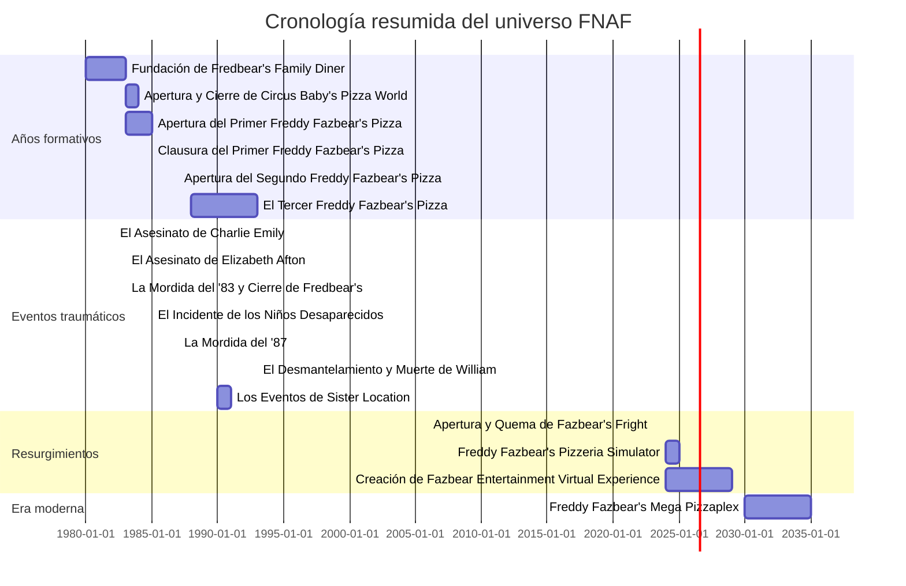

<!-- mi-wiki/index.md -->
<!-- Página principal de la mini-Wiki: FNAF -->

  

  <h1 style="margin:0; font-size:2.2rem;">🎮 Wiki FNAF — Five Nights at Freddy’s</h1>
  
Mini-Wiki interconectada: lore, cronología, animatrónicos, teorías y comunidad.

  

    
    
    
  

---

## 🔎 Descripción 
Esta mini-Wiki es una **colección interconectada de páginas** sobre *Five Nights at Freddy’s* (FNAF). El objetivo es ofrecer una referencia ordenada y navegable. El contenido está pensado para estudio, tener referencia rápida y para compartir con la comunidad fan.

---

## 📚 Índice

| | Artículo | Resumen rápido |
|---:|---|---|
| 🧭 | [Historia del Universo FNAF](articulo-1.md) | Orígenes de Fazbear Entertainment, cierres  y eventos fundacionales. |
| ⏳ | [Línea Temporal y Eventos Clave](articulo-2.md) | Cronología detallada con fechas clave y correlaciones entre juegos. |
| 🤖 | [Animatrónicos Principales](articulo-3.md) | Ficha técnica: comportamiento, apariciones y teorías sobre cada animatrónico. |
| 🕵️ | [Teorías Populares](articulo-4.md) | Análisis de las teorías más difundidas, evidencias y contra-evidencias. |
| 🌍 | [Impacto Cultural y Comunidad](articulo-5.md) | Influencia en YouTubers, fan-games, fanart y legado del juego a traves de los años. |

**⭐​ ​Artículo destacado del mes: ⭐​**  
➡️ **Historia del Universo FNAF** — ver [articulo-1.md](articulo-1.md) (banner y diseño especial en esa página).

---

## 📊 Estadísticas del mini-Wiki
| Métrica | Valor |
|---|---:|
| Total de artículos planificados | 5 |
| Palabras estimadas (total proyecto) | ~8.500 — 12.000 palabras |
| Diagramas Mermaid (en índice) | 2 |
| Diagramas Mermaid (estimado en artículos) | 10 (≈ 2 por artículo) |
| Tablas (en índice) | 2 |
| Bloques colapsables FAQ | 10 |

> Nota: estos números son estimados; cada artículo incluirá sus propios diagramas y tablas.

---

## 🗓 Últimas actualizaciones
- **2025-10-22** — Creación del `index.md` y estructura base de la mini-Wiki.  
- **2025-10-22** — Artículo destacado del mes configurado: `articulo-1.md`.  

---

## 🧭 Navegación rápida
- Ir a: [Historia del Universo FNAF](articulo-1.md) | [Línea Temporal](articulo-2.md) | [Animatrónicos](articulo-3.md)  
- Glosario: [glosario.md](glosario.md) — Referencias: [referencias.md](referencias.md)  
- Recursos (imágenes): `AEC-MD\recursos`

---

## 🧭 Timeline general del tema (Mermaid)

<<<<<<< HEAD
[↑ Volver arriba](#-índice)
=======
[↑ Volver arriba](#-índice)
>>>>>>> 86a7f2128f0560eae25a4150c13c9dd084cad1a1
