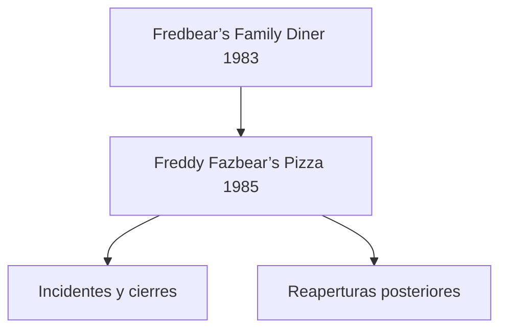
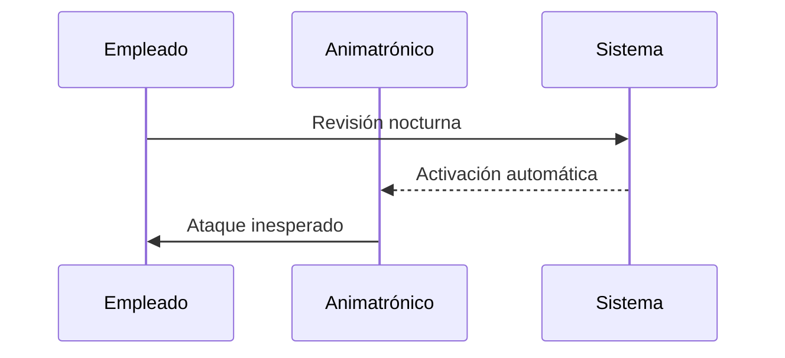

  

# 🧭 Historia del Universo FNAF

**Ruta:** Inicio > Lore > Historia del Universo  
📅 Creado: 2025-10-22 · 🔄 Última actualización: 2025-10-22  
🏷️ Etiquetas: #lore #historia #fnaf #scottcawthon 
⬅️ [Anterior: Introducción al universo FNAF](./Mini-Wiki.md)  
➡️ [Siguiente: Orígenes de Fazbear Entertainment](./articulo-2.md) 

---

## 🗂️ Contenidos
- [Introducción](#-introducción)
- [Orígenes de Fazbear Entertainment](#️-orígenes-de-fazbear-entertainment)
- [Eventos clave y cierres](#-eventos-clave-y-cierres)
- [La tecnología detrás del horror](#️-la-tecnología-detrás-del-horror)
- [Misterios sin resolver](#-misterios-sin-resolver)
- [Conclusión](#-conclusión)

---

## 🧩 Introducción
*Five Nights at Freddy’s* narra la historia de una cadena de restaurantes familiares donde los animatrónicos se vuelven mortales.  
El universo combina **misterio, tecnología y tragedia**, desarrollándose en múltiples líneas temporales y juegos conectados.  
Este artículo recopila los hechos principales y teorías canónicas [ver también](articulo-2.md).

---

## 🏗️ Orígenes de Fazbear Entertainment
### Fundadores
William Afton y Henry Emily fundan Fazbear Entertainment...

  

### Primer restaurante
El primero fue *Fredbear’s Family Diner*...
### Cierre inicial
Debido a incidentes, el local es clausurado...

  

---

## 💀 Eventos clave y cierres
- La Mordida del ‘83
Uno de los eventos más importantes en la saga...

  

- La Mordida del ‘87
Otro incidente clave que marca los juegos y la historia...
- Incendios y reaperturas
Cada intento de reabrir termina en tragedia...

|  Año | Evento         | Consecuencia               |
| :--: | :------------- | :------------------------- |
| 1983 | Mordida del 83 | Cierre temporal            |
| 1987 | Mordida del 87 | Despidos y miedo mediático |
| 1993 | Reapertura     | Nuevos animatrónicos       |
| 2023 | Reboot         | Nuevas generaciones        |

---

## ⚙️ La tecnología detrás del horror
- **Diseño animatrónico**
Los animatrónicos usan mecanismos Springlock...

  

- **IA y comportamiento**
Se teoriza que las almas poseen los robots...
**Errores fatales**
- Los trajes con mecanismos mixtos causan muertes

---

## 🧩 Misterios sin resolver
*¿Quién fue el niño del llanto?*
*¿Qué ocurrió realmente con Golden Freddy?*
*¿Cuál es el verdadero final de FNAF 6?*

Información adicional
 Se especula que algunos eventos ocurren en líneas temporales alternas 
 

Ejemplo detallado
 El incidente del “Security Puppet” es un punto clave en Pizzeria Simulator. 
 

Datos históricos
 El primer juego se lanzó el 8 de agosto de 2014 por Scott Cawthon. 

---

## 🧾 Conclusión

La saga FNAF mezcla terror psicológico y mecánicas simples con una narrativa fragmentada.
Más detalles en [Línea Temporal y Eventos Clave](articulo-2.md) y [Teorías Populares](articulo-4.md)

*Note: Esta cronología usa elementos canónicos y teorías basadas en la comunidad.*
*Warning: Spoilers de FNAF 1–6.*

---
 
[↑ Volver arriba](#-introducción)
## 🔗 Ver también

[Línea Temporal y Eventos Clave](articulo-2.md)

[Animatrónicos Principales](articulo-3.md)

[Teorías Populares](articulo-4.md)

[Impacto Cultural y Comunidad](articulo-5.md)

[Glosario](glosario.md)