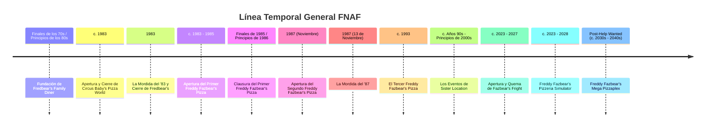

<<<<<<< HEAD
# ⏳ Línea Temporal y Eventos Clave

**Ruta:** Inicio > Cronología > Línea Temporal  
📅 Creado: 2025-10-22 · 🔄 Última actualización: 2025-10-22  
🏷️ Etiquetas: #timeline #eventos #cronología
⬅️ [Anterior: Historia del Universo FNAF](./articulo-1.md)  
➡️ [Siguiente: Animatrónicos Principales](./articulo-3.md) 

---

## 🧩 Introducción
Esta sección reconstruye los principales eventos del universo FNAF según orden cronológico...

*Note: La cronología oficial aún no ha sido confirmada por el autor.*

[Video para entender mejor](https://www.youtube.com/watch?v=3xotxtnAxiM)

[↑ Volver arriba](#-introducción)
=======
# ⏳ Línea Temporal y Eventos Clave

**Ruta:** Inicio > Cronología > Línea Temporal  
📅 Creado: 2025-10-22 · 🔄 Última actualización: 2025-10-22  
🏷️ Etiquetas: #timeline #eventos #cronología
⬅️ [Anterior: Historia del Universo FNAF](./articulo-1.md)  
➡️ [Siguiente: Animatrónicos Principales](./articulo-3.md) 

---

## 🧩 Introducción
Esta sección reconstruye los principales eventos del universo FNAF según orden cronológico...

*Note: La cronología oficial aún no ha sido confirmada por el autor.*

[Video para entender mejor](https://www.youtube.com/watch?v=3xotxtnAxiM)

[↑ Volver arriba](#-introducción)
>>>>>>> 86a7f2128f0560eae25a4150c13c9dd084cad1a1
