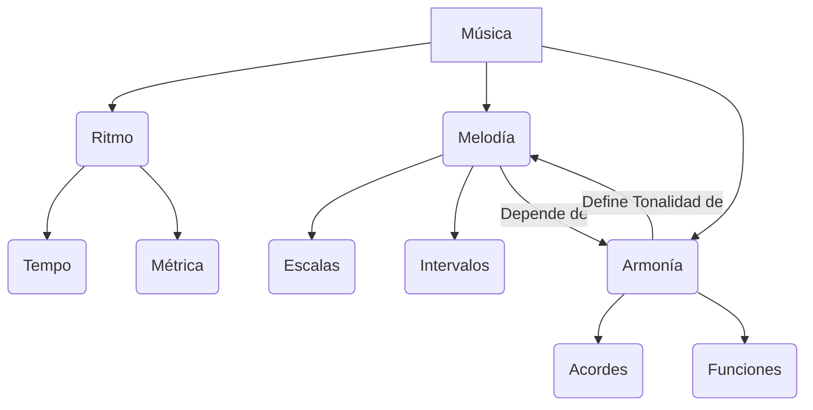
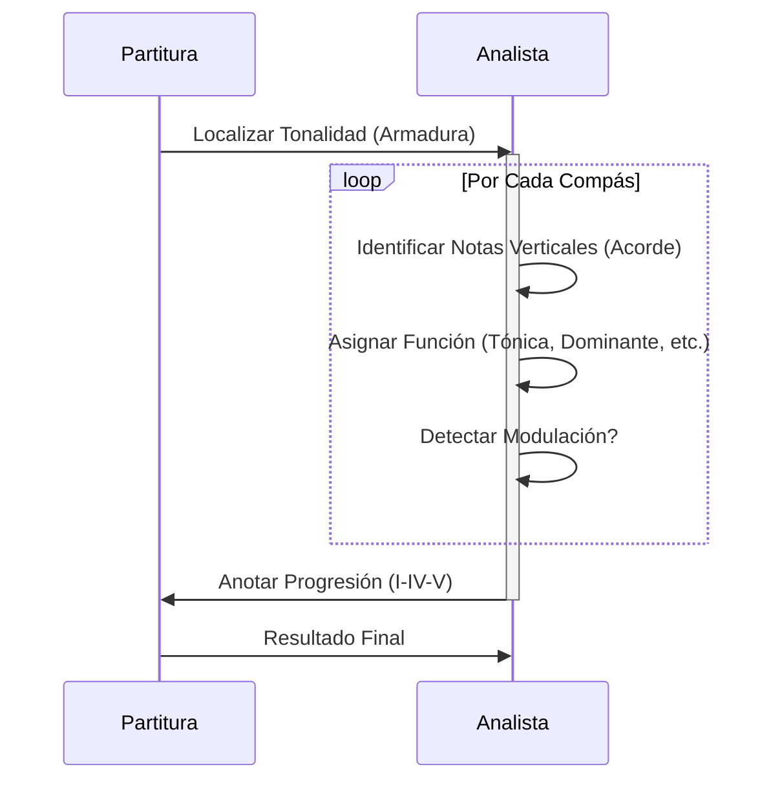

# 🎼 Teoría Musical: Los Pilares Fundamentales

> **Breadcrumb:** [Inicio](../AEC-MD/index.md) > Fundamentos > Teoría Musical

| **Info** | **Detalle** | 
| :--- | :--- | 
| **Fecha de Creación** | 2025-10-25 | 
| **Última Actualización** | 2025-10-25 | 
| **Tiempo de Lectura** | 10 min | 
| **Etiquetas/Tags** | \#Armonía \#Melodía \#Ritmo \#Clásica \#Escalas \#TeoríaMusical |

---

## Tabla de Contenidos
1. [Introducción a la Sintaxis Musical](../AEC-MD/articulo-1.md#1-introducción-a-la-sintaxis-musical)
2. [El Sistema Tonal y las Escalas](../AEC-MD/articulo-1.md#2-el-sistema-tonal-y-las-escalas)
   - [Escalas Mayores y Menores](../AEC-MD/articulo-1.md#21-escalas-mayores-y-menores)
   - [La Escala Pentatónica](../AEC-MD/articulo-1.md#22-la-escala-pentatónica)
   - [Modos Griegos](../AEC-MD/articulo-1.md#23-modos-griegos)
3. [La Armonía: Acordes y Funciones](../AEC-MD/articulo-1.md#3-la-armonía-acordes-y-funciones)
   - [Tríadas y Cuatríadas](../AEC-MD/articulo-1.md#31-tríadas-y-cuatríadas)
   - [Cadenas Armónicas Comunes](../AEC-MD/articulo-1.md#32-cadenas-armónicas-comunes)
   - [Tensión y Resolución](../AEC-MD/articulo-1.md#33-tensión-y-resolución)
4. [Ritmo, Tempo y Métrica](../AEC-MD/articulo-1.md#4-ritmo-tempo-y-métrica)
   - [Compases Simples y Compuestos](../AEC-MD/articulo-1.md#41-compases-simples-y-compuestos)
   - [Síncopa y Polirritmia](../AEC-MD/articulo-1.md#42-síncopa-y-polirritmia)
   - [Groove y Feeling](../AEC-MD/articulo-1.md#43-groove-y-feeling)
5. [Análisis y Composición](../AEC-MD/articulo-1.md#5-análisis-y-composición)
   - [Análisis de la Forma](../AEC-MD/articulo-1.md#51-análisis-de-la-forma)
   - [Técnicas de Modulación](../AEC-MD/articulo-1.md#52-técnicas-de-modulación)
   - [Contrapunto Básico](../AEC-MD/articulo-1.md#53-contrapunto-básico)
6. [Tablas Resumen y Comparativas](../AEC-MD/articulo-1.md#6-tablas-resumen-y-comparativas)
7. [Notas y Referencias](../AEC-MD/articulo-1.md#7-notas-y-referencias)
8. [Ver También](../AEC-MD/articulo-1.md#8-ver-también)

---

## 1. Introducción a la Sintaxis Musical

La teoría musical no es un conjunto de reglas inmutables, sino el **lenguaje y la sintaxis** que utilizamos para describir y predecir los patrones del sonido que resultan agradables o significativos para el oído humano. Es el esqueleto conceptual sobre el que se construye toda composición, desde una sinfonía de Beethoven hasta un *beat* de Hip-Hop. **Entender la teoría** nos permite no solo leer partituras, sino también comprender por qué ciertas notas combinan para evocar emociones específicas, cómo funciona la tensión armónica, y por qué el ritmo es la fuerza motriz que nos hace movernos.  
La música se define por tres pilares fundamentales que interactúan constantemente: **melodía** (la secuencia de notas), **armonía** (la combinación vertical de notas, es decir, los acordes), y **ritmo** (la organización de los sonidos en el tiempo). Sin estos tres componentes, el sonido organizado se convierte, simplemente, en ruido.  

> [!TIP]
> Recuerda que *aprender teoría musical no te limita*, sino que amplía tu capacidad creativa y expresiva. Usa la teoría como una guía, no como una prisión sonora.

> [!NOTE]
> La Teoría Musical, tal como se enseña en Occidente, se centra principalmente en el **Sistema Tonal**, que se consolidó durante el periodo Barroco. Sin embargo, muchas culturas orientales y africanas utilizan sistemas modales o microtonales.

En este artículo exploraremos los **fundamentos tonales, armónicos, rítmicos y compositivos**, haciendo conexiones con otros temas del wiki como [🎷 Géneros Clave y Evolución](../AEC-MD/articulo-2.md), [🌊 Acústica y Ondas](../AEC-MD/articulo-4.md), o el [📜 Glosario Técnico](../AEC-MD/glosario.md).

---

## 2. El Sistema Tonal y las Escalas

El sistema tonal se basa en la idea de que una nota (la *tónica* [glosario.md#Armadura]) actúa como centro de gravedad.

### 2.1. Escalas Mayores y Menores
| **Escala** | **Fórmula de Intervalos (T/S)** | **Tercera Clave** | **Uso Emocional** | **Alineación** |
| :--- | :--- | :---: | ---: | :---: |
| Mayor | T T S T T T S | Mayor | Alegría, Optimismo | Derecha |
| Menor Natural | T S T T S T T | Menor | Tristeza, Melancolía | Izquierda |
| Menor Armónica | T S T T S **T+S** S | Menor | Exótica, Dramática | Centro |

### 2.2. La Escala Pentatónica
La pentatónica (5 notas) es la escala más universal. Consulta [Sabías Que...](../AEC-MD/index.md#sabías-que) para más información histórica.

### 2.3. Modos Griegos
Los modos son variaciones de las escalas mayores, creadas al iniciar la escala en un grado diferente.  

> [!IMPORTANT]
> Los **modos griegos** (jónico, dórico, frigio, lidio, mixolidio, eólico y locrio) son la base de muchos estilos contemporáneos como el jazz modal o el folk europeo.

---

## 3. La Armonía: Acordes y Funciones

La armonía es el arte de combinar sonidos simultáneos. Los acordes básicos se construyen apilando intervalos de tercera.

### 3.1. Tríadas y Cuatríadas
Una tríada consta de Tónica, Tercera y Quinta. Una cuatríada añade la Séptima, fundamental para el Jazz y los [Géneros Clave](articulo-2.md).

> ⚠️ **Peligro de Voz Guía:** Evita los "paralelismos" de quintas u octavas al analizar la conducción de voces.

### 3.2. Cadenas Armónicas Comunes
La progresión I-IV-V-I es la más fundamental en la música tonal. Otras progresiones comunes incluyen II-V-I, o I-VI-II-V en la música pop.

### 3.3. Tensión y Resolución
| **Función Armónica** | **Acorde Clave** | **Sensación** | **Resolución Natural** |
| :--- | :--- | :--- | :--- |
| **Tónica (I)** | Mayor/Menor | Estabilidad, Casa | Ninguna |
| **Subdominante (IV)** | Mayor/Menor | Movimiento, Viaje | Dominante o Tónica |
| **Dominante (V)** | Séptima (V7) | Tensión, Inestabilidad | Tónica (I) |

---

## 4. Ritmo, Tempo y Métrica

El ritmo es la dimensión temporal de la música.  

### 4.1. Compases Simples y Compuestos
El compás simple (ej: 4/4) divide el tiempo en dos partes, el compuesto (ej: 6/8) lo hace en tres.

### 4.2. Síncopa y Polirritmia
La síncopa es la acentuación de una parte débil del compás. La polirritmia es la superposición de diferentes métricas, muy común en [Música Electrónica](articulo-2.md#subgéneros-de-la-electrónica).

### 4.3. Groove y *Feeling*
El *groove* es el elemento rítmico intangible que define el estilo de la interpretación.  
Ejemplo en código inline: `swing feel` = ligera anticipación del segundo y cuarto tiempo.

---

## 5. Análisis y Composición

### 5.1. Análisis de la Forma
El análisis de la forma (ej: AABA) ayuda a entender la estructura de la pieza.

### 5.2. Técnicas de Modulación
La [Modulación](../AEC-MD/glosario.md#Modulación) es clave para dar variedad y dinamismo a una obra.

### 5.3. Contrapunto Básico
El arte de combinar dos o más líneas melódicas independientes.

---

## 6. Tablas Resumen y Comparativas

| **Elemento** | **Melodía** | **Armonía** | **Ritmo** |
| :-- | :-- | :-- | :-- |
| Función | Línea principal | Soporte vertical | Estructura temporal |
| Ejemplo | Voz, Solo | Acordes | Percusión |
| Dimensión | Horizontal | Vertical | Temporal |
| Importancia | Alta | Media-Alta | Vital |
| Asociación Emocional | Narrativa | Profundidad | Energía |

| **Compositor** | **Periodo** | **Estilo Armónico** |
| :--: | :--: | :--: |
| Bach | Barroco | Contrapuntístico |
| Mozart | Clásico | Tonal Claro |
| Debussy | Impresionista | Modal |
| Coltrane | Moderno | Jazz Modal |
| Hans Zimmer | Contemporáneo | Cinemático |

**Tabla de Conclusión**
| **Concepto** | **Conclusión Principal** |
| :--- | :--- |
| Tonalidad | Da coherencia al discurso musical. |
| Ritmo | Define identidad y movimiento. |
| Armonía | Crea profundidad emocional. |
| Escalas | Determinan color melódico. |
| Forma | Da unidad estructural a la obra. |

---
### Elementos Visuales: 

#### Diagrama Conceptual: Componentes Fundamentales de la Música

#### Diagrama de Proceso: Análisis Armónico de una Pieza

---
### Elementos Interactivos: Bloques Colapsables

Información adicional: El Círculo de Quintas

 

El Círculo de Quintas es la herramienta visual más importante en la teoría musical para entender la relación entre las tonalidades.

| **Tonalidad** | **Sostenidos (#)** | **Bemoles (b)** |
| :---: | :---: | :---: |
| C Mayor / Am | 0 | 0 |
| G Mayor / Em | 1 | 0 |
| F Mayor / Dm | 0 | 1 |
| D Mayor / Bm | 2 | 0 |
| Bb Mayor / Gm | 0 | 2 |

Ejemplo Detallado: Progresión II-V-I en Jazz

 

La progresión **II-V-I** es la columna vertebral del Jazz.

En Do Mayor (C), los acordes son:
* II menor 7: Dm7
* V dominante 7: G7
* I Mayor 7: CMaj7

El movimiento de las notas guías (tercera y séptima) entre Dm7 y G7 es lo que le da su fuerte sensación de resolución.

Contexto: Orígenes de la Notación

La notación musical moderna tiene sus raíces en los cantos gregorianos de la Edad Media. Fue Guido d'Arezzo quien, alrededor del siglo XI, desarrolló el sistema de cuatro líneas y las sílabas (Ut/Do, Re, Mi, Fa, Sol, La) que usamos hoy en día.

## 6. Notas y Referencias

> **Bloque de Cita 1:** "La armonía es la lógica de la composición, y el ritmo, su vida." 

> **Bloque de Cita 2:** "La música es la aritmética de los sonidos, la geometría de los ritmos." - Claude Debussy

> **Bloque de Cita 3:** El acorde de séptima de dominante (V7) es el elemento armónico más poderoso y funcional para establecer una tonalidad. (Ver [Glosario Técnico](../AEC-MD/glosario.md#Tonalidad)).

### Referencias Utilizadas
* [1] Schoenberg, A. (1911). Teoría de la Armonía.
* [2] Johnson, T. (2020). The Evolution of Popular Music Genres.
* [3] https://www.musictheory.net 
* [4] https://openmusictheory.com 
* [5] https://www.teoria.com 

## 7. Ver También

* [🌊 Acústica y Ondas](../AEC-MD/articulo-4.md)
* [🎷 Géneros Clave y Evolución](../AEC-MD/articulo-2.md)
* [📜 Glosario Técnico](../AEC-MD/glosario.md)
* [🎹 Instrumentación y Timbre](../AEC-MD/articulo-5.md)
* [🎧 Producción y Mezcla Moderna](../AEC-MD/articulo-6.md)

---
← [Anterior: Glosario Técnico](../AEC-MD/glosario.md) | [Siguiente: Géneros Clave y Evolución](../AEC-MD/articulo-2.md) →
↑ [Volver arriba](#teoría-musical-los-pilares-fundamentales)
