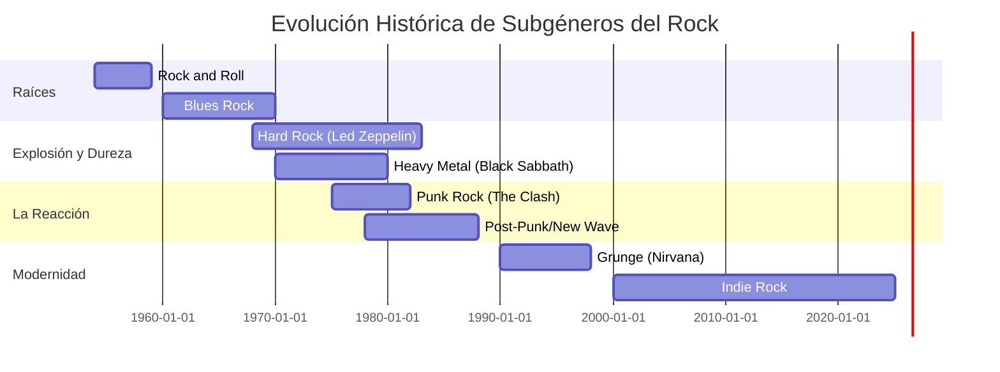
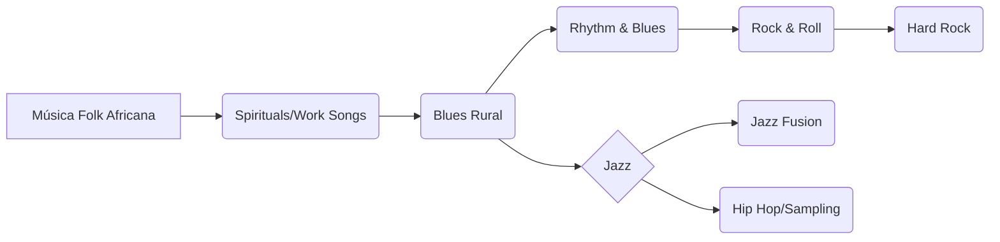
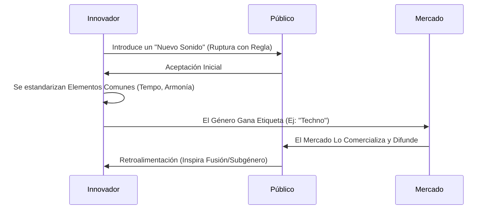

# 🎷 Géneros Clave y Evolución Histórica

> **Breadcrumb:** [Inicio](../AEC-MD/index.md) > Estilos > Géneros y Estilos

| **Info** | **Detalle** | 
| :--- | :--- | 
| **Fecha de Creación** | 2025-10-25 | 
| **Última Actualización** | 2025-10-25 | 
| **Tiempo de Lectura** | 12 min | 
| **Etiquetas/Tags** | \#Rock \#Jazz \#Electrónica \#Clásica \#Historia |

## Tabla de Contenidos

1.  [Introducción a la Clasificación Musical](../AEC-MD/articulo-2.md#introducción-a-la-clasificación-musical)
2.  [Jazz: La Fusión de Culturas](../AEC-MD/articulo-2.md#jazz-la-fusión-de-culturas)
    * [Orígenes en el Blues y Ragtime](../AEC-MD/articulo-2.md#orígenes-en-el-blues-y-ragtime)
    * [Subgéneros Clave (Bebop, Cool, Fusion)](../AEC-MD/articulo-2.md#subgéneros-clave-bebop-cool-fusion)
    * [La Importancia de la Improvisación](../AEC-MD/articulo-2.md#la-importancia-de-la-improvisación)
3.  [Rock y Pop: El Dominio de las Masas](../AEC-MD/articulo-2.md#rock-y-pop-el-dominio-de-las-masas)
    * [Diferencias entre Rock y Pop](../AEC-MD/articulo-2.md#diferencias-entre-rock-y-pop)
    * [Evolución del Rock (Hard Rock, Punk, Grunge)](../AEC-MD/articulo-2.md#evolución-del-rock-hard-rock-punk-grunge)
    * [Estructura Típica de la Canción Pop](../AEC-MD/articulo-2.md#estructura-típica-de-la-canción-pop)
4.  [Música Electrónica (EDM): El Ritmo Sintético](../AEC-MD/articulo-2.md#música-electrónica-edm-el-ritmo-sintético)
    * [Herramientas: Sintetizadores y Cajas de Ritmos](../AEC-MD/articulo-2.md#herramientas-sintetizadores-y-cajas-de-ritmos)
    * [Subgéneros de la Electrónica (Techno, House, Trance)](../AEC-MD/articulo-2.md#subgéneros-de-la-electrónica-techno-house-trance)
    * [Impacto en la Producción Moderna](../AEC-MD/articulo-2.md#impacto-en-la-producción-moderna)
5.  [La Música Clásica y sus Periodos](../AEC-MD/articulo-2.md#la-música-clásica-y-sus-periodos)
    * [Barroco y Contrapunto](../AEC-MD/articulo-2.md#barroco-y-contrapunto)
    * [Clasicismo y Forma Sonata](../AEC-MD/articulo-2.md#clasicismo-y-forma-sonata)
    * [Romanticismo y Expresión](../AEC-MD/articulo-2.md#romanticismo-y-expresión)
6.  [Notas y Referencias](../AEC-MD/articulo-2.md#notas-y-referencias)
7.  [Ver También](../AEC-MD/articulo-2.md#ver-también)

## 1. Introducción a la Clasificación Musical

Clasificar la música por géneros y estilos es un ejercicio necesario pero inherentemente imperfecto. El género sirve como una **etiqueta cultural** que agrupa obras musicales basadas en convenciones compartidas como instrumentación, tempo, estructura armónica, y contexto social o geográfico. Sin embargo, la historia musical es una red compleja de **influencias cruzadas** y [Modulación](../AEC-MD/glosario.md#Modulación) estilística. El Rock'n'Roll, por ejemplo, es una clara amalgama del *Rhythm and Blues* (R&B) afroamericano y la música *Country* de origen europeo. De hecho, los géneros no son cajas estancas, sino puntos en un **continuo evolutivo**, donde la innovación siempre nace de la ruptura o la fusión de las tradiciones existentes. La proliferación de subgéneros desde la era digital (ver [Historia del Sonido Grabado](../AEC-MD/articulo-5.md)) ha complicado aún más la tarea, con términos como *Chillwave*, *Deathcore* o *Afrobeat* que reflejan micro-tendencias específicas. Este artículo explora los géneros fundamentales que han definido el paisaje sonoro moderno, analizando sus características clave y la manera en que se relacionan con la [Teoría Musical](../AEC-MD/articulo-1.md) para establecer sus identidades únicas. Comprender el contexto de cada estilo es crucial para cualquier [Producción de Audio](../AEC-MD/articulo-3.md) exitosa, ya que el ingeniero debe adaptar sus técnicas al *sonido* esperado de cada género.

> [!TIP]
> Al intentar identificar un género, presta atención a la instrumentación (¿guitarra eléctrica o sintetizador?) y al patrón rítmico (¿un *swing* de Jazz o un pulso de *cuatro en el suelo*?).

## 2. Jazz: La Fusión de Culturas

El Jazz nació a principios del siglo XX en Nueva Orleans, Louisiana.

### 2.1. Orígenes en el Blues y Ragtime

El Blues proporcionó la estructura armónica y melódica (la escala de Blues, las progresiones I-IV-V), mientras que el Ragtime aportó la complejidad rítmica.

### 2.2. Subgéneros Clave (Bebop, Cool, Fusion)

| **Subgénero** | **Década** | **Tempo** | **Características Clave** |
| :---: | :---: | :---: | :---: |
| Swing | 1930s | Medio-Rápido | Big Band, ritmo bailable, arreglo preestablecido. |
| Bebop | 1940s | Rápido | Pequeños grupos, improvisación virtuosa y compleja. |
| Cool Jazz | 1950s | Lento-Medio | Mayor énfasis en la melodía y el timbre, introspección. |
| Fusion | 1970s | Mixto | Mezcla con Rock, uso de instrumentos eléctricos y efectos. |

### 2.3. La Importancia de la Improvisación

La improvisación es el alma del Jazz, donde los músicos crean melodías instantáneas sobre una estructura armónica predefinida.

## 3. Rock y Pop: El Dominio de las Masas

Ambos géneros comparten raíces en el Blues y el R&B, pero se separaron por sus objetivos.

### 3.1. Diferencias entre Rock y Pop

| Característica | Rock (Alineación Derecha) | Pop (Alineación Centro) | Pop (Alineación Izquierda) |
| :---: | ---: | :---: | :--- |
| **Objetivo** | Autenticidad, Expresión | Comercial, Viralidad | Experimentación, Nicho |
| **Instrumentación** | Guitarra, Bajo, Batería | Sintetizadores, Voz procesada | Base electrónica, Samplers |
| **Armonía** | Simple (Tríadas) | Sencilla y repetitiva | Simple (Tríadas) |
| **Duración** | Variable (3-8 min) | Corta (2:30-4 min) | Larga (5-10 min) |

> [!WARNING]
> Es un error común confundir **Rock Alternativo** con **Pop**. El Rock Alternativo (como el Grunge) prioriza la textura, la intensidad y la actitud sobre la estructura de radiofórmula del Pop.

### 3.2. Evolución del Rock (Hard Rock, Punk, Grunge)

#### Cronología del Rock 

### 3.3. Estructura Típica de la Canción Pop

La estructura A-B-A-B-C-B (Verso-Estribillo-Verso-Estribillo-Puente-Estribillo) es la más utilizada debido a su predictibilidad.

## 4. Música Electrónica (EDM): El Ritmo Sintético

Nacida de la experimentación con tecnología de sonido.

### 4.1. Herramientas: Sintetizadores y Cajas de Ritmos

El uso del **sintetizador** (un código inline: `synth`) y la [DAW](../AEC-MD/glosario.md#DAW) son obligatorios.

### 4.2. Subgéneros de la Electrónica (Techno, House, Trance)

| **Subgénero** | **BPM Típico** | **Origen Geográfico** | **Elemento Clave** |
| :--- | :---: | :---: | :--- |
| House | 120 - 130 | Chicago, EE. UU. | Ritmo *Four-on-the-floor*, bajos profundos. |
| Techno | 125 - 150 | Detroit, EE. UU. | Repetición, sonido industrial, minimalismo. |
| Trance | 128 - 145 | Europa (Alemania/Países Bajos) | Arpegios, síntesis melódica, "build-ups". |
| Ambient | < 100 | Reino Unido | Texturas, falta de ritmo fuerte, [Reverberación](../AEC-MD/glosario.md#Reverberación). |
| Dubstep | 140 (mitad de tiempo) | Londres, RU | *Wobble bass*, ritmos sincopados. |

### 4.3. Impacto en la Producción Moderna

La producción electrónica influyó en la [Producción de Audio](../AEC-MD/articulo-3.md) de otros géneros, haciendo de la manipulación tímbrica un arte.

## 5. La Música Clásica y sus Periodos

La base de la música occidental (ver [Teoría Musical](../AEC-MD/articulo-1.md)).

### 5.1. Barroco y Contrapunto

J.S. Bach. Énfasis en líneas melódicas entrelazadas.

### 5.2. Clasicismo y Forma Sonata

Mozart, Haydn. Claridad, equilibrio y la forma sonata.

### 5.3. Romanticismo y Expresión

Beethoven, Chopin. Máxima expresión emocional y uso de la [Modulación](../AEC-MD/glosario.md#Modulación) para el drama.

---
### Elementos Visuales: Diagramas Mermaid

#### Diagrama Conceptual: Influencia del Blues

#### Diagrama de Proceso: Ciclo de Creación de un Género

---
### Elementos Interactivos: Bloques Colapsables

Información adicional: El Sistema de Modos en Jazz

 

El Jazz moderno, influenciado por Miles Davis, a menudo abandona el sistema tonal clásico por la **armonía modal**. En lugar de progresiones de acordes (II-V-I), el foco se pone en improvisar sobre un solo acorde o modo durante períodos prolongados (ejemplo: *So What* usa el Modo Dórico y el Modo Eolio). Esto proporciona más libertad melódica.

Ejemplo Detallado: El *Shuffle* de Blues

 

El *shuffle* es un ritmo ternario (tresillo) tocado con la notación de corcheas, donde la primera corchea dura el doble que la segunda (código inline: `swing feel`). Esto da ese característico "rebote" al Blues.

Datos Históricos: La Invasión Británica

 

La **Invasión Británica** de los años 60 (The Beatles, The Rolling Stones) fue cuando bandas británicas tomaron el R&B y el Blues de EE. UU. y lo reinterpretaron con una nueva energía, vendiéndolo de vuelta a la audiencia americana, definiendo el Rock moderno.

## 6. Notas y Referencias

> **Bloque de Cita 1:** "El Blues es la raíz, y todo lo demás es fruto." - Willie Dixon 

> **Bloque de Cita 2:** La música pop, por su propia naturaleza, busca la máxima [Reverberación](../AEC-MD/glosario.md#Reverberación) y accesibilidad, utilizando estructuras predecibles para la radio. 

> **Bloque de Cita 3:** La clave del Hip Hop reside en el concepto de *sampling*, es decir, tomar fragmentos de grabaciones existentes (Ver [Historia del Sonido Grabado](../AEC-MD/articulo-5.md)).

### Referencias Utilizadas
* [1] O’Dair, B. (2001). The Rolling Stone Encyclopedia of Rock & Roll.
* [2] Johnson, T. (2020). The Evolution of Popular Music Genres. 
* [3] YouTube Channel. (2022). Recording Studio Setup Guide. 

## 7. Ver También

* [🎼 Teoría Musical: Los Pilares](../AEC-MD/articulo-1.md)
* [🎚️ Producción de Audio Moderna](../AEC-MD/articulo-3.md)
* [🕰️ Historia del Sonido Grabado](../AEC-MD/articulo-5.md)
* [📜 Glosario Técnico](../AEC-MD/glosario.md)

---
← [Anterior: Teoría Musical](../AEC-MD/articulo-1.md) | [Siguiente: Producción de Audio Moderna](../AEC-MD/articulo-3.md) →
<[↑ Volver arriba](../AEC-MD/#géneros-clave-y-evolución-histórica)

