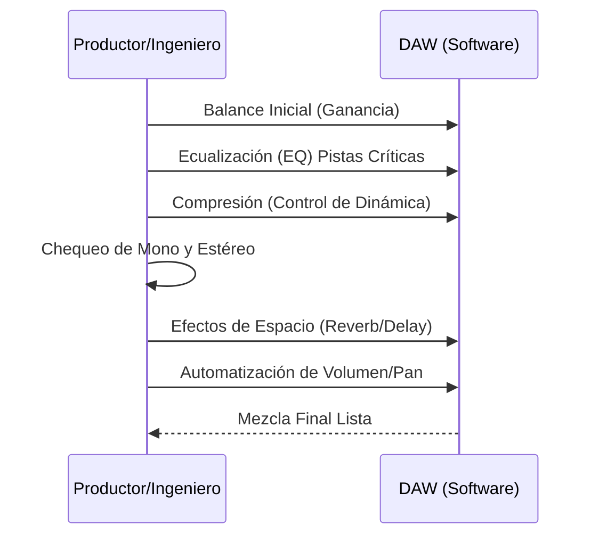

# 🎚️ Producción de Audio Moderna: Del Micrófono al Master

> **Breadcrumb:** [Inicio](../AEC-MD/index.md) > Aplicaciones > Producción de Audio

| **Info** | **Detalle** | 
| :--- | :--- | 
| **Fecha de Creación** | 2025-10-25 | 
| **Última Actualización** | 2025-10-25 | 
| **Tiempo de Lectura** | 15 min | 
| **Etiquetas/Tags** | \#Mezcla \#Masterización \#DAW \#HomeStudio \#Grabación |

## Tabla de Contenidos

1.  [Introducción al Proceso de Producción](../AEC-MD/articulo-3.md#introducción-al-proceso-de-producción)
2.  [Fase de Grabación y Captura](../AEC-MD/articulo-3.md#fase-de-grabación-y-captura)
    * [Tipos de Micrófonos](../AEC-MD/articulo-3.md#tipos-de-micrófonos)
    * [La Cadena de Señal Analógica](../AEC-MD/articulo-3.md#la-cadena-de-señal-analógica)
    * [Entornos de Grabación](../AEC-MD/articulo-3.md#entornos-de-grabación)
3.  [Fase de Edición y Arreglo](../AEC-MD/articulo-3.md#fase-de-edición-y-arreglo)
    * [Quantización y Corrección Tonal](../AEC-MD/articulo-3.md#quantización-y-corrección-tonal)
    * [El Uso de la DAW](../AEC-MD/articulo-3.md#el-uso-de-la-daw)
    * [Diseño Sonoro (*Sound Design*)](../AEC-MD/articulo-3.md#diseño-sonoro-sound-design)
4.  [Fase de Mezcla: El Arte del Balance](../AEC-MD/articulo-3.md#fase-de-mezcla-el-arte-del-balance)
    * [Ecualización y Filtrado](../AEC-MD/articulo-3.md#ecualización-y-filtrado)
    * [Procesamiento Dinámico](../AEC-MD/articulo-3.md#procesamiento-dinámico)
    * [Efectos de Espacio y Tiempo](../AEC-MD/articulo-3.md#efectos-de-espacio-y-tiempo)
5.  [Fase de Masterización: El Estándar Final](../AEC-MD/articulo-3.md#fase-de-masterización-el-estándar-final)
    * [Limitación y Nivel de Loudness](../AEC-MD/articulo-3.md#limitación-y-nivel-de-loudness)
    * [Preparación para Distribución](../AEC-MD/articulo-3.md#preparación-para-distribución)
    * [Consideraciones Acústicas](../AEC-MD/articulo-3.md#consideraciones-acústicas)
6.  [Notas y Referencias](../AEC-MD/articulo-3.md#notas-y-referencias)
7.  [Ver También](../AEC-MD/articulo-3.md#ver-también)

## 1. Introducción al Proceso de Producción

La producción musical moderna es un proceso multifacético que transforma una idea bruta en un producto pulido, listo para el consumo global. Este proceso va mucho más allá de simplemente grabar, abarcando la composición, el arreglo, la ingeniería de sonido y, en la era digital, la programación. El ingeniero o productor actúa como un puente entre la visión artística y la realidad [Acústica y Ondas](../AEC-MD/articulo-4.md), asegurando que cada elemento, desde el bombo hasta la voz, ocupe su propio espacio definido en el panorama estéreo y de frecuencias. La piedra angular de este proceso es la **DAW** [../AEC-MD/glosario.md#DAW] (*Digital Audio Workstation*), que ha democratizado la producción, permitiendo que cualquiera con una computadora y una interfaz de audio pueda crear un [Home Studio](../AEC-MD/glosario.md#Home-Studio) con calidad profesional. Sin embargo, la tecnología solo es una herramienta; la verdadera magia reside en el entendimiento de la [Teoría` Musical](../AEC-MD/articulo-1.md) y la aplicación hábil de técnicas de **Ecualización** y [Compresión](glosario.md#Compresión). Este artículo desglosa las tres etapas principales: Grabación, Mezcla y Masterización, siguiendo los principios de  para lograr un sonido competitivo y profesional, independientemente del [Géneros Clave](../AEC-MD/articulo-2.md) que se esté trabajando.

## 2. Fase de Grabación y Captura

La calidad de la grabación es el límite superior de la calidad final.

### 2.1. Tipos de Micrófonos

Se utilizan dos tipos principales: dinámicos (robustez, para fuentes ruidosas) y de condensador (sensibilidad, para voces y detalles).

> [!TIP]  
> Usa micrófonos dinámicos para percusión y condensadores para voces principales o instrumentos acústicos para capturar todos los matices.

### 2.2. La Cadena de Señal Analógica`

La señal va del micrófono al preamplificador, al convertidor A/D (analógico a digital) y finalmente a la [DAW](../AEC-MD/glosario.md#DAW).

#### Diagrama Conceptual: Cadena de Señal en el Estudio

### 2.3. Entornos de Grabación

La sala debe estar tratada acústicamente para minimizar reflejos indeseados (Ver [Acústica y Ondas](../AEC-MD/articulo-4.md)).

>[!WARNING]
>Evita grabar en habitaciones sin tratamiento acústico. Reflejos y resonancias indeseadas pueden arruinar la grabación desde la fuente.

## 3. Fase de Edición y Arreglo

### 3.1. Quantización y Corrección Tonal

Ajustar el tiempo (quantización) y la afinación (corrección tonal) de las pistas.

>[!TIP]
> La quantización ayuda a sincronizar instrumentos, pero no abuses de ella para no perder sensación orgánica.

### 3.2. El Uso de la DAW

La DAW (ej. Pro Tools, Ableton, Logic) es el centro de control.

### 3.3. Diseño Sonoro (*Sound Design*)

Creación de texturas y sonidos que no provienen de instrumentos tradicionales. Es fundamental en [Música Electrónica](../AEC-MD/articulo-2.md#música-electrónica-edm-el-ritmo-sintético).

## 4. Fase de Mezcla: El Arte del Balance

La mezcla es el balance de volumen, frecuencia, dinámica y espacio.

### 4.1. Ecualización y Filtrado

La [Ecualización (EQ)](../AEC-MD/glosario.md#Ecualización (EQ)) se utiliza para corregir deficiencias y crear espacio para cada instrumento.

| **Tipo de EQ** | **Ajuste** | **Ventajas** | **Uso Típico** |
| :--- | :--- | :--- | :--- |
| **Paramétrico** | Frecuencia, Ganancia, Q | Control quirúrgico total. | Corrección precisa de resonancias. |
| **Gráfico** | Bandas fijas | Rápido, visual. | Ajuste general de la curva tonal. |
| **Paso Alto (HPF)** | Frecuencia de corte | Elimina frecuencias subgraves. | Eliminar *rumble* en voces. |

### 4.2. Procesamiento Dinámico

La **Compresión** [glosario.md#Compresión] (reducir el rango dinámico) y la limitación (evitar picos).

> [!NOTE]
> La compresión excesiva puede "aplastar" la señal, eliminando el impacto y el *punch* que la hacen sonar viva. Úsala con moderación.

### 4.3. Efectos de Espacio y Tiempo

*Delay* y [Reverberación](../AEC-MD/glosario.md#Reverberación) para simular espacios y añadir profundidad.

## 5. Fase de Masterización: El Estándar Final

La masterización es el paso final.

### 5.1. Limitación y Nivel de Loudness

El **limitador** asegura que la música no exceda 0 dBFS (código inline: `digital ceiling`) y cumple con los estándares de *loudness* (LUFS).

### 5.2. Preparación para Distribución

Preparar diferentes formatos (WAV, FLAC, MP3) y asegurar el correcto *dither* y *noise shaping*.

### 5.3. Consideraciones Acústicas

El ingeniero de masterización debe trabajar en un entorno [Acústica y Ondas](../AEC-MD/articulo-4.md) totalmente controlado y con monitores de referencia.

---
### Elementos Visuales: Diagramas Mermaid

#### Diagrama de Proceso: Flujo de Trabajo de Mezcla (Sequence)

#### Tabla de Datos: Rangos de Frecuencia Clave

| Rango de Frecuencia | Hz (Aprox.) | Función Psicoacústica | Instrumento Típico |
| :---: | :---: | :--- | :---: |
| Subgraves | 20 - 60 Hz | Poder, Ruido sísmico | Bombo, Subwoofer |
| Graves | 60 - 250 Hz | Calor, Cuerpo, Fundamento | Bajo, Tuba, Guitarra rítmica |
| Medios Bajos | 250 - 500 Hz | "Barro" si es excesivo, Claridad | Voz (Cuerpo), Violonchelo |
| Medios Altos | 2 kHz - 4 kHz | Presencia, Inteligibilidad del habla | Voz (Articulación), Trompeta |
| Agudos | 6 kHz - 20 kHz | Aire, Brillo, Detalle | Platillos, Armónicos, Silbidos |

#### Tabla de Resumen: Fases de la Producción

| Fase | Objetivo Principal | Herramientas Clave |
| :--- | :--- | :--- |
| **Pre-Producción** | Planificación y Composición | Instrumentos, [Teoría Musical](../AEC-MD/articulo-1.md) |
| **Grabación** | Capturar el mejor sonido fuente | Micrófonos, Preamplificadores |
| **Mezcla** | Balancear y dar coherencia al sonido | EQ, Compresión, [DAW](../AEC-MD/glosario.md#DAW) |
| **Masterización** | Cumplir con los estándares de distribución | Limitador, Medidor de LUFS |

---
### Elementos Interactivos: Bloques Colapsables

Información adicional: El Filtro de Paso Alto (HPF)

 

El HPF (High-Pass Filter) es quizás la herramienta de EQ más importante. Al cortar frecuencias muy bajas en instrumentos que no las necesitan (como una voz), se libera espacio para el bajo y el bombo, mejorando drásticamente la claridad y el *headroom* de la mezcla.

Ejemplo Detallado: Uso de Compresión Paralela

 

La compresión paralela (o compresión New York) es una técnica donde se mezcla una señal sin comprimir con una versión extremadamente comprimida de la misma. Esto añade densidad y pegada a los tambores sin sacrificar completamente la dinámica natural de la pista.

Contexto: El "Loudness War" (Guerra del Volumen)

 

Desde los años 90, los ingenieros compitieron para hacer sus grabaciones lo más ruidosas posible, sacrificando el rango dinámico. Plataformas como Spotify y Apple Music ahora utilizan la medición LUFS (código inline: `Loudness Units Full Scale`) para normalizar el volumen, poniendo fin (o al menos moderando) esta práctica dañina.

## 6. Notas y Referencias

> **Bloque de Cita 1:** "La mezcla es el 80% del trabajo, la masterización es el 20% que lo hace funcionar en la radio." 

> **Bloque de Cita 2:** La clave para un buen bajo es el balance entre los **graves** (fuerza) y los **medios-bajos** (articulación). (Ver [Rangos de Frecuencia Clave](#tabla-de-datos-rangos-de-frecuencia-clave)).

> **Bloque de Cita 3:** Un gran sonido empieza en la fuente, no en el plugin. Principio fundamental en el [Home Studio](../AEC-MD/glosario.md#Home-Studio).

### Referencias Utilizadas
* [1] Sound on Sound. (2023). Principles of Modern Mixing. 
* [2] YouTube Channel. (2022). Recording Studio Setup Guide. 
* [3] Everest, F. A. (2001). The Master Handbook of Acoustics. 

## 7. Ver También

* [🌊 Acústica y Ondas](../AEC-MD/articulo-4.md)
* [🎼 Teoría Musical: Los Pilares](../AEC-MD/articulo-1.md)
* [🕰️ Historia del Sonido Grabado](../AEC-MD/articulo-5.md)

---
← [Anterior: Géneros Clave y Evolución](../AEC-MD/articulo-2.md) | [Siguiente: Acústica y Ondas](../AEC-MD/articulo-4.md) →
[↑ Volver arriba](#producción-de-audio-moderna-del-micrófono-al-master)
