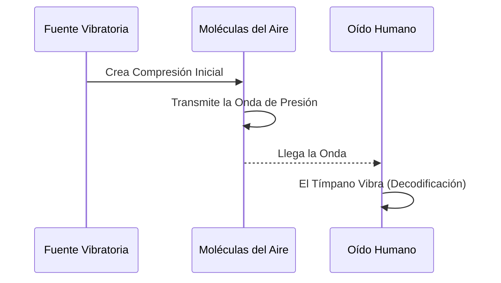
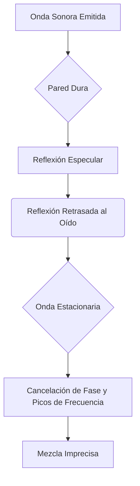

# 🌊 Acústica y Ondas: La Ciencia Detrás del Sonido

> **Breadcrumb:** [Inicio](../AEC-MD/index.md) > Ciencia > Acústica y Ondas

| **Info** | **Detalle** | 
| :--- | :--- | 
| **Fecha de Creación** | 2025-10-25 | 
| **Última Actualización** | 2025-10-25 | 
| **Tiempo de Lectura** | 8 min | 
| **Etiquetas/Tags** | \#Física \#Ondas \#Reverberación \#dB \#Frecuencia |

## Tabla de Contenidos

1.  [Introducción a la Naturaleza del Sonido](../AEC-MD/articulo-4.md#introducción-a-la-naturaleza-del-sonido)
2.  [Propiedades Fundamentales de las Ondas](../AEC-MD/articulo-4.md#propiedades-fundamentales-de-las-ondas)
    * [Frecuencia y Tono](../AEC-MD/articulo-4.md#frecuencia-y-tono)
    * [Amplitud y Volumen](../AEC-MD/articulo-4.md#amplitud-y-volumen)
    * [Fase y Cancelación](../AEC-MD/articulo-4.md#fase-y-cancelación)
3.  [Unidades de Medida en Acústica](../AEC-MD/articulo-4.md#unidades-de-medida-en-acústica)
    * [El Decibelio (dB)](../AEC-MD/articulo-4.md#el-decibelio-db)
    * [Hertz (Hz) y Kilohertz (kHz)](../AEC-MD/articulo-4.md#hertz-hz-y-kilohertz-khz)
    * [La Velocidad del Sonido](../AEC-MD/articulo-4.md#la-velocidad-del-sonido)
4.  [Fenómenos Acústicos en Espacios](../AEC-MD/articulo-4.md#fenómenos-acústicos-en-espacios)
    * [Reverberación vs. Eco](../AEC-MD/articulo-4.md#reverberación-vs-eco)
    * [Reflexión, Absorción y Difusión](../AEC-MD/articulo-4.md#reflexión-absorción-y-difusión)
    * [Ondas Estacionarias](../AEC-MD/articulo-4.md#ondas-estacionarias)
5.  [Acústica Aplicada a la Producción](../AEC-MD/articulo-4.md#acústica-aplicada-a-la-producción)
    * [Tratamiento de Salas](../AEC-MD/articulo-4.md#tratamiento-de-salas)
    * [La Ley del Cuadrado Inverso](../AEC-MD/articulo-4.md#la-ley-del-cuadrado-inverso)
    * [Aislamiento Acústico](../AEC-MD/articulo-4.md#aislamiento-acústico)
6.  [Notas y Referencias](../AEC-MD/articulo-4.md#notas-y-referencias)
7.  [Ver También](../AEC-MD/articulo-4.md#ver-también)

## 1. Introducción a la Naturaleza del Sonido

El sonido es, fundamentalmente, la **vibración mecánica** que se propaga a través de un medio elástico, como el aire, el agua o sólidos. No existe sonido en el vacío. Esta vibración se manifiesta como una serie de ondas de presión, donde las moléculas del medio se comprimen y se expanden, transfiriendo energía del punto A al punto B. **La acústica** es la rama de la física que estudia estas ondas, su producción, transmisión, recepción y efectos. Para cualquier persona involucrada en la [Producción de Audio](../AEC-MD/articulo-3.md), una comprensión sólida de la acústica es tan crucial como dominar una [DAW](../AEC-MD/glosario.md#DAW). El sonido que grabamos y escuchamos está intrínsecamente ligado a las propiedades físicas de su entorno. Por ejemplo, la [Reverberación](../AEC-MD/glosario.md#Reverberación) que experimentamos al cantar en una catedral es una manifestación directa de las leyes de la acústica. [R03] describe estos principios con detalle, destacando que el oído humano es extremadamente sensible, capaz de percibir una gama dinámica enorme y una [Frecuencia](../AEC-MD/glosario.md#Frecuencia) que va, típicamente, de 20 Hz a 20,000 Hz. Este artículo explora cómo estas vibraciones se cuantifican y cómo interactúan con los espacios físicos.

> [!TIP]
> **El sonido es una onda longitudinal** en el aire, lo que significa que la dirección de la vibración de las partículas es paralela a la dirección de propagación de la onda, a diferencia de las ondas transversales (como las ondas de luz).

## 2. Propiedades Fundamentales de las Ondas

### 2.1. Frecuencia y Tono

La [Frecuencia](../AEC-MD/glosario.md#Frecuencia), medida en Hertz (Hz), determina la altura tonal (el tono).

#### Diagrama de Proceso: Propagación de una Onda

### 2.2. Amplitud y Volumen

La amplitud es la intensidad de la onda de presión, percibida como volumen. Se mide en [Decibelio (dB)](../AEC-MD/glosario.md#Decibelio (dB)).

### 2.3. Fase y Cancelación

Dos ondas con la misma frecuencia y amplitud pueden anularse si están desfasadas 180 grados, un concepto crítico en la [Mezcla](#fase-de-masterización-el-estándar-final) de micrófonos.

## 3. Unidades de Medida en Acústica

### 3.1. El Decibelio (dB)

El [Decibelio (dB)](../AEC-MD/glosario.md#Decibelio (dB)) es la unidad de intensidad, basada en una escala logarítmica. Un cambio de 10 dB duplica o reduce a la mitad el volumen percibido.

### 3.2. Hertz (Hz) y Kilohertz (kHz)

El rango audible humano es de 20 Hz a 20,000 Hz (20 kHz). Las bajas [Frecuencias](../AEC-MD/glosario.md#Frecuencia) (graves) tienen longitudes de onda largas, las altas (agudos) tienen longitudes cortas.

| **Unidad** | **Medición** | **Rango Típico** | **Ejemplo Musical** |
| :---: | :---: | :---: | :--- |
| **dB SPL** | Presión Sonora | 0 dB (Umbral) - 120 dB (Dolor) | Concierto de Rock: 110 dB |
| **Hz** | Frecuencia | 20 Hz - 20,000 Hz | Nota A4: 440 Hz |
| **ms** | Tiempo | 1 ms - 500 ms | Delay: 300 ms |

### 3.3. La Velocidad del Sonido

A 20°C, la velocidad del sonido en el aire es de aproximadamente 343 metros por segundo. Esto es clave para calcular el tiempo de [Eco](#reverberación-vs-eco).

## 4. Fenómenos Acústicos en Espacios

### 4.1. Reverberación vs. Eco

| Característica | Reverberación (Alineación Derecha) | Eco (Alineación Centro) |
| :---: | ---: | :---: |
| **Definición** | Reflejos múltiples, densos y superpuestos. | Un único reflejo claramente audible y separado. |
| **Tiempo (Clave)** | Corto (< 50 ms) | Largo (> 50 ms) |
| **Resultado** | Sensación de "espacio" o "cuerpo". | Repetición del sonido original. |

> [!CAUTION]
> Un exceso de [Reverberación](../AEC-MD/glosario.md#Reverberación) en una sala pequeña puede crear un sonido "fangoso" y confundir la [Mezcla](#acústica-aplicada-a-la-producción). Este es el problema número uno en el [Home Studio](../AEC-MD/glosario.md#Home Studio).

### 4.2. Reflexión, Absorción y Difusión

Los materiales de la sala definen la acústica: los duros reflejan, los blandos absorben.

### 4.3. Ondas Estacionarias

Se producen cuando la longitud de onda de una [Frecuencia](../AEC-MD/glosario.md#Frecuencia) coincide con las dimensiones de la sala, creando puntos de presión máxima (nodos) y mínima (antinodos).

## 5. Acústica Aplicada a la Producción

### 5.1. Tratamiento de Salas

Se usan trampas de graves (para las bajas [Frecuencias](#frecuencia-y-tono)) y paneles absorbentes.

#### Diagrama Conceptual: El Problema Acústico Común

### 5.2. La Ley del Cuadrado Inverso

La intensidad sonora disminuye con el cuadrado de la distancia. Si duplicas la distancia, la intensidad cae a un cuarto.

### 5.3. Aislamiento Acústico

Bloquear la transferencia de sonido al exterior (diferente de tratamiento acústico).

---
### Elementos Interactivos: Bloques Colapsables

Información adicional: El Tiempo de Reverberación (RT60)

 

El **RT60** es el parámetro acústico más importante. Mide el tiempo que tarda el sonido en decaer 60 dB una vez que la fuente ha cesado. Para una sala de control de estudio de audio, un RT60 ideal es muy corto (alrededor de 0.2 a 0.5 segundos).

Ejemplo Detallado: Cálculo de Eco

 

Para escuchar un eco distinto, el retardo debe ser de al menos 50 milisegundos. Dado que el sonido viaja a 343 m/s, se necesita una distancia total (fuente-pared-oyente) de al menos 17.15 metros.

Contexto: El Impacto de la Acústica en Instrumentos

 

Los instrumentos acústicos como el violín o la guitarra dependen intrínsecamente de la física de la [Acústica y Ondas](../AEC-MD/articulo-4.md). La madera actúa como un resonador, y la forma del cuerpo está diseñada para optimizar las **ondas estacionarias** internas y amplificar ciertas [Frecuencias](../AEC-MD/glosario.md#Frecuencia).

## 6. Notas y Referencias

> **Bloque de Cita 1:** "El ambiente de la sala es tan importante como el micrófono que uses." 

> **Bloque de Cita 2:** La audición humana es logarítmica, lo que explica por qué usamos el [Decibelio (dB)](../AEC-MD/glosario.md#Decibelio (dB)), no una escala lineal, para medir la intensidad del sonido. (Ver [Unidades de Medida en Acústica](#unidades-de-medida-en-acústica)).

> **Bloque de Cita 3:** Las bajas frecuencias (graves) son omnidireccionales y su longitud de onda es tan grande que son las más difíciles de controlar en una sala pequeña. (Relacionado con [Producción de Audio](../AEC-MD/articulo-3.md#ecualización-y-filtrado)).

**Tabla de resumen/conclusión**
| Fase / Concepto | Clave | Aplicación Práctica |
| :--- | :--- | :--- |
| Reverberación | RT60 ideal | Control del sonido en estudio |
| Eco | Distancia mínima 17 m | Evitar reflejos indeseados |
| Aislamiento | Barreras físicas | Reducir transferencia de sonido |
| Ondas Estacionarias | Nodos/antinodos | Ajuste de tratamiento acústico |
| Intensidad Sonora | Ley del cuadrado inverso | Posicionamiento de fuentes |

### Referencias Utilizadas
* [1] Everest, F. A. (2001). The Master Handbook of Acoustics. 
* [2] Sound on Sound. (2023). Principles of Modern Mixing. 
* [3] Wikipedia. (2024). Historia de la Grabación de Sonido. 

## 7. Ver También

* [🎚️ Producción de Audio Moderna](../AEC-MD/articulo-3.md)
* [🕰️ Historia del Sonido Grabado](../AEC-MD/articulo-5.md)
* [📜 Glosario Técnico](../AEC-MD/glosario.md)
* [🎼 Teoría Musical: Los Pilares](../AEC-MD/articulo-1.md)

---
← [Anterior: Producción de Audio Moderna](../AEC-MD/articulo-3.md) | [Siguiente: Historia del Sonido Grabado](../AEC-MD/articulo-5.md) →

[↑ Volver arriba](#acústica-y-ondas-la-ciencia-detrás-del-sonido)
