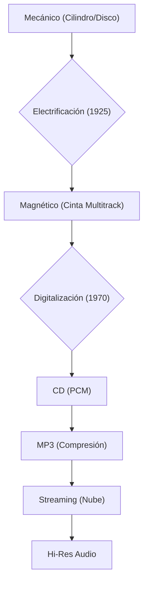
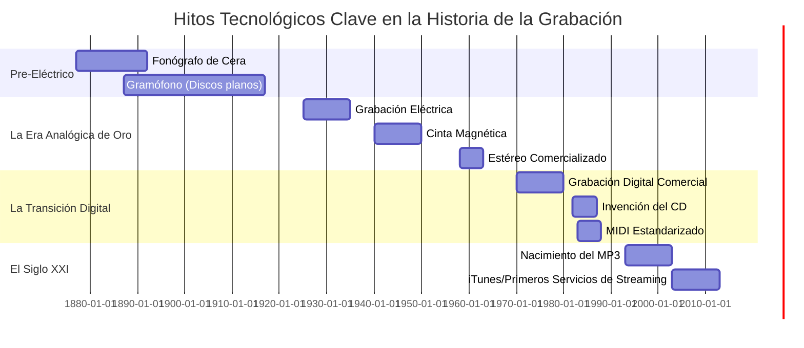

# 🕰️ Historia del Sonido Grabado: Del Fonógrafo al Streaming

> **Breadcrumb:** [Inicio](../AEC-MD/index.md) > Historia > Sonido Grabado

| **Info** | **Detalle** | 
| :--- | :--- | 
| **Fecha de Creación** | 2025-10-25 | 
| **Última Actualización** | 2025-10-25 | 
| **Tiempo de Lectura** | 10 min | 
| **Etiquetas/Tags** | \#Analógico \#Digital \#Vinilo \#Streaming \#Innovación |

## Tabla de Contenidos

1.  [Introducción: El Origen de la Preservación Sonora](../AEC-MD/articulo-5.md#introduccion-el-origen-de-la-preservacion-sonora)
2.  [La Era Mecánica de la Grabación (1877-1925)](../AEC-MD/articulo-5.md#la-era-mecanica-de-la-grabacion-1877-1925)
    * [El Fonógrafo de Edison](../AEC-MD/articulo-5.md#el-fonografo-de-edison)
    * [El Gramófono y los Discos](../AEC-MD/articulo-5.md#el-gramofono-y-los-discos)
    * [Limitaciones del Grabado Acústico](../AEC-MD/articulo-5.md#limitaciones-del-grabado-acustico)
3.  [La Electrificación y el Sonido Magnético (1925-1970)](../AEC-MD/articulo-5.md#la-electrificacion-y-el-sonido-magnetico-1925-1970)
    * [Grabación Eléctrica y Micrófonos](../AEC-MD/articulo-5.md#grabacion-electrica-y-microfonos)
    * [La Cinta Magnética y el Multitrack](../AEC-MD/articulo-5.md#la-cinta-magnetica-y-el-multitrack)
    * [La Estereofonía (Estéreo)](../AEC-MD/articulo-5.md#la-estereofonia-estereo)
4.  [La Revolución Digital y el MIDI (1970-2000)](../AEC-MD/articulo-5.md#la-revolucion-digital-y-el-midi-1970-2000)
    * [El CD y la Muestra Digital](../AEC-MD/articulo-5.md#el-cd-y-la-muestra-digital)
    * [La Invención del MIDI](../AEC-MD/articulo-5.md#la-invencion-del-midi)
    * [El Nacimiento del MP3](../AEC-MD/articulo-5.md#el-nacimiento-del-mp3)
5.  [La Era del Streaming y el Consumo Moderno (2000-Presente)](../AEC-MD/articulo-5.md#la-era-del-streaming-y-el-consumo-moderno-2000-presente)
    * [El Impacto de la Nube](../AEC-MD/articulo-5.md#el-impacto-de-la-nube)
    * [La Lucha por la Calidad de Audio (Hi-Res)](../AEC-MD/articulo-5.md#la-lucha-por-la-calidad-de-audio-hi-res)
    * [El Renacimiento del Vinilo](../AEC-MD/articulo-5.md#el-renacimiento-del-vinilo)
6.  [Notas y Referencias](../AEC-MD/articulo-5.md#notas-y-referencias)
7.  [Ver También](../AEC-MD/articulo-5.md#ver-tambien)

## 1. Introducción: El Origen de la Preservación Sonora

Antes de 1877, la música y el habla existían solo en el momento de su interpretación. Su preservación dependía únicamente de la memoria o la notación (Ver [Teoría Musical](../AEC-MD/articulo-1.md)). La invención de dispositivos capaces de capturar y reproducir el sonido marcó uno de los mayores saltos tecnológicos de la historia. Este avance no solo transformó la industria musical y la forma en que consumimos [Géneros Clave](../AEC-MD/articulo-2.md), sino que también dio lugar a la ingeniería de audio y a la [Producción de Audio](../AEC-MD/articulo-3.md) como la conocemos hoy. El viaje desde el primitivo cilindro de cera hasta los complejos algoritmos de *streaming* es una historia de constantes luchas por la fidelidad, la durabilidad y la portabilidad del medio. Cada nuevo formato ha traído consigo compromisos en la calidad de la [Acústica y Ondas](../AEC-MD/articulo-4.md) a cambio de conveniencia. Comprender esta evolución es crucial para valorar tanto la calidez del audio analógico como la precisión del audio digital , y para entender por qué formatos como el [Vinilo](../AEC-MD/glosario.md#vinilo) están experimentando un renacimiento en la era de la inmaterialidad.

> [!IMPORTANT]
> El hito de la grabación permitió el surgimiento de la **Música Popular**, ya que por primera vez los músicos podían ganar dinero a través de la venta de copias, no solo de actuaciones en vivo.

## 2. La Era Mecánica de la Grabación (1877-1925)

### 2.1. El Fonógrafo de Edison

Inventado en 1877, usaba cilindros de papel de estaño y una aguja que vibraba lateralmente.

### 2.2. El Gramófono y los Discos

Emile Berliner inventó el Gramófono (1887), que usaba discos planos, más duraderos y fáciles de replicar, sentando las bases del [Vinilo](../AEC-MD/glosario.md#vinilo).

### 2.3. Limitaciones del Grabado Acústico

No se utilizaba electricidad. El sonido tenía que ser lo suficientemente fuerte para vibrar directamente el diafragma de grabación.

## 3. La Electrificación y el Sonido Magnético (1925-1970)

### 3.1. Grabación Eléctrica y Micrófonos

El uso de micrófonos de condensador mejoró drásticamente la calidad (Ver [Producción de Audio](articulo-3.md#tipos-de-microfonos)) y el rango de [Frecuencia](../AEC-MD/glosario.md#frecuencia) capturado.

### 3.2. La Cinta Magnética y el Multitrack

La cinta, popularizada después de la IIGM, permitió la edición, el corte y, lo más importante, la grabación multipista (*multitrack*), un cambio de juego para la [Mezcla](articulo-3.md#mezcla).

| **Formato** | **Tecnología** | **Año Pico** | **Ventajas** |
| :---: | :---: | :---: | :---: |
| **Cilindro (Edison)** | Mecánico | 1890s | Primera grabación/reproducción. |
| **Disco de Goma Laca (78 RPM)** | Acústico/Eléctrico | 1920s | Más fácil de replicar que el cilindro. |
| **Vinilo (LP 33 1/3 RPM)** | Electromagnético | 1950s-1980s | Mayor duración, mejor fidelidad. |

### 3.3. La Estereofonía (Estéreo)

La grabación en dos canales (estéreo) revolucionó la percepción espacial del sonido.

## 4. La Revolución Digital y el MIDI (1970-2000)

### 4.1. El CD y la Muestra Digital

El Compact Disc (CD) ofrecía audio PCM (`Pulse Code Modulation`) con una fidelidad teórica perfecta y cero ruido de fondo.

| Formato | Capacidad de Almacenamiento | Durabilidad Estimada | Calidad (Bit/Sample Rate) | Alineación |
| :--- | :--- | :--- | :--- | :---: |
| **Vinilo LP** | 20-25 minutos por lado | 50-100 reproducciones | Analógica (Ilimitada) | Derecha |
| **CD** | 74-80 minutos totales | 50-100 años | 16-bit / 44.1 kHz | Centro |
| **Cinta de Cassette** | 30-45 minutos por lado | 20 años | Analógica (Sujeta a ruido) | Derecha |
| **DVD-Audio** | 4.7 GB | 50-100 años | 24-bit / 96 kHz | Centro |
| **MP3 (128 kbps)** | Miles de canciones | Ilimitada (Digital) | Comprimida (Lossy) | Derecha |

> [!WARNING]
> La compresión con pérdida del MP3 (`lossy compression`) elimina frecuencias que el oído humano tiene dificultad para percibir, pero puede generar artefactos audibles.

### 4.2. La Invención del MIDI

El MIDI (1983) permitió que los instrumentos electrónicos (como los [Sintetizadores](../AEC-MD/articulo-2.md#herramientas-sintetizadores-y-cajas-de-ritmos)) se comunicaran entre sí y con el [DAW](../AEC-MD/glosario.md#daw).

### 4.3. El Nacimiento del MP3

El formato MP3 democratizó la distribución, pero a costa de la calidad.

## 5. La Era del Streaming y el Consumo Moderno (2000-Presente)

### 5.1. El Impacto de la Nube

Servicios como Spotify y Apple Music se convirtieron en el principal medio de consumo.

### 5.2. La Lucha por la Calidad de Audio (Hi-Res)

Respuesta a la baja calidad del MP3 con formatos sin pérdida (*Lossless*), como FLAC. La adopción de Hi-Res ha permitido a los audiófilos y profesionales del sonido mantener un rango dinámico amplio y preservar la fidelidad de grabaciones originales, especialmente en música clásica y jazz. Los servicios modernos ofrecen descargas y streaming de alta resolución, pero requieren mayor ancho de banda y almacenamiento. La comparación entre MP3, FLAC y formatos de alta resolución muestra diferencias significativas en detalle armónico y percepción espacial, influyendo en la experiencia de escucha de manera tangible.  

### 5.3. El Renacimiento del Vinilo

El [Vinilo](../AEC-MD/glosario.md#vinilo) ha experimentado un resurgimiento por su carácter coleccionable y la calidez percibida de su sonido analógico. Muchos artistas lanzan ediciones limitadas en vinilo para ofrecer valor adicional a los fans, mientras que los estudios de masterización ajustan sus procesos para optimizar la experiencia analógica. Este renacimiento también ha impulsado la fabricación de tocadiscos modernos y accesorios especializados.  

---

### Tabla de Resumen: Cambios de Paradigma

| Paradigma | Características Clave | Compromiso/Sacrificio |
| :--- | :--- | :--- |
| **Mecánico** | Preservación del momento. | Baja fidelidad, difícil replicación. |
| **Analógico** | Alta fidelidad, edición flexible. | Degradación con el tiempo (ruido de cinta). |
| **Digital** | Fidelidad perfecta, fácil copia. | Rigidez inicial, "frialdad" percibida. |
| **Streaming** | Acceso universal, portabilidad. | Propiedad de la música, calidad comprimida. |

---

### Elementos Interactivos: Bloques Colapsables

Información adicional: El Formato de Audio de Alta Resolución (Hi-Res)

 
El audio de alta resolución (Hi-Res) generalmente se refiere a formatos con una profundidad de bits y una frecuencia de muestreo superiores a las del CD estándar (16-bit/44.1 kHz). Los formatos comunes son 24-bit/96 kHz o 24-bit/192 kHz. La mayor profundidad de bits proporciona un mejor rango dinámico (`dynamic range`).

Ejemplo Detallado: Grabación Multipista

 
Antes de la cinta, no era posible grabar la batería, el bajo y la voz por separado. La grabación multipista permitió a un artista grabar primero las pistas instrumentales, luego añadir la voz, y finalmente mezclar todo, permitiendo la [Producción de Audio](articulo-3.md) compleja y el *overdubbing*.

Datos Históricos: El Inventor Olvidado

 
Mientras que Edison inventó el fonógrafo, el **Fonoautógrafo** fue patentado en 1857 por Édouard-Léon Scott de Martinville. Este dispositivo solo registraba visualmente las ondas sonoras en papel ahumado; no tenía capacidad de reproducción. Se considera la primera máquina en *grabar* el sonido. 

## 6. Notas y Referencias

> **Bloque de Cita 1:** La invención del *Multitrack* permitió a The Beatles crear texturas y arreglos que eran imposibles de replicar en vivo. (Relacionado con [Géneros Clave](../AEC-MD/articulo-2.md)).

> **Bloque de Cita 2:** El MP3 no solo redujo el tamaño de los archivos, sino que cambió las expectativas de los consumidores sobre el nivel de *loudness* y calidad del audio. (Ver [Producción de Audio](articulo-3.md#limitacion-y-nivel-de-loudness)).

> **Bloque de Cita 3:** "La grabación es la prisión de la música, pero también su única vía para la eternidad." - Igor Stravinsky (Citado en ).

### Referencias Utilizadas
* [1] Wikipedia. (2024). Historia de la Grabación de Sonido. 
* [2] Everest, F. A. (2001). The Master Handbook of Acoustics. 
* [3] Sound on Sound. (2023). Principles of Modern Mixing. 

## 7. Ver También

* [🎚️ Producción de Audio Moderna](articulo-3.md)
* [🌊 Acústica y Ondas](../AEC-MD/articulo-4.md)
* [📜 Glosario Técnico](../AEC-MD/glosario.md)
* [📚 Referencias y Bibliografía](referencias.md)

---
← [Anterior: Acústica y Ondas](../AEC-MD/articulo-4.md) | [Siguiente: Glosario Técnico](../AEC-MD/glosario.md) →
[↑ Volver arriba](#historia-del-sonido-grabado-del-fonografo-al-streaming)
