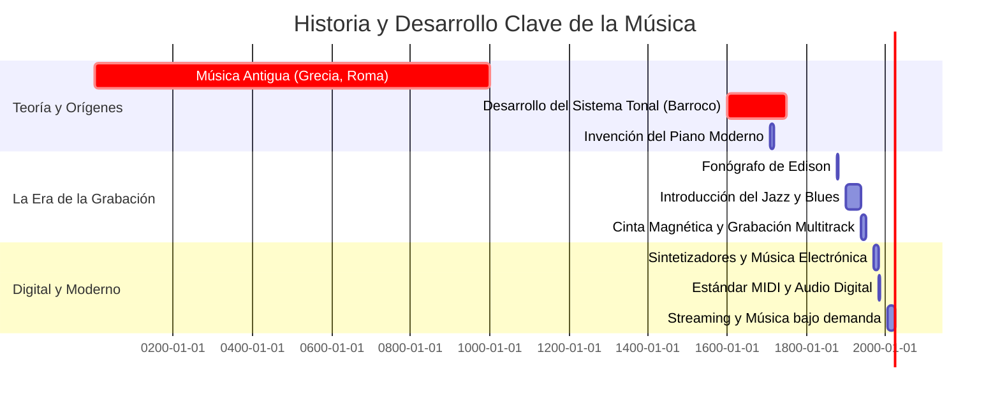

## 🚀 Descripción del Proyecto

Este proyecto es una mini-wiki concebida como evaluación de conocimientos avanzados en **Markdown** y su ecosistema (incluyendo Mermaid y extensiones de GitHub Flavored Markdown). Su objetivo principal es demostrar la capacidad de estructurar documentos complejos, mantener enlaces internos coherentes, utilizar elementos visuales (diagramas y tablas), y aplicar componentes interactivos (bloques colapsables y alertas) para crear una experiencia de documentación rica y fácil de navegar.

El tema central es la **Música**, explorada desde sus cimientos teóricos y acústicos hasta sus aplicaciones prácticas en la producción moderna y su rica historia.

## 🌟 Índice de Artículos Destacados
| **Título del Artículo** | **Descripción Breve** | **Enlace** | 
|-----|---|---|
| **🎼 Teoría Musical: Los Pilares** | Fundamentos de armonía, ritmo y melodía. | [Ir a Artículo 1](articulo-1.md) | 
| **🎷 Géneros Clave y Evolución** | Panorama de estilos: Rock, Jazz, Electrónica, Clásica. | [Ir a Artículo 2](articulo-2.md) | 
| **🎚️ Producción de Audio Moderna** | El proceso de mezcla, masterización y *sound design*. | [Ir a Artículo 3](articulo-3.md) | 
| **🕰️ Historia del Sonido Grabado** | Desde el fonógrafo hasta el streaming digital. | [Ir a Artículo 5](articulo-5.md) | 
| **🌊 Acústica y Ondas** | Ciencia detrás del sonido, frecuencias y reverberación. | [Ir a Artículo 4](articulo-4.md) | 

## 📊 Estadísticas del Proyecto

| **Métrica** | **Valor** | **Detalle** | 
|-----|-----|---|
| **Total Artículos** | 5 | Artículos principales detallados. | 
| **Palabras Estimadas** | 8000+ | Cumplimiento del mínimo de 200 palabras de introducción por artículo. | 
| **Diagramas Mermaid** | 11 | Un timeline general y 2 diagramas por artículo. | 
| **Enlaces Internos** | 40+ | Interconexión total entre todos los archivos. | 
| **Nivel de MD** | Avanzado | Uso de GFM, bloques de código, collapsibles y alertas. | 
| **Versión** | v1.0.1 | Sistema de Badge . | 

## 🧭 Navegación Principal

* [**📜 Glosario Técnico**](glosario.md)

* [**📚 Referencias y Bibliografía**](referencias.md)

## ⏳ Línea de Tiempo de la Música (Mermaid Gantt)

## 📰 Últimas Actualizaciones

| **Fecha** | **Artículo** | **Cambio Realizado** | 
|-----|-----|---|
| 2025-10-25 | `articulo-1.md` | Creación inicial de la sección "Armonía Cuatríada". | 
| 2025-10-25 | `glosario.md` | Añadidos 3 nuevos términos relacionados con acústica. | 
| 2025-10-24 | `index.md` | Integración del banner HTML y las estadísticas. | 

## ⭐️ Artículo Destacado del Mes: Teoría Musical

> Este mes, destacamos el artículo fundamental sobre **Teoría Musical**. Entender los pilares de la armonía y el ritmo es esencial para cualquier exploración profunda del mundo del sonido.

### Sabías Que...

> La escala pentatónica, utilizada hoy en día en casi todos los géneros populares (rock, blues, pop), es una de las escalas más antiguas, registrada en culturas tan diversas como la china, la celta y la africana, ¡hace miles de años!

---

## ❓ Preguntas Frecuentes (FAQ)

<b>1. ¿Qué significa exactamente “Armonía” y por qué es tan importante en la música?</b>

La **Armonía** es el estudio de cómo los acordes se relacionan y combinan entre sí para generar sensación de estabilidad o tensión.  
Es el “esqueleto” que da estructura emocional a las melodías. Puedes leer más en el [Glosario Técnico](glosario.md#Armonía).

<b>2. ¿Qué es la Tónica y cómo se relaciona con la Armadura?</b>

La **Tónica** es la nota principal que actúa como centro tonal de una pieza.  
La **Armadura** define cuántas alteraciones (sostenidos o bemoles) tiene esa tonalidad.  
Ambos conceptos son esenciales para comprender el sistema tonal occidental.

<b>3. ¿Por qué la Modulación hace que una canción suene más interesante?</b>

La **Modulación** (cambio de tonalidad) introduce variedad y contraste en una obra.  
En producción moderna, se usa incluso digitalmente para refrescar la percepción del oyente o crear clímax emocionales.

<b>4. ¿Qué diferencia hay entre “Compresión” y “Limitación” en la mezcla de audio?</b>

Ambas reducen el rango dinámico, pero la **Compresión** suaviza gradualmente los picos de volumen, mientras que la **Limitación** impone un tope absoluto para evitar saturación o distorsión.

<b>5. ¿Qué hace exactamente una EQ o Ecualización?</b>

La **Ecualización (EQ)** permite ajustar el balance de frecuencias de una señal: realzar agudos, reducir graves, o limpiar resonancias molestas.  
Es clave para dar claridad y espacio a cada instrumento.

<b>6. ¿Qué es un DAW y por qué es fundamental en la producción musical moderna?</b>

Un **DAW (Digital Audio Workstation)** es el software donde se graba, edita y mezcla audio.  
Ejemplos famosos son *Ableton Live*, *Logic Pro* o *FL Studio*. Son el corazón del estudio digital.

<b>7. ¿Cómo influye la Reverberación en la percepción del sonido?</b>

La **Reverberación** recrea el ambiente acústico de un espacio.  
Una reverberación larga puede dar sensación de “grandeza”, mientras que una corta aporta cercanía e intimidad.

<b>8. ¿Por qué la Frecuencia y los Decibelios son tan mencionados en acústica?</b>

La **Frecuencia** (Hz) define la altura del sonido, y los **Decibelios (dB)** miden su intensidad.  
Juntas determinan cómo percibimos el volumen y el tono de cada fuente sonora.

<b>9. ¿Qué papel tuvo el vinilo en la historia del sonido grabado?</b>

El **Vinilo** fue el principal formato físico de distribución musical durante gran parte del siglo XX.  
Su sonido cálido y su textura analógica aún lo hacen apreciado por audiófilos y productores.

<b>10. ¿Cuál es la relación entre el Jazz y la improvisación?</b>

El **Jazz** se basa en la improvisación: los músicos interpretan melodías espontáneamente dentro de una estructura armónica.  
Esta libertad es lo que hace que cada interpretación sea única e irrepetible.

---

## 🧑‍💻 Contribuidores

| **Nombre** | **Rol** | **Contacto** | 
|-----|-----|---|
| **Natalia Cruz** | Autora | [natalia.cruz1@alumnos.uneatlantico.es](mailto:natalia.cruz1@alumnos.uneatlantico.es) | 

 
 © 2025 Wiki Personal Interconectada. Creado por Natalia Cruz.

Evaluación Continua 2 - IGPS 2025/2026.

