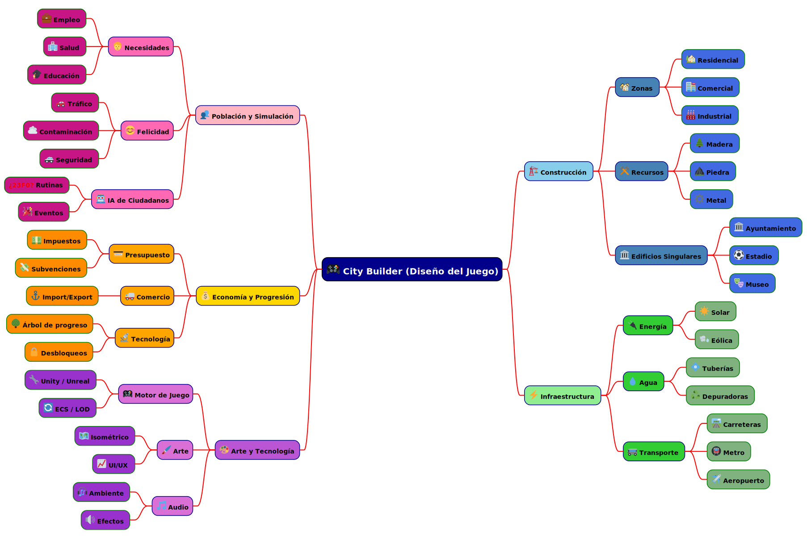
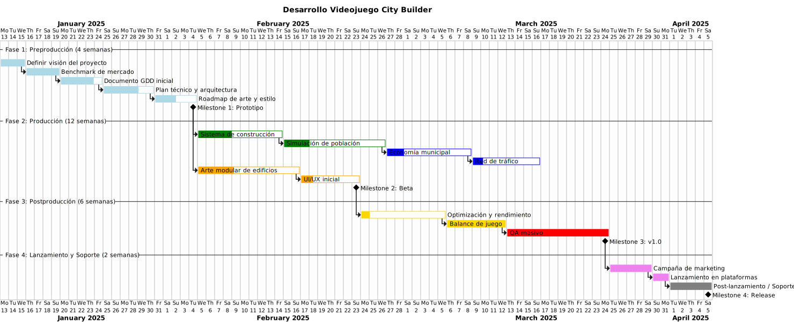
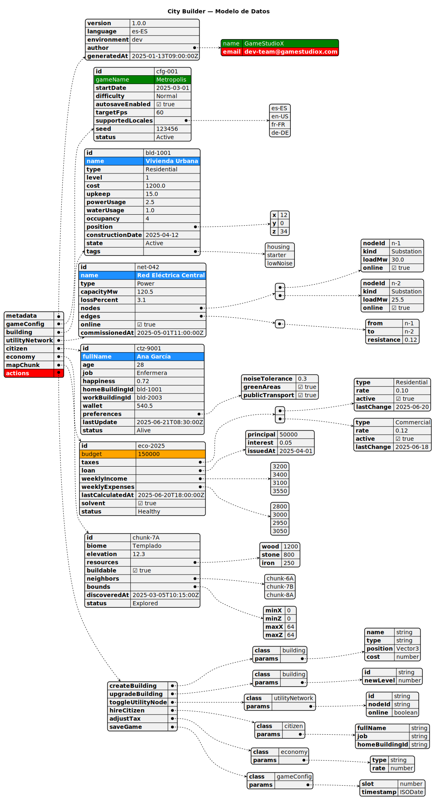
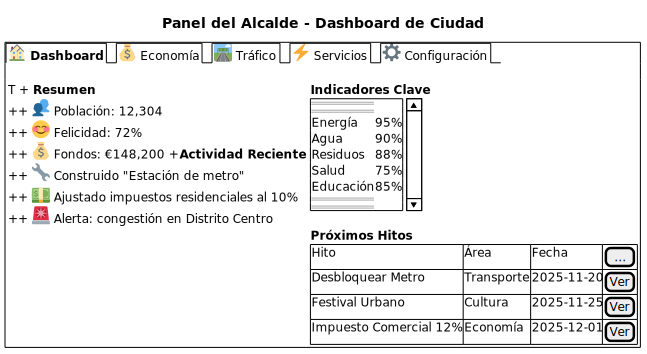
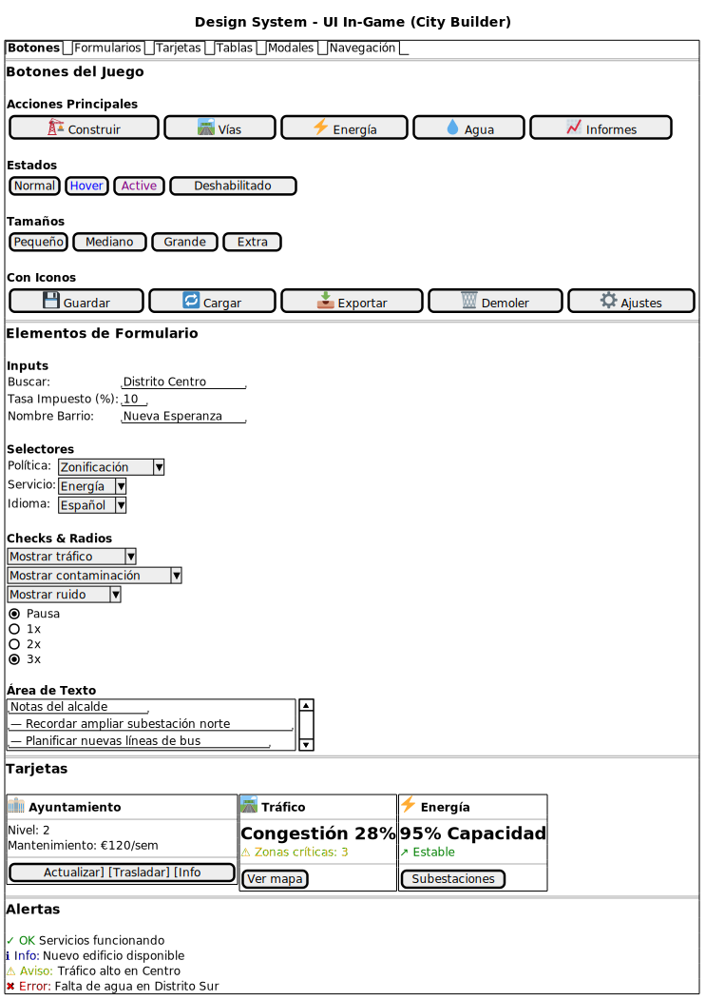
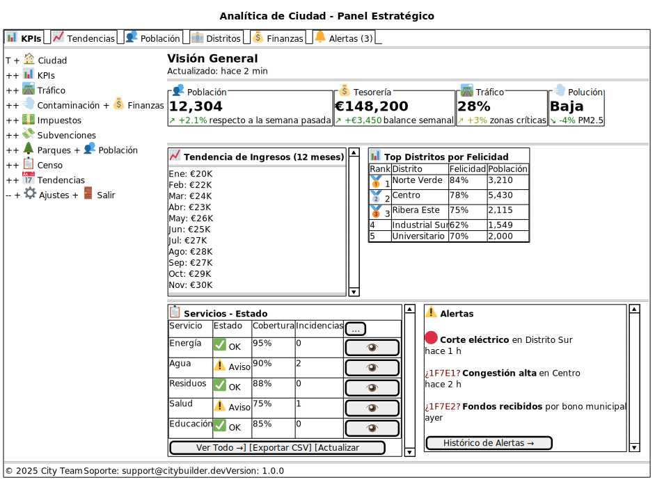

# 🏙️ City Builder — Documento de Análisis Técnico y de Diseño

> **Autor:** GameStudioNat  
> **Ingeniero responsable:** Natalia Cruz  
> **Fecha:** 2025-11-08  
> **Versión del documento:** 1.0.0  

---

## 📘 Tabla de Contenidos

| Nº | Sección | Descripción |
|----|----------|-------------|
| 1️⃣ | [Resumen del Proyecto](#-1-resumen-del-proyecto) | Visión general y objetivos del juego |
| 2️⃣ | [Estructura de Diagramas](#-2-estructura-de-diagramas) | Tipos de diagramas creados y finalidad |
| 3️⃣ | [🧠 Mindmap](#-3-mindmap--mapa-mental) | Ideas iniciales y categorías del City Builder |
| 4️⃣ | [📅 Gantt](#-4-gantt--planificación-del-proyecto) | Plan temporal, fases, hitos y dependencias |
| 5️⃣ | [🧱 JSON](#-5-json--modelo-de-datos-del-juego) | Estructura de clases y objetos principales |
| 6️⃣ | [🖥️ Wireframes](#-6-wireframes--bocetos-de-interfaz) | Interfaz y paneles del juego |
| 7️⃣ | [📈 Conclusiones y Recomendaciones](#-7-conclusiones-y-recomendaciones) | Resumen y próximos pasos |

---

## 🚀 1. Resumen del Proyecto

**City Builder** es un videojuego de simulación urbana donde el jugador actúa como alcalde y planifica el desarrollo de una ciudad moderna.  
El objetivo es **balancear economía, infraestructura y felicidad ciudadana**, asegurando sostenibilidad y progreso.

**Características clave:**
- Simulación en tiempo real con IA ciudadana  
- Múltiples sistemas interconectados (energía, agua, tráfico, economía, arte)  
- Estilo visual isométrico y optimización para PC  

---

## 🧭 2. Estructura de Diagramas

| Tipo de Diagrama | Propósito | Archivo |
|------------------|------------|----------|
| 🧠 **Mindmap** | Organización de ideas iniciales del proyecto | [`01_mindmap_citybuilder.puml`](./diagrams/01_mindmap_citybuilder.puml) |
| 🗓️ **Gantt** | Planificación temporal de desarrollo y fases | [`02_gantt_citybuilder.puml`](./diagrams/02_gantt_citybuilder.puml) |
| 🧱 **JSON** | Modelo de datos del juego (clases, objetos, acciones) | [`03_json_citybuilder.puml`](./diagrams/03_json_citybuilder.puml) |
| 🖥️ **Wireframes** | Diseño de interfaz de usuario y paneles | [`04c_wireframe_analytics.puml`](./diagrams/04c_wireframe_analytics.puml) |

> 💡 Todos los diagramas están listos para visualizar en [PlantUML](https://plantuml.com/) o en la siguiente parte del documento.

---

## 🧩 3. Mindmap — Mapa Mental

**Archivo:** [`01_mindmap_citybuilder.puml`](./diagrams/01_mindmap_citybuilder.puml)  
**Imagen:** 

**Propósito:**  
Organizar las ideas base del proyecto, separando áreas funcionales y de desarrollo.

| Categoría Principal | Subtemas |
|----------------------|----------|
| 🏗️ Construcción | Zonas, recursos, edificios singulares |
| ⚡ Infraestructura | Energía, agua, transporte |
| 👥 Población | IA, necesidades, felicidad |
| 💰 Economía | Presupuesto, comercio, tecnología |
| 🎨 Arte & Tech | Motor, arte, sonido |

**Destacado:** uso de emojis `:<unicode>:`, colores, tres niveles de profundidad y estilo visual uniforme con `<style>`.

---

## 📅 4. Gantt — Planificación del Proyecto

**Archivo:** [`02_gantt_citybuilder.puml`](./diagrams/02_gantt_citybuilder.puml)  
**Imagen:** 

**Propósito:**  
Definir la línea temporal del desarrollo del videojuego, recursos, dependencias y hitos clave.

| Fase | Duración Estimada | Color | Hito Asociado |
|------|--------------------|--------|----------------|
| Preproducción | 4 semanas | LightBlue | 🎯 Prototipo |
| Producción | 12 semanas | Green / Blue / Orange | 🚧 Beta |
| Postproducción | 6 semanas | Gold / Red | 🧪 v1.0 |
| Lanzamiento & Soporte | 2 semanas | Violet / Gray | 🚀 Release |

**Hitos definidos:**
- Milestone 1: Prototipo  
- Milestone 2: Beta  
- Milestone 3: v1.0  
- Milestone 4: Release  

---

## 🧱 5. JSON — Modelo de Datos del Juego

**Archivo:** [`03_json_citybuilder.puml`](./diagrams/03_json_citybuilder.puml)  
**Imagen:** 

**Propósito:**  
Representar las clases y objetos del sistema que sustentan la simulación del City Builder.

| Objeto | Tipo | Contiene | Ejemplo |
|--------|------|-----------|----------|
| `metadata` | Objeto | info del sistema | autor, versión, fecha |
| `gameConfig` | Objeto | configuración global | idioma, FPS, dificultad |
| `building` | Objeto | propiedades de edificios | id, tipo, coste, posición |
| `utilityNetwork` | Objeto con listas | nodos y conexiones | subestaciones, edges |
| `citizen` | Objeto | estado del ciudadano | nombre, felicidad, empleo |
| `economy` | Objeto | tasas e ingresos | impuestos, préstamos |
| `actions` | Objeto | métodos del sistema | crear, actualizar, guardar |

> 🧠 Incluye tipos mixtos (string, number, boolean, arrays, objetos), fechas ISO, highlights y metadatos.

---

## 🖥️ 6. Wireframes — Bocetos de Interfaz

**Archivos:**
| Wireframe | Descripción | `.puml` | `.svg` |
|------------|-------------|---------|--------|
| 🏙️ Panel del Alcalde | Vista general, KPIs, hitos | [`04a_wireframe_dashboard.puml`](./diagrams/04a_wireframe_dashboard.puml) |  |
| 🎨 UI In-Game | Botones, formularios, alertas | [`04b_wireframe_ui_elements.puml`](./diagrams/04b_wireframe_ui_elements.puml) |  |
| 📊 Panel Analítico | Estadísticas, alertas, top distritos | [`04c_wireframe_analytics.puml`](./diagrams/04c_wireframe_analytics.puml) |  |

**Características:**
- Uso extensivo de emojis `:<unicode>:`  
- Tablas, pestañas, tarjetas y alertas visuales  
- Inspirado en dashboards de gestión urbana profesional  

---

## 📈 7. Conclusiones y Recomendaciones

| Aspecto | Evaluación | Recomendación |
|----------|-------------|----------------|
| Estructura del proyecto | ✅ Bien definida | Mantener separación clara por fases |
| Recursos humanos | ⚙️ Suficientes (arte, tech, QA) | Añadir 1 diseñador UX adicional |
| Riesgos | ⚠️ Equilibrio IA y rendimiento | Priorizar optimización en Fase 3 |
| Documentación | 🧩 Completa y estandarizada | Integrar PlantUML + CI/CD para docs |
| Arte y audio | 🎨 En progreso | Revisión de coherencia visual/UI |

**Próximos pasos:**
1. Validar hitos y dependencias con producción.  
2. Alinear backlog técnico (Unity ECS, simulación IA).  
3. Integrar documentación en repositorio GitHub.  
4. Iniciar desarrollo vertical del **“sistema de construcción”**.  

---

## 📎 Enlaces de Referencia

| Tipo | Enlace |
|------|--------|
| 📂 Repositorio principal | [github.com/natiicruuz/25-26-igps.git](https://github.com/natiicruuz/25-26-igps.git) |
| 📘 PlantUML | [https://plantuml.com/](https://plantuml.com/) |
| 💻 Renderizador Online | [https://www.planttext.com/](https://www.planttext.com/) |

---

**© 2025 GameStudioNat — Todos los derechos reservados.**  
_“Construyendo la ciudad del futuro, un nodo a la vez.”_ 🏗️
