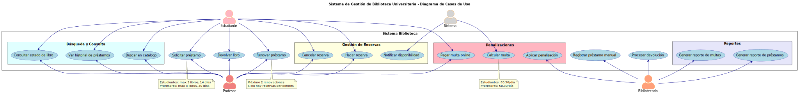
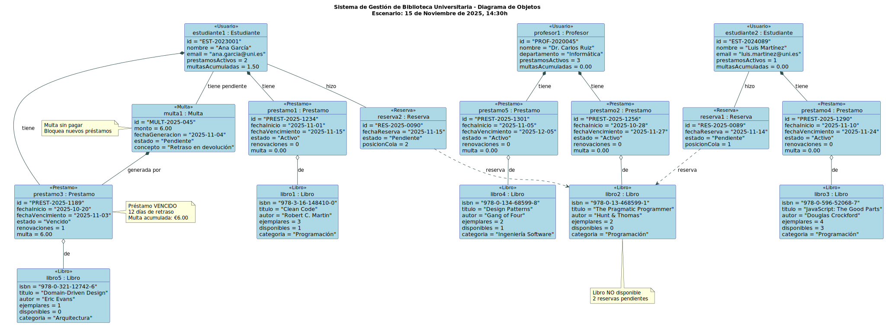
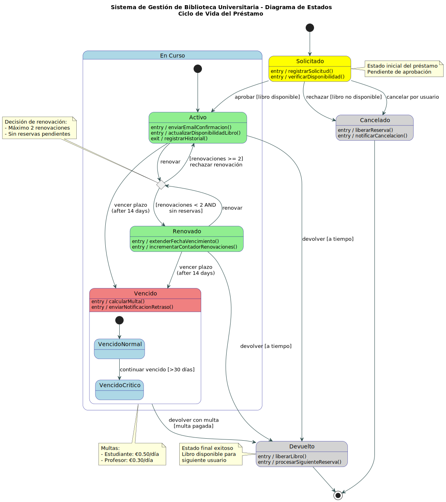

# Sistema de Gestión de Biblioteca Universitaria

##  Descripción del Proyecto

Sistema de gestión integral para la Biblioteca Central de la Universidad que permite a estudiantes y profesores realizar préstamos de libros, gestionar reservas y manejar devoluciones. El sistema controla el estado de cada préstamo desde su solicitud hasta su finalización, con diferentes operaciones según el rol del usuario.

##  Objetivos

- Modelar un sistema completo usando diferentes tipos de diagramas UML
- Practicar la creación de diagramas de objetos, casos de uso y estados
- Comprender las relaciones entre diferentes vistas del sistema
- Aplicar PlantUML en un caso de uso real

## Diagramas UML

### 1. Diagrama de Casos de Uso

| Descripción | Diagrama |
|:------------|:--------:|
| **Propósito:** Modelar las interacciones entre los actores del sistema (Estudiante, Profesor, Bibliotecario y Sistema) y las funcionalidades disponibles.  **Características principales:** - 4 actores del sistema - 16 casos de uso organizados en packages - Gestión de préstamos, reservas, búsqueda y penalizaciones - Generación de reportes para bibliotecarios |  |
| | Código fuente: [01-diagrama-casos-uso.puml](./diagramas/01-diagrama-casos-uso.puml) |

---

### 2. Diagrama de Objetos

| Descripción | Diagrama |
|:------------|:--------:|
| **Propósito:** Representar una instancia concreta del sistema en un momento específico (15 Nov 2025, 14:30h), mostrando objetos reales y sus relaciones.  **Escenario modelado:** - 3 usuarios (2 estudiantes, 1 profesor) - 5 libros del catálogo de programación - 5 préstamos en diferentes estados - 2 reservas pendientes - 1 multa por préstamo vencido  **Relaciones implementadas:** - Composición, Agregación, Dependencia y Asociación |  |
| | Código fuente: [02-diagrama-objetos.puml](./diagramas/02-diagrama-objetos.puml) |

---

### 3. Diagrama de Estados

| Descripción | Diagrama |
|:------------|:--------:|
| **Propósito:** Modelar el ciclo de vida completo de un préstamo, desde su creación hasta su finalización, incluyendo todos los estados posibles y transiciones.  **Estados principales:** - Solicitado (pendiente aprobación) - En Curso (Activo, Renovado, Vencido) - Devuelto / Cancelado (estados finales)  **Características:** - Estados compuestos con subestados - Puntos de decisión para renovaciones - Eventos temporales (vencimiento a 14 días) - Multas diferenciadas por tipo de usuario - Máximo 2 renovaciones por préstamo |  |
| | Código fuente: [03-diagrama-estados.puml](./diagramas/03-diagrama-estados.puml) |

---

## Reglas de Negocio del Sistema

### Préstamos para Estudiantes
- ✅ Máximo 3 libros simultáneos
- ⏱️ Duración: 14 días
- 🔄 Renovaciones: hasta 2 veces (si no hay reservas)
- 💶 Multa por retraso: €0.50/día

### Préstamos para Profesores
- ✅ Máximo 5 libros simultáneos
- ⏱️ Duración: 30 días
- 🔄 Renovaciones: hasta 2 veces
- 💶 Multa por retraso: €0.30/día

### Estados de un Libro
- 🟢 Disponible
- 🔵 Prestado
- 🟡 Reservado
- 🔴 En Mantenimiento

### Estados de un Préstamo
- 📝 Solicitado
- ✅ Activo
- 🔄 Renovado
- ⚠️ Vencido
- ✔️ Devuelto
- ❌ Cancelado
