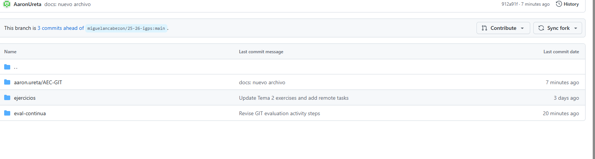

Para realizar esta actividad, primero hice la configuración inicial utilizando la terminal Git Bash. Me moví hasta el directorio correcto (comando: `cd documents`) y verifiqué que estaba en la ubicación deseada (comando: `ls`).

Después, cloné el repositorio de la asignatura desde GitHub (comando: `git clone <URL-del-repositorio>`), lo cual me permitió tener una copia local del proyecto en mi equipo. Una vez clonado, accedí a la carpeta del proyecto (comando: `cd nombre-del-repositorio`) y abrí el entorno de trabajo con Visual Studio Code (comando: `code .`).

Con el entorno listo, creé una nueva rama llamada `develop` para trabajar de forma ordenada y evitar hacer cambios directamente en la rama principal (comando: `git checkout -b develop`). Todo lo que fui desarrollando lo hice dentro de esta rama.

También creé una carpeta adicional dentro del repositorio para organizar toda la información y los archivos relacionados con esta actividad.

A continuación, agrego dos imágenes como evidencia del trabajo realizado. Estas deben estar ubicadas en la misma carpeta que este archivo `.md` para que se visualicen correctamente:

1. Uso de la terminal y navegación de carpetas:  
   

2. Repositorio en GitHub con commits y ramas:  
   

Una vez terminado todo el trabajo, volví a la rama principal (comando: `git checkout main`) y luego subí los cambios al repositorio remoto (comando: `git push`). Finalmente, desde GitHub, creé un Pull Request (PR) para fusionar los cambios de la rama `develop` en `main`, completando así la actividad de forma organizada.

Este proceso me permitió aplicar buenas prácticas de control de versiones y mantener el proyecto bien estructurado durante toda la actividad.
