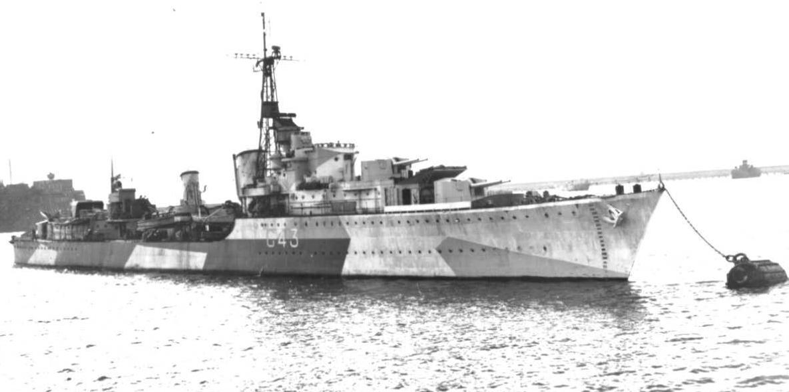
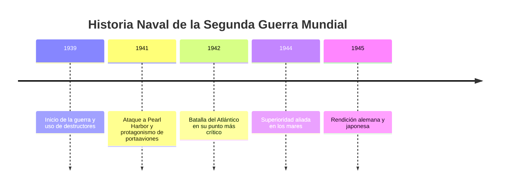

# 🚢 Wiki de Barcos de la Segunda Guerra Mundial

  

---

## 🌊 Descripción del Proyecto

Esta mini-Wiki explora los principales **barcos de guerra utilizados durante la Segunda Guerra Mundial**, desde los imponentes **acorazados** hasta los **portaaviones** que cambiaron la forma de combatir en el mar. Cada artículo ofrece información técnica, histórica y curiosidades sobre su papel en la guerra naval.

---

## 📚 Índice Visual

| Tipo de Barco | Enlace | Descripción breve |
|:---------------|:--------|:------------------|
| ⚓ Acorazados | [Acorazados](acorazados.md) | Gigantes blindados con gran poder de fuego. |
| 🛫 Portaaviones | [Portaaviones](portaaviones.md) | Bases aéreas flotantes que dominaron los océanos. |
| 🐋 Submarinos | [Submarinos](submarino.md) | Armas sigilosas y letales bajo las olas. |
| 🚤 Destructores | [Destructores](destructores.md) | Escoltas veloces y versátiles. |
| 🌊 Batalla del Atlántico | [Batalla del Atlántico](batalla-atlantico.md) | El conflicto naval más largo de la guerra. |

---

## 📊 Estadísticas del Proyecto

| Elemento | Cantidad |
|:----------|:----------:|
| Artículos principales | 5 |
| Palabras totales (aprox.) | 3,000 |
| Diagramas Mermaid | 10 |
| Tablas | 15 |

---

## 🕒 Últimas Actualizaciones

- *24 de octubre de 2025*: Se agregaron diagramas y glosario.  
- *22 de octubre de 2025*: Publicado artículo de los portaaviones.  
- *20 de octubre de 2025*: Inicio del proyecto.

---

## 🗺️ Timeline General

🔗 Navegación

Glosario

Referencias

👨‍💻 Autor

Abner Eliel Villeda Molina
Proyecto realizado para AEC-MD – 2025