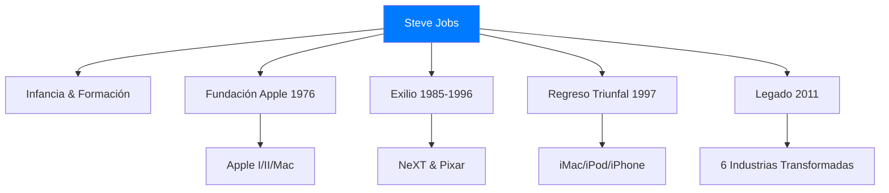
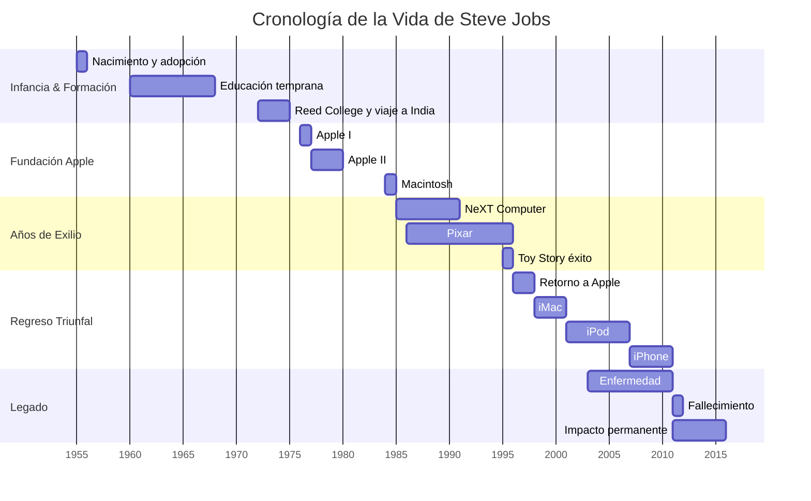

# 👤 Steve Jobs: Del garaje al gigante tecnológico 🚀

**Fecha de creación**: 24 de Octubre, 2025  
**Última actualización**: 25 de Octubre, 2025  
**Tiempo estimado de lectura**: 5 minutos  
**Etiquetas**: `#Biografía` `#SteveJobs` `#Apple` `#Pixar` `#Innovación`

## 📑 Tabla de Contenidos

1. [Introducción](#-introducción)
2. [Infancia y Formación](#-infancia-y-formación)
3. [Fundación de Apple](#-fundación-de-apple)
4. [Años de Exilio](#-años-de-exilio)
5. [Regreso Triunfal](#-regreso-triunfal)
6. [Legado](#-legado)

## 📖 Introducción 

Steve Jobs (1955-2011) fue el visionario que transformó/revolucionó seis industrias: computación personal, películas animadas, música, teléfonos, tablets y publicación digital. Su obsesión por el **diseño simple** y la **experiencia perfecta** creó productos que millones de personas aman hoy en día.

 

> **"No es tener fe en la tecnología. Es tener fe en la gente."**

 

## 👶 Infancia y Formación 

Adoptado por Paul y Clara Jobs, Steve creció en [Silicon Valley](glosario.md#silicon-valley). Desde niño mostró interés por la electrónica, trabajando en Hewlett-Packard durante veranos.

En 1972, asistió a Reed College pero abandonó después de 6 meses. Continuó auditando clases, incluyendo caligrafía, que influiría en las fuentes del Macintosh.

📚 <strong>Dato Curioso</strong>

Jobs viajó a India en 1974 buscando iluminación espiritual. Practicó budismo zen y dietas frutarianas que moldearon su filosofía de simplicidad.

## 🍎 Fundación de Apple 

En 1976, Jobs y Steve Wozniak fundaron Apple en el garaje de los padres de Jobs. Comenzaron con el Apple I, vendiendo 200 unidades.

| Producto | Año | Impacto |
|----------|-----|---------|
| **Apple I** | 1976 | Primera computadora personal |
| **Apple II** | 1977 | Éxito comercial masivo |
| **Macintosh** | 1984 | Interfaz gráfica revolucionaria |

El Macintosh de 1984 introdujo la **interfaz gráfica** al mercado masivo, haciendo los ordenadores accesibles para todos.

💡 El famoso comercial "1984" del Macintosh se emitió solo una vez durante la SuperBowl, pero se considera uno de los mejores anuncios de la historia.

## 🔄 Años de Exilio 

Forzado a dejar Apple en 1985, Jobs fundó NeXT Computer y compró Pixar por $10 millones.

🎬 <strong>Éxito con Pixar</strong>

Pixar revolucionó la animación con "Toy Story" (1995), el primer largometraje animado por ordenador. La salida a bolsa hizo a Jobs multimillonario.

**Logros durante el exilio:**
- NeXTSTEP: Sistema operativo base para futuro macOS
- Pixar: Transformó la industria del cine animado
- Maduración como líder y visionario

## 🔁 Regreso Triunfal 

Apple adquirió NeXT en 1996, llevando a Jobs de vuelta. Como CEO interino, tomó decisiones radicales:

- Redujo productos de 15 a 3 líneas
- Lanzó el iMac (1998) - diseño revolucionario
- Creó iPod + iTunes (2001) - revolución musical
- Presentó iPhone (2007) - smartphone moderno

> **"Estamos aquí para hacer una mella en el universo."**

## 🌟 Legado 

Diagnosticado con cáncer en 2003, Jobs falleció el 5 de octubre de 2011. Su legado perdura en:

- **Filosofía de diseño**: Simplicidad y perfección
- **Ecosistema integrado**: Hardware + software
- **Cultura innovadora**: Piensa diferente
- **Liderazgo visionario**: Ver el futuro y saber lo que necesitará la sociedad en unos años

📊 <strong>Impacto Numérico</strong>

| Métrica | Logro |
|---------|-------|
| **Valor Apple** | Empresa más valiosa del mundo (quitando Nvidia) |
| **Productos vendidos** | Miles de millones de dispositivos |
| **Industrias transformadas** | 6 diferentes |
| **Legado cultural** | Icono de innovación global |

## 📊 Tabla Resumen Cronológico y Gantt

| Período | Eventos Clave | Resultado |
|---------|---------------|-----------|
| **1955-1975** | Nacimiento, adopción, educación | Formación del carácter |
| **1976-1984** | Fundación Apple, Apple I/II, Mac | Revolución computacional |
| **1985-1996** | NeXT, Pixar, Toy Story | Maduración y éxito alternativo |
| **1997-2011** | Regreso a Apple, iMac, iPod, iPhone, iPad | Transformación global |

## 🔗 Navegación

**← [Página Principal](index.md)** | **[Siguiente: Fundación de Apple →](articulo-2.md)**

[↑ Volver arriba](#-steve-jobs-del-garaje-al-gigante-tecnologico-)

## 👀 Ver También

- [Fundación de Apple](articulo-2.md) - Detalles del inicio en el garaje
- [Años de Exilio](articulo-3.md) - NeXT y Pixar en profundidad
- [Renacimiento Apple](articulo-4.md) - La era de innovación

---

📅 Última actualización: 25 de Octubre, 2024  
⏱️ Tiempo de lectura: 5 minutos  

