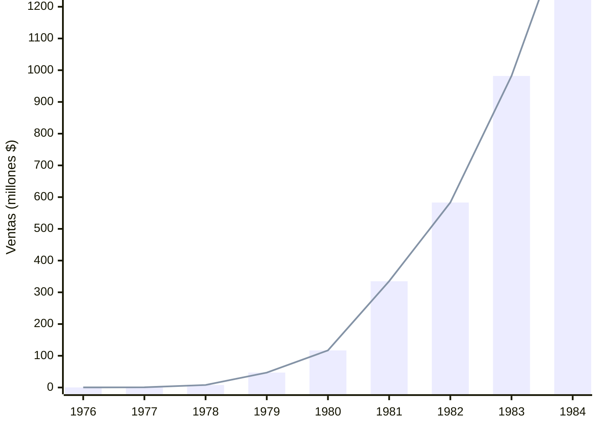

# 🏢 Apple Computer: Nacimiento en un Garaje 🍎

**Fecha de creación**: 24 de Octubre, 2025  
**Última actualización**: 25 de Octubre, 2025  
**Tiempo estimado de lectura**: 5 minutos  
**Etiquetas**: `#Apple` `#Fundación` `#SteveJobs` `#SteveWozniak` `#Historia`

## 📑 Tabla de Contenidos

1. [El Encuentro Legendario](#el-encuentro-legendario)
2. [Apple I: El Primer Producto](#apple-i-el-primer-producto)
3. [Apple II: Éxito Masivo](#apple-ii-éxito-masivo)
4. [Expansión y Crecimiento](#expansión-y-crecimiento)
5. [Macintosh: La Revolución](#macintosh-la-revolución)
6. [Legado del Inicio](#legado-del-inicio)

## 🤝 El Encuentro Legendario 

Steve Jobs (21 años) y Steve Wozniak (26 años) se conocieron en 1971 a través de un amigo mutuo. Wozniak, el genio técnico, y Jobs, el visionario comercial, formaron una asociación perfecta.

**Contexto inicial:**
- **Lugar**: Garaje de la familia Jobs en Los Altos, California
- **Inversión inicial**: $1,350 (Jobs vendió su furgoneta, Wozniak su calculadora)
- **Primer contrato**: 50 Apple I para Byte Shop
- **Nombre**: "Apple" por la dieta frutariana de Jobs y porque aparecería antes que Atari

📝 <strong>Dato Curioso</strong>

El acuerdo con Byte Shop fue por 50 computadoras a $500 cada una, pero el dueño Paul Terrell quería computadoras ensambladas, no solo placas. Jobs y Wozniak trabajaron días enteros para cumplir el pedido.

## 💻 Apple I: El Primer Producto 

Lanzado en 1976, el [Apple I](glosario.md#apple-i) fue una placa base que los usuarios debían ensamblar con carcasa, teclado y monitor.

| Especificación | Detalle |
|----------------|---------|
| **Procesador** | MOS 6502 a 1 MHz |
| **Memoria** | 4 KB RAM |
| **Precio** | $666.66 |
| **Unidades** | ~200 vendidas |
| **Característica** | Primera computadora con interfaz de video |

💡 El precio de $666.66 fue elegido por Wozniak porque le gustaban los números repetidos, no por "connotaciones religiosas".

## 🚀 Apple II: Éxito Masivo 

El [Apple II](glosario.md#apple-ii) (1977) fue el primer éxito comercial masivo de Apple, vendiendo millones de unidades.

**Innovaciones clave:**
- Carcasa de plástico integrada 
- Gráficos a color
- Disquetera integrada
- VisiCalc - primera hoja de cálculo

📈 <strong>Crecimiento Explosivo</strong>

| Año | Ventas | Evento |
|-----|--------|--------|
| **1977** | $770,000 | Lanzamiento Apple II |
| **1978** | $7.9 millones | Expansión rápida |
| **1980** | $117 millones | Preparación IPO |
| **1982** | $1 billón | Empresa establecida |

La hoja de cálculo VisiCalc impulsó ventas empresariales, haciendo al Apple II indispensable para negocios.

## 📈 Expansión y Crecimiento 

Apple se convirtió en empresa pública el 12 de diciembre de 1980. La OPI fue una de las más grandes en la historia.

**Logros tempranos:**
- 1980: OPI genera más millonarios que cualquier empresa anterior
- 1982: Apple ingresa a Fortune 500
- 1983: Contratan a John Sculley de Pepsi como CEO
- 1983: Lanzan Apple Lisa ($9,995)

> **"¿Quieres vender agua azucarada el resto de tu vida o venir conmigo y cambiar el mundo?"** - Jobs a Sculley

## 💫 Macintosh: La Revolución 

El [Macintosh](glosario.md#macintosh) 128K (1984) revolucionó la computación personal con interfaz gráfica y ratón.

| Característica | Impacto |
|----------------|---------|
| **Interfaz gráfica** | Computación accesible para todos |
| **Ratón incluido** | Navegación intuitiva |
| **Aplicaciones integradas** | Listo para usar inmediatamente |
| **Diseño compacto** | Todo-en-uno elegante |

⚠️ Aunque revolucionario, el Macintosh inicial era lento y caro ($2,495). Las ventas fueron decepcionantes, llevando a conflictos entre Jobs y Sculley.

## 🌟 Legado del Inicio 

El garaje donde comenzó Apple es ahora monumento histórico de Silicon Valley.

**Impacto duradero:**
- Estableció el modelo "startup en garaje"
- Demostró que jóvenes podían desafiar gigantes
- Creó cultura de innovación continua
- Inspiró generaciones de emprendedores

🏆 <strong>Reconocimientos</strong>

- **1982**: Jobs en portada de Time Magazine
- **1985**: Medalla Nacional de Tecnología (rechazada por Jobs)
- **2013**: Garaje declarado sitio histórico
- **2018**: Apple primera empresa en valer $1 trillón

El espíritu innovador de esos primeros años sigue definiendo a Apple hoy.

## 📋 Tabla Comparativa: Primera Década 

| Modelo | Año | Precio | Unidades | Innovación Principal |
|--------|-----|--------|----------|---------------------|
| **Apple I** | 1976 | $666 | 200 | Primera computadora personal |
| **Apple II** | 1977 | $1,298 | 6+ millones | Gráficos color + éxito comercial |
| **Apple III** | 1980 | $4,340 | 120,000 | Enfocado a empresas |
| **Lisa** | 1983 | $9,995 | 10,000 | Interfaz gráfica empresarial |
| **Macintosh** | 1984 | $2,495 | 70,000 (primer año) | Interfaz gráfica masiva |

 

## 📊 Gráfico Crecimiento de Ventas Apple (1976-1984) 

  

## 🔗 Navegación

**← [Anterior: Biografía Steve Jobs](articulo-1.md)** | **[Siguiente: Años de Exilio →](articulo-3.md)**

[↑ Volver arriba](#-apple-computer-nacimiento-en-un-garaje-)

## 👀 Ver También

- [Biografía Steve Jobs](articulo-1.md) - Vida del co-fundador
- [Años de Exilio](articulo-3.md) - Lo que pasó después de 1985
- [Renacimiento Apple](articulo-4.md) - El regreso de Jobs

---

📅 Última actualización: 25 de Octubre, 2025 
⏱️ Tiempo de lectura: 5 minutos  

