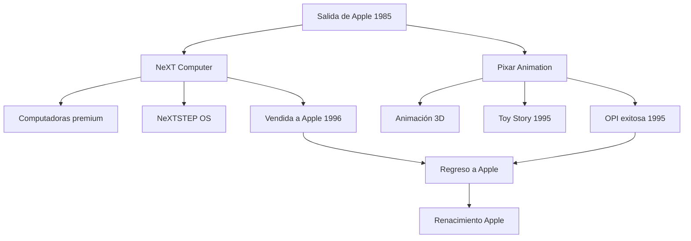

# 🔄 El Exilio Productivo: NeXT y Pixar 🎬

**Fecha de creación**: 24 de Octubre, 2025  
**Última actualización**: 25 de Octubre, 2025  
**Tiempo estimado de lectura**: 5 minutos  
**Etiquetas**: `#NeXT` `#Pixar` `#SteveJobs` `#Exilio` `#Animación`

## 📑 Tabla de Contenidos

1. [La Salida de Apple](#la-salida-de-apple)
2. [NeXT Computer](#next-computer)
3. [La Aventura Pixar](#la-aventura-pixar)
4. [Toy Story: Éxito Histórico](#toy-story-éxito-histórico)
5. [Preparando el Regreso](#preparando-el-regreso)
6. [Balance del Exilio](#balance-del-exilio)

## 🚪 La Salida de Apple 

En 1985, tras conflictos con el CEO John Sculley y el directorio, Steve Jobs renunció a Apple. Vendió todas sus acciones excepto una, declarando: "Ya no confío en que sepan lo que hay que hacer."

**Contexto de la salida:**
- Macintosh no cumplió expectativas de ventas
- Luchas de poder internas (una de las principales causas)
- Sculley relegó a Jobs de operaciones
- Jobs intentó una especie de "golpe de estado" fallido

## 💻 NeXT Computer 

Jobs fundó NeXT Computer en 1985, enfocándose en computadoras de alta gama para educación y negocios.

| Aspecto | Innovación NeXT |
|---------|-----------------|
| **Hardware** | Diseño elegante tipo cubo negro |
| **Software** | [NeXTSTEP](glosario.md#nextstep) (base de futuro macOS) |
| **Precio** | $6,500 - muy premium |
| **Mercado** | Educación e investigación |

**Logros técnicos de NeXT:**
- Primer navegador web en computadora comercial
- Sistema orientado a objetos
- Desarrollo rápido de software
- Tim Berners-Lee creó la Web en NeXT

  

💡 Aunque NeXT vendió solo 50,000 unidades, su tecnología NeXTSTEP se convirtió en la base de macOS y iOS cuando Apple compró la compañía.

## 🎬 La Aventura Pixar

En 1986, Jobs compró la división de gráficos de Lucasfilm por $10 millones, renombrándola [Pixar](glosario.md#pixar).

**Evolución inicial:**
- **1986-1991**: Vende hardware y software de renderizado
- **1991**: Firma acuerdo con Disney para 3 películas
- **Corto "Luxo Jr."** (1986) - demuestra potencial animación
- **Crisis financiera**: [Pixar](glosario.md#pixar) casi quiebra varias veces

📉 <strong>Inversión de Riesgo</strong>

Jobs invirtió más de $50 millones de su bolsillo en Pixar durante años sin ver retorno. Muchos lo consideraron un error, hasta que Toy Story cambió todo.

## 🎪 Toy Story: Éxito Histórico 

  

En 1995, [Pixar](glosario.md#pixar) estrenó "Toy Story", el primer largometraje animado por computadora.

**Impacto inmediato:**
- Recaudación mundial: $373 millones
- Crítica: 100% en Rotten Tomatoes
- Reconocimiento: 3 nominaciones Oscar
- Valor [Pixar](glosario.md#pixar): Se disparó tras OPI

> **"Toy Story no solo cambió la animación, cambió la forma en que contamos historias."**

## 🔄 Preparando el Regreso 

El éxito de Pixar y la tecnología de NeXT posicionaron a Jobs para su regreso triunfal.

**Eventos clave:**
- 1995: OPI de Pixar hace a Jobs multimillonario
- 1996: Apple busca sistema operativo moderno
- Diciembre 1996: Apple compra NeXT por $429 millones
- Jobs regresa como "asesor" del CEO

🔄 <strong>Ironía del Destino</strong>

Apple compró NeXT principalmente por su sistema operativo NeXTSTEP, que se convirtió en macOS. Así, la tecnología que Jobs creó durante su exilio salvó a la empresa que lo había echado.

## ⚖️ Balance del Exilio 

Los 11 años fuera de Apple fueron cruciales para el crecimiento de Jobs.

**Lecciones aprendidas:**
- Madurez como líder y manager
- Experiencia en industria del entretenimiento
- Desarrollo de tecnología avanzada
- Confianza para tomar riesgos mayores

✅ El "exilio" forzoso resultó ser el mejor entrenamiento posible para el renacimiento de Apple.

## 📊 Tabla: Comparación NeXT vs Pixar

| Aspecto | NeXT Computer | Pixar Animation |
|---------|---------------|-----------------|
| **Fundación** | 1985 | 1986 (comprada) |
| **Inversión inicial** | $7 millones | $10 millones |
| **Enfoque** | Computación alta gama | Animación por computadora |
| **Éxito comercial** | Limitado (50k unidades) | Masivo (billones en taquilla) |
| **Legado** | Tecnología para macOS/iOS | Revolución animación digital |
| **Venta/OPI** | Vendida a Apple (1996) | OPI exitosa (1995) |

## 🗳️ Diagrama de su salida de Apple

## 🔗 Navegación

**← [Anterior: Fundación Apple](articulo-2.md)** | **[Siguiente: Renacimiento Apple →](articulo-4.md)**

[↑ Volver arriba](#-el-exilio-productivo-next-y-pixar-)

## 👀 Ver También

- [Fundación Apple](articulo-2.md) - Los comienzos antes del exilio
- [Renacimiento Apple](articulo-4.md) - El regreso triunfal
- [Legado y Filosofía](articulo-5.md) - Impacto permanente

---

📅 Última actualización: 25 de Octubre, 2025
⏱️ Tiempo de lectura: 5 minutos  

