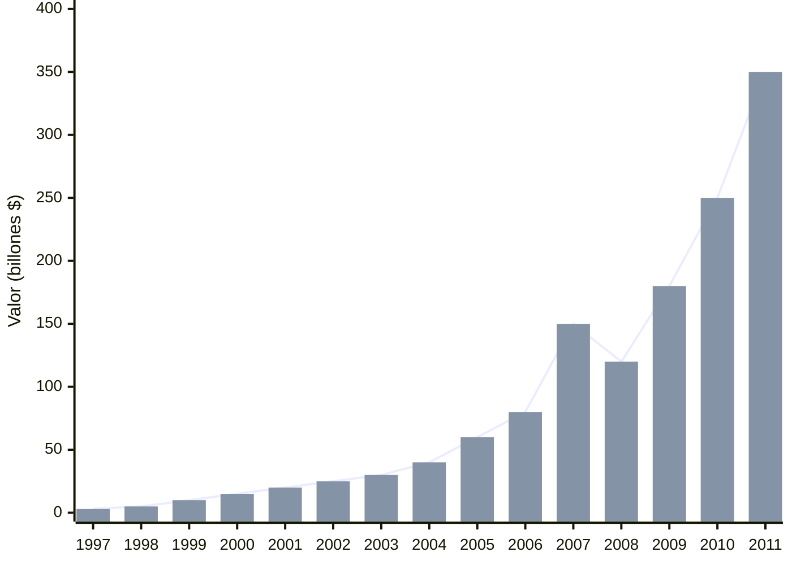

# 📈 El Renacimiento Apple: iMac, iPod, iPhone 📱

**Fecha de creación**: 25 de Octubre, 2025  
**Última actualización**: 26 de Octubre, 2024  
**Tiempo estimado de lectura**: 5 minutos  
**Etiquetas**: `#iPhone` `#iPod` `#iMac` `#Innovación` `#Apple`

## 📑 Tabla de Contenidos

1. [El Regreso del Rey](#regreso)
2. [iMac: El Primer Éxito](#imac)
3. [iPod: Revolución Musical](#ipod)
4. [iPhone: El Cambio Total](#iphone)
5. [iPad y Ecosistema](#ipad)
6. [Transformación Empresarial](#transformacion)

## 👑 El Regreso del Rey {#regreso}

En 1997, Apple estaba en crisis: pérdidas de $1.6 billones, productos desconectados y sin visión. El regreso de Jobs marcó el inicio de la transformación más espectacular en la historia corporativa.

**Primeras acciones clave:**
- Canceló proyectos innecesarios (como Newton PDA)
- Redujo línea de productos de 15 a 3
- Asociación con Microsoft ($150 millones)
- Campaña "Think Different"

> **"La gente olvidará lo que dijiste, pero nunca cómo los hiciste sentir."**

## 🖥️ iMac: El Primer Éxito {#imac}

El [iMac](glosario.md#imac) G3 (1998) fue la declaración de que Apple estaba de vuelta. Su diseño revolucionario rompió todos los moldes.

| Característica | Innovación |
|----------------|------------|
| **Diseño** | Todo-en-uno |
| **Conectividad** | Primer ordenador con USB |
| **Filosofía** | Simplicidad y elegancia |
| **Recepción** | 800,000 unidades en 5 meses |

🎨 <strong>Diseño Revolucionario</strong>

El iMac eliminó la disquetera cuando era estándar, apostando por USB y CD-ROM. Jony Ive diseñó la carcasa transparente que mostraba el interior, haciendo la tecnología "amigable". 

## 🎵 iPod: Revolución Musical {#ipod}

Lanzado en 2001, el [iPod](glosario.md#ipod) transformó cómo escuchamos música con su eslogan "1,000 canciones en tu bolsillo".

**Evolución del iPod:**
- **2001**: iPod original (rueda click física)
- **2003**: iTunes Store (99 centavos por canción)
- **2004**: iPod mini (colores, más pequeño)
- **2005**: iPod nano (pantalla color)
- **2007**: iPod touch (pantalla táctil)

✅ El iPod + iTunes creó un ecosistema completo: hardware fácil de usar + tienda de contenido + software simple. Este modelo definiría la estrategia  de Apple a futuro.

## 📱 iPhone: Un Antes y un Después {#iphone}

El [iPhone](glosario.md#iphone) (2007) no fue solo un teléfono, fue una computadora de bolsillo que redefinió múltiples industrias.

**Anuncio histórico de Jobs:**
"Hoy, Apple reinventa el teléfono. Tres productos en uno: un iPod con controles táctiles, un teléfono revolucionario y un comunicador de internet."

📊 <strong>Impacto Inmediato</strong>

- **Primer año**: 1.4 millones de unidades vendidas
- **App Store (2008)**: 500 millones de descargas en primer año
- **Efecto en competencia**: Nokia, BlackBerry, Palm obsoletos
- **Nueva industria**: Economía de aplicaciones móviles

El iPhone creó un mercado de $1 trillón en smartphones.

## 📟 iPad y Ecosistema {#ipad}

El [iPad](glosario.md#ipad) (2010) creó la categoría de tablets modernas, aunque muchos criticaron su necesidad inicial.

**Logros del iPad:**
- **Primer año**: 15 millones de unidades vendidas
- **Mercado educativo**: Reemplazó libros de texto
- **Profesional**: Herramienta para artistas y médicos
- **Ecosistema**: Apps optimizadas para pantalla grande

| Dispositivo | Año | Impacto |
|-------------|-----|---------|
| **iMac** | 1998 | Salvó a Apple de la quiebra |
| **iPod** | 2001 | Dominó música digital |
| **iPhone** | 2007 | Revolucionó telefonía móvil |
| **iPad** | 2010 | Creó categoría tablets |

## 💼 Transformación Empresarial {#transformacion}

Bajo el liderazgo de Jobs, Apple se transformó de empresa al borde de la quiebra a la más valiosa del mundo.

**Métricas del éxito:**
- **1997**: Pérdidas de $1.6 billones
- **2011**: Ganancias de $108 billones
- **Valor de mercado**: De 3 billones a $350 billones
- **Tiendas Apple**: Experiencia de retail revolucionaria
- **Cultura corporativa**: Enfoque en excelencia y diseño

💡 Jobs implementó el "Directly Responsible Individuals" (DRI) donde cada tarea tenía una persona específica responsable. Esta claridad eliminó burocracia y aceleró la innovación.

## 📈 Tabla: Evolución de Productos 1997-2011

| Año | Producto | Innovación | Resultado |
|-----|----------|------------|-----------|
| **1998** | iMac G3 | Diseño colorido todo-en-uno | Apple vuelve a ser rentable |
| **2001** | iPod | 1,000 canciones en bolsillo | Domina música digital |
| **2003** | iTunes Store | Música legal a $0.99 | 1 billón de canciones en 5 años |
| **2007** | iPhone | Pantalla multitáctil | Revoluciona telefonía |
| **2008** | App Store | Economía de aplicaciones | 500M descargas en primer año |
| **2010** | iPad | Tableta moderna | Crea nueva categoría |

## 🔗 Navegación

**← [Anterior: Años de Exilio](articulo-3.md)** | **[Siguiente: Legado y Filosofía →](articulo-5.md)**

[↑ Volver arriba](#)

## 👀 Ver También

- [Años de Exilio](articulo-3.md) - Lo que aprendió Jobs fuera de Apple
- [Legado y Filosofía](articulo-5.md) - El impacto permanente
- [Biografía Steve Jobs](articulo-1.md) - Contexto personal del líder

---

📅 Última actualización: 26 de Octubre, 2025
⏱️ Tiempo de lectura: 5 minutos  

